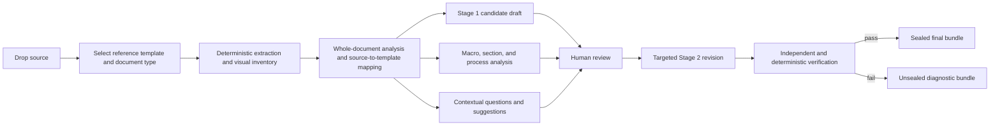

# Draft-first document transformation implementation plan

Status: frozen for implementation  
Baseline: `87ccd065658bf79a88f52d5549fb6b96e6b66cf3` (`main`, 2026-08-16)  
Plan owner: the primary orchestration task in `/Users/gvrubim/Documents/document-enhancer`  
Execution profile: independent Codex worktrees using `gpt-5.6-luna` with `thinking=max`  

## Frozen-plan rule

This file is the implementation contract. After its initial commit, no worker or integrator may
change its scope, rewards, ownership, acceptance thresholds, or sequencing. A worker gets one
coherent implementation pass and at most one bounded correction pass for demonstrated blockers.

If a lane finds work that is useful but not required by a reward below, the worker must return a
short proposed follow-up to the orchestrator instead of implementing it. The orchestrator records
accepted deferrals in `FOLLOW_UP.md`. A lane must not loop on optional polish, speculative
hardening, or architecture changes.

Implementation evidence belongs in `DRAFT_FIRST_IMPLEMENTATION_EVIDENCE.md`, not in this frozen
plan. Workers must not edit either shared plan, `FOLLOW_UP.md`, the root `README.md`, shared
configuration, or another lane's files unless ownership below explicitly grants that path.

## Outcome

Change the authoring workflow so Stage 1 produces both the existing analysis and an unapproved,
template-aligned draft. The draft must:

- move all supported source information into the appropriate selected-template sections;
- improve grammar, clarity, organization, and professional English without inventing facts;
- preserve source-span and figure provenance for every populated section;
- show structured gap markers wherever required information is absent;
- show structured decision markers wherever the source is ambiguous or contradictory;
- convert native tables deterministically and propose bounded conversions of eligible image-based
  tables or diagrams while retaining the original figure;
- give contextual questions safe, useful suggestions grounded in the whole document, recipe, and
  cited evidence;
- remain visibly unapproved and unsealed until the human decision gate is completed.

Stage 2 applies the approved decisions to the Stage 1 draft, performs targeted revision rather than
an unconstrained whole-document rewrite when possible, runs deterministic and independent fidelity
checks, and seals only a fully verified bundle.

The optional RAG/GraphRAG path remains a downstream consumer of the same canonical sealed
`markdown/07-final-document.md` and `core.graph.v1` boundary.

## Target operator journey



One Stage 1 command performs the complete left side of this flow and then always pauses for explicit
human approval. A document with no detected ambiguity still requires `approve_rewrite: true` before
Stage 2 can produce a seal.

## Deliberate architecture

Keep the existing file-backed `CoreRunner`; do not add Deep Agents, a graph runtime, a workflow
engine, a checkpoint database, a general-purpose agent loop, arbitrary filesystem tools, shell
tools, or subagents to the authoring runtime.

The application owns the sequence and promotion decisions. Models are bounded collaborators behind
typed interfaces:

1. zero or more visual-interpretation calls for eligible figures;
2. one whole-document analysis and mapping call;
3. one draft-generation call based on the frozen mapping;
4. one independent draft-fidelity call;
5. after human review, zero or one targeted revision call;
6. one final independent content audit.

Tests use deterministic fake providers. Live-provider checks are opt-in and earn no evidence unless
they actually execute with secret-safe manifests. A fixed character slice is not an acceptable
context policy: preflight must account for source, template, structured visual evidence, prompts,
and expected output. Oversized documents must fail clearly or use a deterministic documented
hierarchical fallback; they must never be silently truncated.

## Stage 1 artifact contract

Existing numbered analysis artifacts remain supported. Add a separate draft namespace so current
final and retrieval paths do not move:

```text
runs/RUN_ID/
├── draft/
│   ├── transformation.json       # typed source-to-template mapping and coverage ledger
│   ├── document.md               # unapproved template-aligned candidate
│   ├── document.docx             # rendered candidate with visible review callouts
│   ├── audit.json                # preliminary deterministic/provider fidelity result
│   └── visual-extractions.json   # bounded interpretations linked to FIG IDs
├── review/decisions.yaml         # contextual questions, suggestions, steering, waivers, approval
├── markdown/01..06               # existing source and analysis reports
└── report.html                   # draft-first reviewer with supporting analysis tabs
```

The final Stage 2 paths remain unchanged, including `markdown/07-final-document.md`,
`documents/final.docx`, `json/09-ontology.json`, `json/11-audit.json`, and `json/12-seal.json`.

## Transformation contracts

The implementation must define strict, versioned contracts equivalent to:

```text
TransformationBundle
  source_digest
  recipe_id and recipe_digest
  template_sections[]
  source_dispositions[]
  gaps[]
  questions[]
  visual_extractions[]

DraftSection
  template_section_id
  heading
  status: populated | partial | missing | conflicting | not_applicable
  rewritten_markdown
  source_span_ids[]
  figure_ids[]
  gap_ids[]

SourceDisposition
  source_span_id
  action: placed | duplicated | intentionally_omitted
  destination_section_ids[]
  rationale

Gap
  gap_id
  template_section_id
  kind: missing | ambiguous | conflicting | unreadable_visual
  description
  evidence_span_ids[]
  figure_ids[]
  blocking
  question_id

VisualExtraction
  figure_id and source digest
  kind: table | process_diagram | chart | ui_screenshot | decorative | unknown
  status: extracted | best_effort | requires_review | unsupported
  structured_content
  source_span_ids[]
  warnings[]
```

All models forbid unknown fields. Every source span must have exactly one disposition record, every
template requirement must have a section status, every reference must resolve, and no populated
content may lack a source span, accepted decision, or explicitly classified recipe-only structural
origin.

## Contextual question and suggestion policy

Question generation must use whole-document context, not an isolated sentence. It must consider:

- document type and selected recipe requirement;
- the containing section and relevant cross-section evidence;
- contradictory values, authority cues, process dependencies, and defined terminology;
- related visual evidence and extraction warnings;
- whether the missing value is a business fact that only an accountable owner can supply.

Each question records evidence span IDs or figure IDs when evidence exists, a concise context and
reason, whether it blocks promotion, and an optional suggestion with one of these bases:

- `source_supported`: proposes wording or a resolution strategy supported by cited source evidence;
- `recipe_guidance`: proposes a safe process for filling a gap without supplying the missing fact;
- `none`: no safe suggestion exists.

Suggestions must never invent owners, dates, thresholds, approvals, policy requirements, system
names, evidence, or numeric values. When sources conflict, the suggestion may identify the likely
authoritative evidence or recommend an accountable resolution process, but must not silently choose
a value. Tests must include adversarial examples where a plausible suggestion would be unsafe.

Draft callouts are machine-readable and human-readable. They use stable `GAP-###` and question IDs,
not ordinary `TBD` prose. Unresolved blocking callouts cannot appear in a sealed final document.

## Visual conversion policy

Native DOCX and Markdown tables remain deterministic parser output and do not require a model call.
For already extractable passive PNG/JPEG figures:

- preserve the original bytes, digest, `FIG-###` identity, caption, location, and appendix entry;
- interpret only figures within explicit count, size, media-type, and context budgets;
- represent an image table as structured rows/cells before it can become a native Markdown/DOCX
  table;
- represent a process diagram as a candidate graph/Mermaid view with a visible review marker;
- extract chart values only when the response marks them legible and reviewable;
- treat UI screenshots as non-authoritative visual guidance;
- retain `requires_review` for every best-effort conversion until a human accepts or rejects it.

Remote images are never fetched. Scanned-PDF OCR and PDF image materialization remain the existing
bounded follow-up unless this increment can support them without adding an OCR/platform subsystem.

## Integrity prerequisites

This increment must close the following fail-open paths while preserving the current operator
workflow:

- missing `approve_rewrite` is rejection, never approval;
- every Stage 1 artifact consumed during Stage 2 is checked against its registered digest;
- current recipe and configuration digests must match the waiting run before revision;
- the seal contains and the sealed-bundle loader verifies digests for every authoritative consumed
  artifact, including ontology and graph exports;
- two concurrent or repeated resume attempts cannot silently promote mismatched artifacts;
- a candidate draft is never treated as final or consumed by RAG.

## Reward protocol

Each reward is binary and immutable. It is earned only when its exact acceptance statement and named
verification pass on the integrated branch. Narrower tests do not earn broader rewards. Evidence is
recorded in `DRAFT_FIRST_IMPLEMENTATION_EVIDENCE.md` with the integrated commit SHA and exact command
result. No live reward may be claimed from a fake, skipped, cached-only, unavailable, or
`not_evaluated` call.

Required implementation reward: **100/100**. Optional live proof is reported separately and does not
hide an offline or contract failure.

## DFT-1 — Transformation contracts and deterministic draft engine (15 points)

- Reward: strict versioned transformation, section, disposition, gap, and visual-reference models;
  deterministic coverage validation; and deterministic Markdown rendering of populated, partial,
  missing, and conflicting sections.
- Acceptance:
  - every source span is accounted for exactly once;
  - every required template section receives a status;
  - unknown span, figure, gap, and section references fail closed;
  - gap callouts contain stable IDs and never masquerade as source facts;
  - repeated rendering of identical input is byte-identical.
- Verify:

  ```bash
  PYTHONPATH=src uv run pytest -q tests/unit/core/test_transformation.py
  ```

## DFT-2 — Contextual questions and safe suggestions (10 points)

- Reward: deterministic and provider-enriched questions use whole-document context and provide
  helpful suggestions only when the source or recipe supports a safe suggestion.
- Acceptance:
  - cross-section contradictions produce one contextual question rather than disconnected prompts;
  - questions cite existing spans/figures;
  - source-supported suggestions cite their basis;
  - missing owners, dates, thresholds, and approvals never receive invented values;
  - unsafe suggestions are absent and explicitly classified `none`.
- Verify:

  ```bash
  PYTHONPATH=src uv run pytest -q tests/unit/core/test_contextual_questions.py tests/unit/core/test_providers.py
  ```

## DFT-3 — Bounded visual interpretation (10 points)

- Reward: eligible extracted figures can be classified and converted to typed table/diagram/chart
  candidates without replacing or mutating source image evidence.
- Acceptance:
  - native tables bypass visual calls;
  - fake multimodal responses produce validated cell grids and provenance;
  - malformed grids, mismatched figure digests, oversized images, unknown IDs, and unsupported media
    fail or return `requires_review` predictably;
  - original figures remain present and digest-identical;
  - no remote fetch, OCR, shell, or arbitrary filesystem capability is introduced.
- Verify:

  ```bash
  PYTHONPATH=src uv run pytest -q tests/unit/core/test_visuals.py tests/unit/llm/test_multimodal.py
  ```

## DFT-4 — Artifact, approval, and seal integrity (15 points)

- Reward: Stage 2 and sealed consumers reject missing approval, modified intermediate artifacts,
  changed recipe/configuration, incomplete digest manifests, and post-seal graph/ontology tampering.
- Acceptance:
  - regression tests reproduce and then reject every integrity prerequisite above;
  - failed validation writes no seal and preserves diagnosable state;
  - valid existing-style runs can be migrated or regenerated explicitly; no silent compatibility
    downgrade is introduced.
- Verify:

  ```bash
  PYTHONPATH=src uv run pytest -q tests/unit/core/test_integrity.py \
    tests/unit/core/test_core_indexing_adapter.py tests/unit/core/test_core_runner.py
  ```

## DFT-5 — Whole-document mapping, drafting, and verification providers (15 points)

- Reward: bounded typed provider seams perform analysis/mapping, drafting, and independent draft
  audit without Deep Agents or silent truncation.
- Acceptance:
  - one mapping call returns macro, section, process, question, coverage, and template-placement data;
  - one drafting call consumes the frozen map and returns typed section content rather than only an
    opaque Markdown string;
  - one audit call rejects unsupported additions, omissions, invalid references, and unresolved
    blocking gaps;
  - context preflight either fits the complete request/output budget or returns a controlled
    oversized status/fallback;
  - call manifests contain digests and usage, never credentials or raw source text.
- Verify:

  ```bash
  PYTHONPATH=src uv run pytest -q tests/unit/core/test_transformation_providers.py \
    tests/unit/llm/test_gateway.py tests/unit/llm/test_gateway_async.py
  ```

## DFT-6 — Draft-first five-phase runner and targeted Stage 2 (20 points)

- Reward: the public runner remains five-phase and file-backed, but Stage 1 always produces the
  candidate draft and pauses; Stage 2 revises that exact draft from approved decisions and seals only
  after all gates pass.
- Acceptance:
  - `run` and `watch-inbox` generate every Stage 1 draft/analysis artifact and exit waiting;
  - even a complete document requires explicit approval;
  - accepted decisions update only implicated draft sections when possible;
  - reject/defer/waiver behavior is deterministic and traceable;
  - unresolved blocking gaps, unreviewed visual conversions, or changed evidence prevent sealing;
  - final canonical paths and the downstream retrieval boundary remain compatible.
- Verify:

  ```bash
  PYTHONPATH=src uv run pytest -q tests/unit/core/test_core_runner.py \
    tests/e2e/test_draft_first_workflow.py tests/e2e/test_core_document_types.py
  ```

## DFT-7 — Draft-first reviewer and CLI journey (5 points)

- Reward: `report.html` and terminal output lead with the candidate draft, visibly distinguish draft
  from final, link gaps/questions/evidence, and preserve the existing supporting reports.
- Acceptance:
  - accessible tabs show candidate draft first, then source, macro, sections, flow, and questions;
  - gap and decision IDs link to matching question context;
  - converted visuals show source `FIG-###`, status, and reviewer action;
  - Stage 2 status and exit codes remain machine-readable and documented by tests.
- Verify:

  ```bash
  PYTHONPATH=src uv run pytest -q tests/unit/core/test_draft_reviewer.py \
    tests/unit/core/test_core_cli.py
  ```

## DFT-8 — Evaluation, documentation, and release evidence (10 points)

- Reward: representative fixtures prove full-context transformation quality, no-invention behavior,
  contextual suggestions, visual table conversion, final fidelity, and package compatibility.
- Acceptance:
  - fixtures cover all four supported document types;
  - at least one fixture has cross-section ambiguity and a safe contextual suggestion;
  - at least one DOCX fixture has a native table and an image-based table candidate;
  - automated metrics report source-span coverage = 1.00, required-section status coverage = 1.00,
    invalid provenance references = 0, unresolved blockers in sealed bundles = 0, and deterministic
    citation/reference validity = 1.00;
  - README documents source + template -> Stage 1 draft -> decisions -> Stage 2 final;
  - the complete repository gate and package build pass from the integrated checkout.
- Verify:

  ```bash
  uv sync --frozen
  uv run ruff format --check .
  uv run ruff check .
  uv run ty check
  uv run pytest -m "not live_model and not public_download"
  uv run python scripts/verify_reference_pack.py reference_packs/enterprise_core
  uv build
  ```

## Optional live proof — reported, never inferred

- A real provider proof may be run only when credentials are explicitly available and use is in
  scope. It must exercise one complete source within the context budget, one contextual question,
  one image-table conversion, Stage 1 drafting, approved Stage 2 revision, final audit, and sealing.
- Record only model/profile IDs, digests, counts, timings, statuses, and validation results. Never
  persist credentials or raw source text in call manifests.
- If not run, report `not run`; do not promote deterministic fake-provider evidence into a live
  claim.

## Parallel worktree execution

All worker tasks start from the integrated commit named by the orchestrator. Each task uses an
independent Codex worktree, `gpt-5.6-luna`, and `thinking=max`. The create-thread interface has no
separate service-tier field; selecting Luna is the available fast execution profile.

Workers are not alone in the repository. They must preserve other work, edit only owned paths,
avoid root/shared files, make one coherent commit, run focused checks, self-review their diff, and
return commit SHA plus exact evidence. Workers do not push or merge.

### Wave 1 — Independent foundations

Run these concurrently from the frozen-plan baseline:

1. **W1-A / DFT-1 — transformation engine**
   - Own: new `src/document_enhancer/core/transformation.py` and
     `tests/unit/core/test_transformation.py` only.
   - Must not edit `models.py`, `runner.py`, providers, CLI, HTML, plans, or configuration.
2. **W1-B / DFT-2 — contextual questions**
   - Own: `src/document_enhancer/core/models.py`, `src/document_enhancer/core/review.py`,
     `tests/unit/core/test_contextual_questions.py`, and only the directly necessary contextual
     question assertions in existing core review tests.
   - Must not edit providers, runner, CLI, HTML, plans, or configuration.
3. **W1-C / DFT-3 — visual interpretation**
   - Own: new `src/document_enhancer/core/visuals.py`, the minimum multimodal extension under
     `src/document_enhancer/llm/`, `tests/unit/core/test_visuals.py`, and
     `tests/unit/llm/test_multimodal.py`.
   - Must not edit ingestion, figures, runner, providers, CLI, plans, or configuration.
4. **W1-D / DFT-4 foundation — integrity validators**
   - Own: new `src/document_enhancer/core/integrity.py` and
     `tests/unit/core/test_integrity.py` only.
   - Build reusable digest/approval/config/seal validation helpers without wiring shared runner or
     consumer files yet.

The orchestrator reviews and cherry-picks each verified commit, resolves integration-only import or
contract alignment, and runs the full repository gate once after Wave 1.

### Wave 2 — Independent adapters on the integrated foundation

Run these concurrently only after Wave 1 is integrated:

1. **W2-A / DFT-5 — transformation providers and context budgeting**
   - Own: `src/document_enhancer/core/providers.py`, new focused provider/context helper modules,
     `tests/unit/core/test_transformation_providers.py`, and directly necessary provider tests.
2. **W2-B / DFT-7 — draft reviewer rendering**
   - Own: `src/document_enhancer/core/html_report.py` and
     `tests/unit/core/test_draft_reviewer.py` only.
   - Implement against the frozen draft paths and IDs; do not wire the runner or CLI.
3. **W2-C / DFT-4 wiring outside the runner**
   - Own: `src/document_enhancer/core/store.py`, `src/document_enhancer/core/indexing.py`,
     `tests/unit/core/test_core_indexing_adapter.py`, and directly necessary store/index tests.
   - Add verified reads and sealed-consumer digest enforcement; leave runner wiring to Wave 3.

The orchestrator integrates these commits and runs the full repository gate once after Wave 2.

### Wave 3 — Critical-path integration

Run one implementation task, not competing writers:

1. **W3-A / DFT-6 — runner, layout, CLI, finalization, and integrity integration**
   - Own: `src/document_enhancer/core/runner.py`, `src/document_enhancer/core/layout.py`,
     `src/document_enhancer/core/__init__.py`, `src/document_enhancer/cli.py`, runner/CLI tests, and
     new `tests/e2e/test_draft_first_workflow.py`.
   - Wire the already integrated foundation; do not redesign its contracts.

After the coherent commit, the orchestrator performs one bounded integrator review. A demonstrated
acceptance blocker receives one correction pass in the same worktree. Everything else is deferred.

### Wave 4 — Evaluation and closure

Run a final bounded lane after the integrated workflow is green:

1. **W4-A / DFT-8 — fixtures, evaluation, and documentation**
   - Own: new draft-first fixtures/evaluation scripts and tests, `README.md`, and
     `DRAFT_FIRST_IMPLEMENTATION_EVIDENCE.md` as explicitly directed by the orchestrator.
   - Do not alter production behavior merely to satisfy a metric; report a blocker instead.

The orchestrator integrates the lane, executes the complete gate exactly once, records honest live
limitations, updates `FOLLOW_UP.md` only for accepted non-blocking deferrals, and verifies a clean
working tree. Pushing is out of scope unless separately requested.

## Merge and correction policy

- Every worker commit must contain only its owned paths.
- The orchestrator cherry-picks verified lane commits in dependency order.
- Conflicts indicate an ownership or baseline error and are resolved by the orchestrator, not by
  expanding worker ownership.
- One worker self-review plus one orchestrator review is the normal budget.
- One bounded correction pass is allowed only for a failed named reward, integration gate, data
  integrity condition, security/provenance boundary, or required consumer contract.
- Optional refactors, naming polish, broader formats, OCR, distributed execution, agent frameworks,
  and unrelated RAG improvements go to `FOLLOW_UP.md`.
- Completed tasks are archived after their commits are integrated and their evidence captured.

## Final completion condition

The implementation goal is complete only when all required rewards total 100/100 on the integrated
branch, the full gate passes, the worktree is clean, final artifacts remain compatible with the
sealed retrieval boundary, and no required work remains. Otherwise the orchestrator reports the
specific unearned reward and either performs the single allowed blocker correction or records a
non-blocking follow-up without changing this plan.
