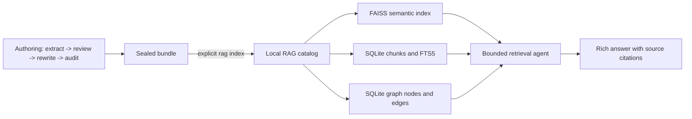

# RAG and GraphRAG CLI implementation plan

Status: implemented and verified
Branch: `gvr/rag-graphrag-cli`  
Baseline: `8d696d0` (`main`, 2026-07-18)  
Implementation: `0a5e2c4` (`Implement local RAG and GraphRAG CLI`)

## Outcome

Add an optional local retrieval consumer that indexes selected sealed Document Enhancer bundles and
answers questions in a Rich terminal conversation. It must combine semantic retrieval, lexical
retrieval, and bounded traversal of the existing `core.graph.v1` topology; support repeated
retrieval across documents; and render every answer from validated, inspectable citations.

The authoring workflow remains unchanged:



Retrieval is never invoked automatically by `run`, `continue`, or `stage-two`. The authoring package
must still import and run without FAISS, LangChain agents, or any retrieval catalog installed.

## Deliberate simplifications

- Use one local catalog directory, not a service, graph database, workflow engine, checkpoint store,
  migration framework, or deployment platform.
- Use LangChain's normal `create_agent` tool loop with two read-only retrieval tools. Do not add Deep
  Agents in v1: its filesystem, task-planning, subagent, skills, and memory middleware do not advance
  this bounded question-answering workflow.
- Use the graph already emitted by sealed bundles. Do not invent graph relationships or run a second
  LLM entity-extraction pipeline during indexing.
- Keep chat history in memory for the current CLI process. Do not add persisted sessions, users,
  permissions, a web UI, or an API server.
- Rebuild a selected catalog atomically. Do not implement incremental migrations, distributed
  ingestion, background workers, or automatic version promotion in v1.
- No web search or general filesystem tool is available to the answering agent. Indexed document
  content is untrusted evidence, never agent instruction.

Deep Agents may be reconsidered only if the completed retrieval evaluation demonstrates a concrete
query class that cannot be handled by the bounded two-tool loop. That decision requires a separate
plan and reward; it is not an implicit extension of this plan.

## Corpus-selection decision

The default index input is an explicit list of run IDs. An operator may deliberately choose
`--all-sealed`, but there is no hidden "index everything" behavior.

Embed only `markdown/07-final-document.md` from bundles accepted by `load_sealed_bundle()`. This is
the approved canonical document. Do not embed the original source, normalized source, analysis
reports, decision YAML, rewrite plan, audit prose, or change report: those artifacts duplicate
content, contain process metadata, or represent pre-approval text. Load `json/09-ontology.json` as
structured graph data rather than embedding its JSON serialization.

Every chunk records at least:

- stable `chunk_id`, `run_id`, bundle path, final digest, and source digest;
- document title, heading path, section ordinal, chunk ordinal, and character offsets;
- matched graph node IDs and graph provenance span IDs, when a deterministic match exists;
- embedding profile and chunker version used to build the catalog.

The initial catalog treats each selected run as an explicit document version and always displays
its run ID in citations. Automatic "latest version" selection is deferred because the current
sealed contract does not guarantee a universal cross-document identity/effective-date policy.

## Minimal target design

### Storage

Default location: `.document-enhancer/rag/catalog/`

```text
catalog/
├── manifest.json       # schema, selected bundle digests, chunker and embedding profile, file hashes
├── catalog.sqlite3     # chunk metadata, FTS5 text, graph nodes/edges, graph-to-chunk links
└── faiss/              # Native FAISS index; SQLite is the validated docstore
```

Build into a sibling temporary directory, validate counts and hashes, and atomically promote the
directory. A failed build must leave the previous catalog untouched. Persist only FAISS's native
index format; keep text and metadata in SQLite. This avoids pickle deserialization entirely, and
arbitrary downloaded indexes are rejected by manifest path, SHA-256, dimension, and row-count checks.

### Chunking

Chunk the final Markdown in two levels:

1. Split on the heading hierarchy and retain the full heading path.
2. Pack Markdown blocks within a section to a configurable target size, preserving tables, lists,
   and fenced blocks when possible. Use `RecursiveCharacterTextSplitter` only for an individual
   block that exceeds the hard limit.

Start with a versioned `2400` character target and `300` character overlap for oversized prose,
then keep or change those numbers only from retrieval evaluation evidence. Chunk IDs are a digest
of the final-document digest, heading path, ordinal, and chunk text digest, so the same sealed input
and chunker version reproduce the same IDs.

### Embeddings and vector search

Use `gemini-embedding-2` at 768 dimensions for the live profile, subject to the compatibility spike
in RAG-0.2. Format document inputs as `title: ... | text: ...` and query inputs as
`task: question answering | query: ...`; do not send the unsupported `task_type` field to Embeddings
2. Record provider, model, dimensions, format version, and normalization in the manifest, and reject
mixed profiles.

Use `GoogleGenerativeAIEmbeddings` if its locked version passes the document/query cardinality,
format, and dimensionality probe. If it cannot preserve that contract, implement only a thin
LangChain `Embeddings` adapter over the official Google client. Tests use deterministic fake
embeddings and do not require credentials.

### Hybrid retrieval and graph traversal

`search_evidence(query, run_ids=None)` performs FAISS similarity and SQLite FTS5 search, then fuses
the ranked chunk IDs with deterministic reciprocal-rank fusion. It returns bounded evidence cards,
not an unbounded document dump.

`expand_graph(node_ids, depth=1)` traverses actual namespaced `core.graph.v1` edges to a hard maximum
depth of two and returns paths plus chunks deterministically linked to the reached nodes. A graph
node is linked to chunks only by an exact node ID carried in metadata or a unique normalized section
label match; ambiguous matches remain unlinked and are reported.

Cross-document multi-hop does not require invented cross-document edges. The agent may discover a
document name, policy ID, role, system, or other term in one evidence card and call
`search_evidence` again across the catalog. Within a bundle it may use `expand_graph` to inspect the
real topology. This supports repeated hops while keeping every transition observable.

### Bounded answering agent and citations

Create one LangChain agent with only the two tools above and hard limits on tool calls, graph depth,
returned chunks, and total evidence characters. The default budget is at most four retrieval rounds,
eight tool calls, twelve full chunks, and one structured final response.

The final model response is a Pydantic envelope:

```text
status: answered | insufficient
claims[]:
  text: string
  citation_ids: [evidence IDs]
```

The application, not the model, builds the visible source list. It rejects citation IDs not present
in the per-question evidence ledger and rejects an `answered` result containing an uncited claim.
On failure or insufficient evidence, the CLI says so plainly instead of presenting an unsupported
answer. The optional trace shows retrieval queries, result IDs, graph paths, and timings, but never
hidden chain-of-thought.

### CLI surface

```text
docenhance rag index RUN_ID... [--all-sealed] [--catalog PATH]
docenhance rag inspect [--catalog PATH] [--json]
docenhance rag ask "QUESTION" [--run RUN_ID] [--show-trace] [--json]
docenhance rag chat [--run RUN_ID] [--show-trace]
```

`chat` uses Rich panels, Markdown rendering, a source table, a compact retrieval status line, and
the slash commands `/sources`, `/trace`, `/clear`, `/help`, and `/exit`. Conversation history is
bounded and exists only until the process exits.

## Reward protocol

A checkbox is a binary implementation reward. Change `[ ]` to `[x]` only in the same commit that
records the named evidence below. Passing a narrower test does not earn a broader reward. If a task
is intentionally deferred, leave it unchecked and record the reason under "Deferred after v1".

For every earned reward, append the commit SHA and exact command result to the task's `Evidence:`
line. Never check a live-provider reward from a fake, skipped, unavailable, or `not_evaluated` run.

## RAG-0 - Boundary and dependency proof

- [x] **RAG-0.1 — Freeze the public retrieval contract and dependency boundary.**
  - Reward: authoring imports remain retrieval-free; RAG imports are lazy and optional.
  - Verify: dependency-boundary tests import `document_enhancer.core` with `langchain`, `langgraph`,
    `faiss`, and `deepagents` blocked, then import the RAG package only with the `rag` extra present.
  - Evidence: `0a5e2c4`; `uv run pytest tests/unit/core/test_dependency_boundary.py -q`
    -> `2 passed in 0.40s`.
- [x] **RAG-0.2 — Prove the locked embedding and FAISS compatibility.**
  - Reward: one live document batch returns one finite 768-dimensional vector per input; one query
    vector is compatible; a FAISS save/load round trip preserves ranked IDs.
  - Verify: an opt-in, secret-safe live test plus a deterministic local FAISS round-trip test.
  - Evidence: `0a5e2c4`; `uv run pytest tests/unit/retrieval/test_live_embeddings.py -q -m live_model`
    -> `2 passed in 9.93s`; the first test verifies live 768d document/query
    cardinality plus native FAISS ranked-ID save/load.
- [x] **RAG-0.3 — Add only the optional RAG dependency group.**
  - Reward: normal installation remains authoring-only; `document-enhancer[rag]` installs the
    minimum locked LangChain agent, Google provider, text-splitter, and `faiss-cpu` packages.
  - Verify: `uv sync --frozen`, package metadata test, and `uv build`.
  - Evidence: `0a5e2c4`; `uv sync --frozen` -> exit 0; package metadata test is included in
    `33 passed, 2 deselected`; `uv build` -> wheel and sdist built successfully.

## RAG-1 - Sealed corpus and deterministic chunks

- [x] **RAG-1.1 — Select explicit sealed bundles and fail closed.**
  - Reward: explicit run IDs and `--all-sealed` resolve predictably; unsealed, failed, missing, or
    tampered bundles are rejected before the catalog staging directory is promoted.
  - Verify: unit tests cover every rejection and prove the prior catalog digest is unchanged.
  - Evidence: `0a5e2c4`; `uv run pytest tests/unit/retrieval -q -m 'not live_model'`
    -> `33 passed, 2 deselected in 0.52s`.
- [x] **RAG-1.2 — Produce structure-aware, reproducible chunks.**
  - Reward: headings, heading paths, tables, lists, fenced blocks, offsets, and overlap behavior are
    covered; rebuilding identical input reproduces identical chunk IDs and text.
  - Verify: golden chunk tests over process, methodology, standard, and desktop-procedure finals.
  - Evidence: `0a5e2c4`; the same focused RAG command -> `33 passed, 2 deselected in 0.52s`.
- [x] **RAG-1.3 — Build and atomically validate the local catalog.**
  - Reward: manifest counts/hashes, SQLite chunk rows, FTS rows, graph rows, and FAISS vector ordinals
    agree exactly before promotion.
  - Verify: corruption/cardinality tests plus a successful two-bundle build and inspect snapshot.
  - Evidence: `0a5e2c4`; the same focused RAG command -> `33 passed, 2 deselected in 0.52s`.

## RAG-2 - Effective hybrid retrieval

- [x] **RAG-2.1 — Implement semantic retrieval with metadata filters.**
  - Reward: relevant chunks rank above distractors and `--run` filters are applied before evidence
    reaches the agent.
  - Verify: deterministic retrieval fixtures assert exact chunk IDs and exclusion behavior.
  - Evidence: `0a5e2c4`; `uv run pytest tests/unit/retrieval -q -m 'not live_model'`
    -> `33 passed, 2 deselected in 0.52s`.
- [x] **RAG-2.2 — Add FTS5 and deterministic rank fusion.**
  - Reward: exact IDs/terms missed by semantic search and paraphrases missed by lexical search are
    both recovered; fused ordering is reproducible.
  - Verify: channel-ablation tests and fixed reciprocal-rank-fusion expectations.
  - Evidence: `0a5e2c4`; the same focused RAG command -> `33 passed, 2 deselected in 0.52s`.
- [x] **RAG-2.3 — Enforce retrieval budgets.**
  - Reward: empty queries, invalid filters, huge `k`, oversized chunks, and excessive context fail or
    clamp predictably without leaking unbounded text.
  - Verify: boundary and property-style unit tests.
  - Evidence: `0a5e2c4`; the same focused RAG command -> `33 passed, 2 deselected in 0.52s`.

## RAG-3 - Real graph retrieval

- [x] **RAG-3.1 — Import the namespaced `core.graph.v1` graph without identity collisions.**
  - Reward: nodes and edges from multiple runs coexist, retain provenance span IDs, and never merge
    merely because labels are similar.
  - Verify: two bundles with repeated local node IDs remain distinct; invalid endpoints fail closed.
  - Evidence: `0a5e2c4`; `uv run pytest tests/unit/retrieval -q -m 'not live_model'`
    -> `33 passed, 2 deselected in 0.52s`.
- [x] **RAG-3.2 — Link chunks to graph nodes deterministically.**
  - Reward: unique section matches produce inspectable links; ambiguous/unmatched nodes are counted
    and reported rather than guessed.
  - Verify: exact, ambiguous, missing, and namespaced linkage fixtures.
  - Evidence: `0a5e2c4`; the same focused RAG command -> `33 passed, 2 deselected in 0.52s`.
- [x] **RAG-3.3 — Traverse bounded topology and return evidence-bearing paths.**
  - Reward: one- and two-hop expansion returns stable paths and associated chunks; cycles terminate;
    depth greater than two is rejected.
  - Verify: cyclic graph tests plus one process-flow topology fixture.
  - Evidence: `0a5e2c4`; the same focused RAG command -> `33 passed, 2 deselected in 0.52s`.

## RAG-4 - Multi-hop agent and citation integrity

- [x] **RAG-4.1 — Expose only bounded read-only retrieval tools.**
  - Reward: the model can search again and expand the graph, but cannot read arbitrary files, write,
    execute commands, access the network, or call authoring operations.
  - Verify: tool inventory assertion and prompt-injection fixture embedded in a document.
  - Evidence: `0a5e2c4`; `uv run pytest tests/unit/retrieval -q -m 'not live_model'`
    -> `33 passed, 2 deselected in 0.52s`.
- [x] **RAG-4.2 — Complete a genuine two-document retrieval hop.**
  - Reward: a fixture question that cannot be answered from either first-hit chunk alone causes at
    least two retrieval actions and produces claims citing both run IDs.
  - Verify: scripted-model test asserts the public tool trace, evidence ledger, answer, and sources.
  - Evidence: `0a5e2c4`; the same focused RAG command -> `33 passed, 2 deselected in 0.52s`;
    scripted trace performs two searches and cites both run IDs.
- [x] **RAG-4.3 — Validate every visible citation and abstention.**
  - Reward: cited IDs must exist in retrieved evidence, every answered claim is cited, sources are
    rendered from metadata, and unsupported/conflicting evidence returns `insufficient`.
  - Verify: unknown citation, uncited claim, conflicting sources, and no-evidence tests.
  - Evidence: `0a5e2c4`; the same focused RAG command -> `33 passed, 2 deselected in 0.52s`.
- [x] **RAG-4.4 — Stop all loops at deterministic limits.**
  - Reward: repeated identical searches, agent recursion, graph cycles, and oversized evidence stop
    within the declared budget and return a controlled status.
  - Verify: adversarial scripted-agent tests assert maximum calls and bounded ledger size.
  - Evidence: `0a5e2c4`; the same focused RAG command -> `33 passed, 2 deselected in 0.52s`.

## RAG-5 - Rich terminal experience

- [x] **RAG-5.1 — Deliver `rag index` and `rag inspect`.**
  - Reward: Rich progress and summary tables show selected/rejected bundles, chunks, graph counts,
    embedding profile, catalog path, and digest; `--json` is stable and contains no ANSI codes.
  - Verify: Typer CLI tests for TTY, non-TTY, JSON, failure exit codes, and help text.
  - Evidence: `0a5e2c4`; `uv run pytest tests/unit/retrieval/test_cli.py -q`
    -> `6 passed in 0.35s`; `uv run docenhance rag --help` -> exit 0 with all four commands.
- [x] **RAG-5.2 — Deliver cited `rag ask`.**
  - Reward: one command renders status, answer claims, `[S#]` markers, source table, and optional
    non-reasoning retrieval trace; insufficient answers are visually explicit.
  - Verify: CLI snapshots for answered, multi-document, filtered, and insufficient cases.
  - Evidence: `0a5e2c4`; the same CLI command -> `6 passed in 0.35s`, including answered,
    insufficient, Rich `[S#]`, trace, and ANSI-free JSON cases.
- [x] **RAG-5.3 — Deliver the bounded Rich chat REPL.**
  - Reward: multiple questions retain bounded visible conversation context; `/sources`, `/trace`,
    `/clear`, `/help`, EOF, Ctrl-C, and `/exit` behave cleanly without persisted hidden state.
  - Verify: scripted stdin/output tests and one manual terminal transcript saved as test evidence.
  - Evidence: `0a5e2c4`; the same CLI command -> `6 passed in 0.35s`; normalized transcript is
    saved at `fixtures/rag/chat_transcript.txt` and asserted against scripted output.

## RAG-6 - Evaluation, documentation, and release gate

- [x] **RAG-6.1 — Add a compact retrieval corpus and measurable thresholds.**
  - Reward: at least 20 questions cover exact lookup, paraphrase, graph hop, cross-document hop,
    filters, conflicts, and insufficient evidence; report recall@5, citation validity, answerability,
    abstention accuracy, mean tool calls, and p95 latency.
  - Acceptance: recall@5 >= 0.85; citation validity = 1.00; abstention accuracy >= 0.90; every
    designated multi-hop case uses at least two observable retrieval actions.
  - Evidence: `0a5e2c4`; `uv run pytest tests/unit/retrieval/test_evaluation.py -q`
    -> `3 passed in 0.27s`; 20 cases run through the real deterministic catalog, bounded tools,
    citation ledger, and threshold evaluator.
- [x] **RAG-6.2 — Pass one real provider end-to-end proof.**
  - Reward: selected sealed bundles are embedded with the recorded live profile, indexed, queried,
    and answered with valid citations through `rag ask` and `rag chat` without exposing credentials.
  - Verify: opt-in `live_model` test reads the existing ignored `.env` in place and records only
    status, model/profile IDs, counts, timings, and citation validation.
  - Evidence: `0a5e2c4`; `uv run pytest tests/unit/retrieval/test_live_embeddings.py -q -m live_model`
    -> `2 passed in 9.93s`; live index -> ask -> chat produced validated citations.
- [x] **RAG-6.3 — Document the operator journey and supported boundary.**
  - Reward: README shows seal -> select -> index -> inspect -> ask/chat, corpus-selection rules,
    source rendering, insufficient behavior, local-catalog trust, costs, and catalog rebuilds.
  - Verify: README command smoke test and package-surface test.
  - Evidence: `0a5e2c4`, `0f18faf`; `uv run docenhance rag --help` -> exit 0 with `index`,
    `inspect`, `ask`, and `chat`; README contains the complete journey, trust, rebuild, and cost
    boundary.
- [x] **RAG-6.4 — Pass integration and package gates without regressing authoring.**
  - Reward: focused RAG tests, the full repository gate, reference-pack verification, and wheel/sdist
    checks all pass from a clean checkout with the optional RAG extra.
  - Verify:

    ```bash
    uv sync --frozen
    uv run ruff format --check .
    uv run ruff check .
    uv run ty check
    uv run pytest -m "not live_model and not public_download"
    uv run python scripts/verify_reference_pack.py reference_packs/enterprise_core
    uv build
    ```

  - Evidence: `0a5e2c4`; exact gate above -> formatting clean, lint clean, typing clean,
    `135 passed, 2 deselected in 3.92s`, reference pack `OK` (27 files), wheel and sdist built.

## RAG-7 - Adaptive corpus questions

- [x] **RAG-7.1 — Route focused and corpus questions without adding another agent framework.**
  - Reward: focused questions retain the bounded multi-hop/graph path; explicit corpus language and CLI
    overrides select a separate question-driven map path.
  - Verify: planner tests cover automatic focused/corpus routing plus explicit exhaustive routing.
- [x] **RAG-7.2 — Extract arbitrary question-shaped facts per document with fail-closed citations.**
  - Reward: the mapper has no control-specific schema, accepts only citations from the current evidence
    batch, preserves document conflicts, and deterministically deduplicates supported rows.
  - Verify: retrieval tests compile reconciliation controls while rejecting an invented evidence ID.
- [x] **RAG-7.3 — Make corpus completeness observable.**
  - Reward: retrieval coverage searches every selected document independently; exhaustive coverage maps
    every selected chunk and reports requested/scanned documents, examined/available chunks, failures,
    matches, and truncation.
  - Verify: the exhaustive unit fixture proves examined chunks equal available chunks across three runs.
- [x] **RAG-7.4 — Expose the adaptive path through cited Rich ask/chat and deterministic JSON.**
  - Reward: corpus answers render a coverage panel, generic attributes, run IDs, sources, and map trace;
    focused CLI behavior and chat commands remain compatible.
  - Evidence: focused retrieval suite -> `38 passed, 2 deselected`; formatting, lint, and typing clean.
- [x] **RAG-7.5 — Prove question-driven map-reduce on a fully authored five-document corpus.**
  - Reward: five fictional sources pass Stage 1, explicit decisions, Stage 2, sealing, live indexing,
    focused retrieval, arbitrary comparison, exhaustive list compilation, graph expansion, and Rich
    chat; expected answers are recorded before querying.
  - Evidence: `fixtures/rag/corpus_demo/README.md`; exhaustive live proof examined 215/215 chunks in
    5/5 documents with 30 successful map batches, one successful reducer, zero failures, no
    truncation, and exactly the four expected reconciliation control IDs; final repository gate ->
    formatting, lint, and typing clean, `143 passed, 2 deselected`, reference pack OK, wheel and
    source distribution built.

## RAG-8 - Self-contained graph observatory

- [x] **RAG-8.1 — Expose a filtered read-only graph snapshot from the validated catalog.**
  - Reward: nodes, edges, document identity, provenance, and linked final-chunk excerpts are exported
    without provider calls or access to unsealed authoring artifacts.
  - Verify: catalog tests cover complete and per-run snapshots, evidence linkage, stable counts, and
    rejection of an unknown run filter.
  - Evidence: focused retrieval suite -> `42 passed, 2 deselected`; live catalog snapshot -> 5
    documents, 115 nodes, 80 edges, and 75 evidence-linked nodes.
- [x] **RAG-8.2 — Export one navigable local HTML file with no runtime dependency.**
  - Reward: embedded data, CSS, and JavaScript provide perspective 3D force layout, rotate, pan,
    zoom, search, filters, selection, neighbor highlighting, provenance, and evidence inspection;
    no server, CDN, or external asset is required.
  - Verify: HTML tests reject overwrite without `--force`, escape untrusted graph text inside the
    script payload, and assert that no HTTP URL or external script is emitted.
  - Evidence: exported `/private/tmp/document-enhancer-rag-graph.html` as one 100,146-byte file;
    browser inspection confirmed search, filtering, neighbor navigation, evidence/provenance,
    responsive rendering, zero console warnings/errors, and exactly one network request (the HTML).
- [x] **RAG-8.3 — Deliver the exporter through the supported CLI and cookbook.**
  - Reward: `docenhance rag graph --output FILE` supports repeated run filters, fail-closed overwrite,
    Rich confirmation, and deterministic JSON metadata; README documents the complete journey.
  - Verify: CLI tests build an offline catalog, export one file, validate counts/content, and prove
    the duplicate-output failure path.
  - Evidence: full gate -> formatting, lint, and typing clean, `146 passed, 2 deselected in 4.30s`,
    reference pack OK, wheel and source distribution built.

## Final acceptance rewards

- [x] **A1:** Two selected sealed bundles produce a validated FAISS index, FTS catalog, and traversable
  graph; a tampered third bundle cannot alter the promoted catalog.
  - Evidence: `0a5e2c4`; focused RAG suite -> `33 passed, 2 deselected in 0.52s`.
- [x] **A2:** A single-document question returns a correct answer with only valid source markers.
  - Evidence: `0a5e2c4`; focused RAG suite -> `33 passed, 2 deselected in 0.52s`.
- [x] **A3:** A cross-document question performs observable repeated retrieval and cites both documents.
  - Evidence: `0a5e2c4`; focused RAG suite -> `33 passed, 2 deselected in 0.52s`.
- [x] **A4:** A graph question traverses a real exported edge and cites the text supporting the answer.
  - Evidence: `0a5e2c4`; focused RAG suite -> `33 passed, 2 deselected in 0.52s`.
- [x] **A5:** An unanswerable or conflicting question returns `insufficient`, not an invented resolution.
  - Evidence: `0a5e2c4`; focused RAG suite -> `33 passed, 2 deselected in 0.52s`.
- [x] **A6:** Rich `ask` and multi-turn `chat` work interactively; JSON output remains deterministic and
  ANSI-free.
  - Evidence: `0a5e2c4`; CLI suite -> `6 passed in 0.35s`; live suite -> `2 passed in 9.93s`.
- [x] **A7:** The authoring journey and dependency boundary remain unchanged and the complete gate passes.
  - Evidence: `0a5e2c4`; dependency boundary -> `2 passed in 0.40s`; full gate -> `135 passed,
    2 deselected in 3.92s`, reference pack OK, wheel and sdist built.

The feature is mergeable only when RAG-0 through RAG-8 and A1 through A7 are checked with evidence.

## Deferred after v1

- Persistent or shared chat sessions.
- Neo4j, a managed vector database, server deployment, API/UI, auth, or multi-user isolation.
- LLM-created graph edges, entity resolution, graph community summaries, or GraphRAG global search.
- Automatic current-version selection and cross-document identity reconciliation.
- Incremental background ingestion, embedding cache/migrations, or deletion/tombstone workflows.
- Rerankers, query expansion models, answer-repair loops, Deep Agents, and subagents unless the v1
  evaluation supplies a failing query class and an explicit reward for the added complexity.

## Planning evidence already verified

- [x] Current branch was clean and synchronized at baseline `8d696d0` before the planning branch.
- [x] `load_sealed_bundle()` validates seal status, passing audit, artifact digests, graph node
  uniqueness, and graph endpoints before exposing a bundle.
- [x] Current focused boundary tests pass:
  `uv run pytest tests/unit/core/test_core_indexing.py tests/unit/core/test_core_indexing_adapter.py tests/unit/core/test_dependency_boundary.py -q`
  -> `7 passed in 0.38s`.
- [x] The planning baseline had `langchain-google-genai 4.2.7`, including document/query embedding
  methods and configurable output dimensionality; the RAG branch now locks the optional agent,
  text-splitter, and native FAISS packages without Deep Agents.

## External API references verified while planning

- [LangChain retrieval architectures](https://docs.langchain.com/oss/python/langchain/retrieval)
- [LangChain agents and bounded tool loops](https://docs.langchain.com/oss/python/langchain/agents)
- [LangChain structured agent output](https://docs.langchain.com/oss/python/langchain/structured-output)
- [LangChain recursive text splitting](https://docs.langchain.com/oss/python/integrations/splitters/recursive_text_splitter)
- [Deep Agents customization surface](https://docs.langchain.com/oss/python/deepagents/customization)
- [Gemini Embeddings 2 profiles and dimensions](https://ai.google.dev/gemini-api/docs/embeddings)
