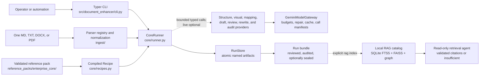
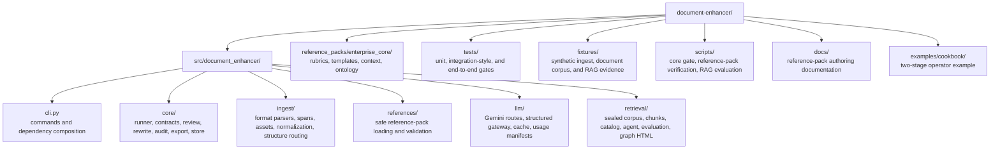
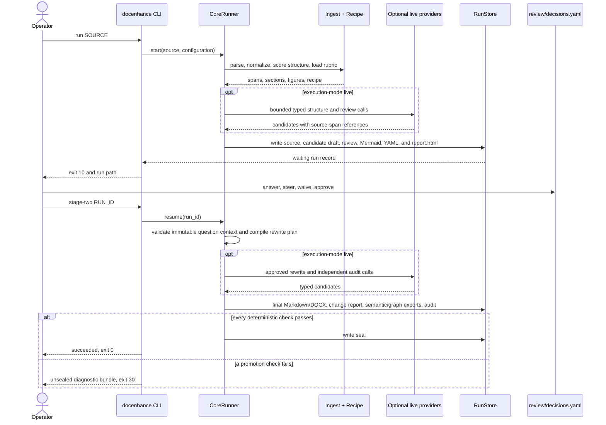
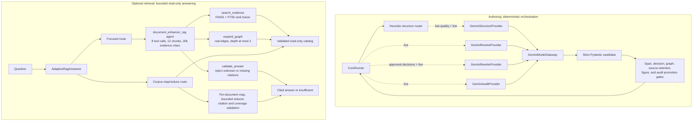

# Document Enhancer

Turn one governed source document plus a selected reference/template into a reviewed, rewritten,
audited, and graph-ready document bundle. Stage 1 produces an unapproved candidate draft, analysis,
and questions; explicit decisions and approval are required before Stage 2 can produce a strict-v2
sealed final package.

The product is intentionally file-backed and linear: no workflow engine, database checkpoint,
retrieval system, prompt-pack runtime, Deep Agents runtime, or compatibility mode is required on the
authoring path.

## Operator journey

1. Drop one `.md`, `.txt`, `.docx`, or `.pdf` into an inbox (or pass the file path) and select the
   reference pack/template and document type.
2. Run Stage 1. Parse with heuristics and optional bounded LLM structure recovery, then write the
   candidate draft, macro/section/flow analysis, contextual questions, and visual review markers.
3. Open `report.html`, read the candidate draft first, and compare the inferred and proposed Mermaid
   diagrams when a process is documented.
4. Answer questions and steering in `review/decisions.yaml`, then set explicit
   `approve_rewrite: true`.
5. Run Stage 2. The runner revises the exact candidate draft from approved decisions, performs the
   deterministic and independent audit checks, and writes `json/12-seal.json` only after a strict-v2
   manifest validates every authoritative artifact.
6. When the source contains extractable screenshots, use the `FIG-###` references in the rewritten
   body and the source-screenshot appendix in the final Markdown and DOCX.
7. Use the portable semantic, ontology, and graph exports later for GraphRAG, RAG, or ontology;
   retrieval consumes sealed final bundles only.

## How the repository is implemented

Document Enhancer is one Python package with two deliberately separated runtimes:

1. The **authoring runtime** turns one source into a file-backed run bundle through a controlled
   five-phase state machine. It is always available and has no retrieval dependency.
2. The **optional retrieval runtime** indexes explicitly selected, passing sealed bundles. It adds
   LangChain, FAISS, Gemini embeddings, and a read-only question-answering agent without changing
   the authoring path.

The Typer CLI composes dependencies at the boundary. `CoreRunner` owns authoring transitions,
`RunStore` owns atomic artifact persistence, Pydantic models own the durable contracts, and the
reference pack supplies the rubric, template, terminology, and allowed graph vocabulary.

### System architecture



The solid path is the authoring critical path. The dashed provider integration is bounded and live
mode is optional. A normal import, offline run, or sealed-bundle audit does not import the optional
retrieval stack. Full-context preflight accounts for source, selected template, visual evidence,
prompts, and expected output before mapping, drafting, or audit calls. Live model output is always
treated as a typed candidate: deterministic application checks decide whether recovered structure,
findings, rewritten text, and audit results can be promoted.

### Repository map



| Area | Primary implementation responsibility |
| --- | --- |
| `src/document_enhancer/cli.py` | Validates command options, chooses offline/live dependencies, maps run states to exit codes, and renders Rich operator output. |
| `src/document_enhancer/ingest/` | Dispatches by suffix, preserves ordered source blocks and stable span IDs, inventories figures, normalizes Markdown, scores structure, and routes optional recovery. |
| `src/document_enhancer/core/` | Implements the five phases, human gate, review reports, rewrite plan, figure appendix, DOCX rendering, graph exports, deterministic audit, seal, and atomic store. |
| `src/document_enhancer/references/` and `reference_packs/` | Validate and compile governed templates, rubrics, context, and ontology vocabularies into the selected recipe. |
| `src/document_enhancer/llm/` | Provides bounded structured Gemini calls with explicit routes, budgets, safe repair, caching, redacted errors, and call manifests. |
| `src/document_enhancer/retrieval/` | Validates sealed inputs, chunks only approved final Markdown, builds the local catalog, answers cited questions, and exports the graph observatory. |
| `tests/`, `fixtures/`, and `scripts/` | Hold deterministic evidence for contracts, negative cases, document types, retrieval behavior, and release gates. |

### Authoring control flow

`json/00-run.json` is the only mutable state manifest. It records one status, one phase, digests,
artifact references, and unresolved question IDs; large values stay in named files.

```mermaid
stateDiagram-v2
    [*] --> Extract
    state "running · extract" as Extract
    state "running · analyze" as Analyze
    state "human_review" as HumanReview
    state "waiting · human_review" as Waiting
    state "running · rewrite" as Rewrite
    state "verify" as Verify
    state "succeeded · verify" as Succeeded
    state "failed · verify" as Failed

    Extract --> Analyze: parse, normalize, persist source evidence
    Analyze --> HumanReview: rubric, section, and flow analysis
    HumanReview --> Waiting: always pause for explicit approval
    Waiting --> Waiting: decision contract incomplete; exit 10
    Waiting --> Rewrite: blockers resolved and approve_rewrite is true
    Rewrite --> Verify: final documents and portable exports written
    Verify --> Succeeded: every promotion check passes; write seal
    Verify --> Failed: one or more checks fail; do not seal
    Failed --> Rewrite: retry a failed verification run
    Succeeded --> [*]
```



`docenhance run` and `continue` use exit `10` for an intentional human wait and `20` for command or
workflow failure. `docenhance stage-two` additionally uses exit `30` when outputs exist but the
promotion audit fails. Failed verification artifacts remain available for diagnosis; only a passing
audit produces `json/12-seal.json`, after which `RunStore` rejects writes to non-seal artifacts.

### Operator and artifact sequence

This is the explicit two-stage path. Stage 1 always pauses for human review, even when no blocking
question was generated; Stage 2 starts only after the editable decision contract contains explicit
approval.



### Model and agent boundaries

The authoring runtime is **not** a free-running agent and does not use Deep Agents. `CoreRunner`
selects each operation and the application owns every promotion decision. Bounded typed providers
use full-context preflight: structure recovery is called only when heuristics route to it; visual
interpretation is limited to eligible extracted images; mapping, drafting, and draft audit consume
the complete source/template/visual context within explicit budgets; review and rewrite receive
typed evidence and approved decisions; and the independent content audit is additive to
deterministic checks. Every model-derived visual table or diagram remains a human-review candidate.

The optional RAG runtime contains the tool-using agent. `AdaptiveRagAnswerer` routes focused
questions to a bounded LangChain agent and corpus-wide questions to a question-driven map/reduce
path. The focused agent receives exactly two read-only tools. It has no shell, web, arbitrary
filesystem, authoring, or catalog-write capability.



### Durable contracts and safety invariants

- Every invocation creates a new run ID, even for identical source bytes; stale or failed state is
  never silently reused.
- Source bytes, normalized evidence, recipe/configuration digests, stable spans, and every artifact
  digest remain inspectable. `RunStore` uses path containment and atomic replacement for writes.
- The reviewer edits one file. Question IDs, question text, and suggestions are validated against
  the generated review before accepted answers can reach rewriting.
- Offline mode uses deterministic local analysis and rewriting. Live mode can enrich the same
  contracts but cannot bypass source-span, decision, graph, figure, or promotion checks.
- Stage 1 candidate artifacts are unapproved and never final or retrieval-authoritative. Stage 2
  validates explicit approval, immutable artifact digests, provenance, visual review, and audit
  results before emitting a strict `core.seal.v2` manifest.
- The final Markdown is the canonical approved text. DOCX, semantic JSON, ontology JSON, Mermaid,
  graph JSONL, and source-to-target CSV are derived outputs from the same reviewed run.
- Retrieval indexing is explicit and fail-closed: it accepts passing sealed bundles, embeds only
  `markdown/07-final-document.md`, loads ontology as graph data, validates staged counts and hashes,
  and atomically replaces the previous local catalog only after validation.

When an implementation change moves a responsibility or changes a transition, update the relevant
diagram and table in this section in the same task. `AGENTS.md` makes that README synchronization a
required completion step.

## Quick start

```bash
uv sync --frozen

# File path, or a directory containing exactly one supported source.
uv run docenhance run .document-enhancer/inbox/aurora-ai-complaint-triage.docx --document-type process

# Or the thin inbox wrapper (directory must contain exactly one document):
uv run docenhance watch-inbox
```

Exit code `10` means the run is waiting for human decisions. Exit code `0` means it finished;
non-zero other than `10` means failure.

When waiting, open the run directory printed by the CLI. Start with `report.html`, which renders
all currently available Markdown reports in one styled, navigable page and renders the Mermaid
process diagrams as embedded SVG without an external web dependency. The same reports remain
available as portable Markdown files:

```text
report.html                              # pastel tabbed reviewer for every report
markdown/01-source-normalized.md         # exact parsed evidence used by the run
markdown/02-review-overview.md           # reading order and readiness snapshot
markdown/03-macro-review.md              # document-level rubric report
markdown/04-section-review.md            # correct / missing / improve with rationale
markdown/05-process-flow-review.md       # inferred + proposed Mermaid and reasoning
markdown/06-review-questions.md          # every question, rationale, and safe suggestion
diagrams/01-inferred-flow.mmd            # standalone inferred diagram
diagrams/02-proposed-flow.mmd            # standalone proposed diagram
review/decisions.yaml                    # only file the reviewer edits
```

`05-process-flow-review.md` is the human-readable flow report: both Mermaid diagrams are embedded as fenced
`mermaid` blocks, followed by a section explaining why the proposed diagram differs from the
inferred source diagram.

Edit only the allowed response fields in `review/decisions.yaml`: choose each disposition, fill an
answer when using `accept`, add optional rationale / steering / waivers, and set
`approve_rewrite: true`. Then run the complete narrated Stage 2 workflow:

```bash
uv run docenhance stage-two RUN_ID
```

The single command continues the reviewed run, inspects the resulting bundle, and presents every
final audit check using a Rich terminal interface. The individual `continue`, `inspect`, and
`audit` commands remain available for automation and focused troubleshooting.

### Cookbook example

The checked-in Aurora AI complaint triage process is a complete two-stage example. It intentionally
contains contradictory operating details so the workflow must stop for human decisions instead of
silently inventing an answer.

#### Stage 1: generate and review the analysis

```bash
uv run docenhance run examples/cookbook/aurora_ai_complaint_triage_process.docx \
  --document-type process \
  --execution-mode live \
  --until questions
```

Exit code `10` is expected. Copy the printed `RUN_ID`; runs are written under
`.document-enhancer/runs/<RUN_ID>/`. Open the accompanying reviewer:

```text
.document-enhancer/runs/<RUN_ID>/report.html
```

Read reports `01` through `06` in order. The HTML navigation, readiness cards, rendered Markdown,
and Mermaid diagrams present the same evidence stored under `markdown/` and `diagrams/`.

#### Human gate: answer and save the decisions

Open `.document-enhancer/runs/<RUN_ID>/review/decisions.yaml`. For every blocking question, replace
the empty answer with the accountable owner's answer and choose a disposition:

```yaml
approve_rewrite: true
steering: "Keep the final process concise and make every control owner explicit."
waivers: []
decisions:
  - question_id: question-example
    question: "Which P1 acknowledgement target should govern the final process?"
    suggestion: "Use one owner-approved target consistently in the procedure and controls."
    answer: "Use the documented 30-minute P1 acknowledgement target."
    disposition: accept
    rationale: "The control register is the authoritative source."
```

Use `accept` to apply the text in `answer`; use `accept_suggestion` to apply the generated suggestion
without writing a separate answer; use `reject` to resolve the question without applying either;
and use `defer` to keep the run paused. Not every question has a safe suggestion. Do not change the
question ID, question text, or suggestion—the runner validates these against the review artifact.
Save the YAML before continuing.

#### Stage 2: rewrite, verify, and seal the same run

```bash
uv run docenhance stage-two RUN_ID
```

The terminal explains each step while it validates decisions, rewrites, exports, inspects, and
audits the bundle. Reopen the same `report.html`; it is regenerated with reports `07` through `09`:
the final
document, detailed change explanation, and expanded final audit. A successful run reports
`succeeded`, passes the audit, and writes `json/12-seal.json`.

For a deterministic local demonstration without provider enrichment, replace `live` with
`offline`; the same two-stage artifact and decision contracts apply.

The project `uv` configuration installs the live-provider dependency group by default, so the
cookbook command above works after the normal `uv sync --frozen`. If you install the published
package instead of using this checkout, install `document-enhancer[live]` before selecting live
mode.

If a local macOS environment was created by an older checkout and Python reports that it cannot
import `document_enhancer`, refresh it with `uv sync --frozen --reinstall-package
document-enhancer`. As a temporary source-tree diagnostic, the equivalent Stage 1 command is:

```bash
PYTHONPATH=src uv run docenhance run examples/cookbook/aurora_ai_complaint_triage_process.docx \
  --document-type process \
  --execution-mode live \
  --until questions
```

`PYTHONPATH` is not required for the supported workflow; the example is only a troubleshooting
fallback for an already-corrupted local environment.

## Execution modes

- `--execution-mode offline` (default): fully deterministic local parse/review/rewrite/audit.
- `--structure-mode auto` (default): heuristics may request bounded LLM structure recovery in live mode.
- `--execution-mode live`: optional Gemini enrichment. The checkout installs the live dependency
  group by default; set credentials in `.env` or the environment, then pass `--execution-mode live`.

Only these `.env` keys are loaded: `GOOGLE_API_KEY`, `GEMINI_API_KEY`, `GOOGLE_CLOUD_PROJECT`,
`GOOGLE_CLOUD_LOCATION`, `DOCENHANCE_BACKEND`.

## What a run produces

```text
runs/RUN_ID/
├── report.html                 # pastel tabbed rendering of all Markdown reports
├── json/                       # 00-run.json through 12-seal.json; every JSON artifact
├── draft/                      # Stage 1 candidate, mapping, draft audit, and visual candidates
├── markdown/                   # 01 source through 09 final audit; numbered reading order
├── review/decisions.yaml       # questions, steering, waivers, approve_rewrite
├── diagrams/                   # numbered inferred, proposed, and final Mermaid sources
├── documents/                  # original source and styled DOCX with native headings/tables
├── assets/source/              # immutable extracted source screenshots
├── assets/final/               # screenshot copies embedded by the final renderers
├── data/                       # graph.jsonl and source-to-target.csv
└── debug/                      # optional provider call manifests in JSONL
```

The five phases are extract, analyze, human review, rewrite, and verify. Large values live in named
artifacts; `json/00-run.json` remains below 50 KB and records the selected execution mode so a live run
continues live after human review. Stage 1 always writes `draft/document.md`,
`draft/transformation.json`, `draft/audit.json`, and `draft/visual-extractions.json`; these paths
are verified during Stage 2 but are never accepted by retrieval. Only a passing audit writes the
complete strict-v2 seal and makes `markdown/07-final-document.md` eligible for retrieval.

## Quality boundaries

- Parsers preserve source bytes, block order, locations, stable span IDs, warnings, and digests.
- Embedded PNG/JPEG figures in the DOCX body and local relative PNG/JPEG Markdown images are assigned
  stable `FIG-###` IDs, referenced from their source section, and rendered once in a final appendix.
  PDF images remain inventoried but are not extracted, and remote Markdown images are never fetched.
- Heuristics choose parser structure or bounded LLM structure recovery; providers cannot invent
  source spans or replace deterministic evidence checks.
- Cross-section ambiguity is consolidated into evidence-linked questions with safe suggestions only
  when the source or recipe supports them; missing owners, dates, thresholds, and approvals remain
  human decisions.
- Native tables are deterministic parser output. Eligible image tables and diagrams can receive
  bounded candidate conversions, but the original figure is retained and every conversion remains
  `requires_review` until an explicit human decision.
- Reference packs define the document type, policy context, rubric, terminology, and templates.
- The single decision file holds genuine business questions plus steering/waivers/approval.
- Final auditing checks source retention, required sections, graph references, unresolved blockers,
  section assessments, and dual flow artifacts before sealing an approved bundle.
- Semantic JSON and JSONL graph exports are portable for a future RAG/ontology consumer; no retrieval
  runtime is required on the authoring path, and the retrieval runtime accepts only complete passing
  strict-v2 sealed bundles.

## Draft-first release evidence

The deterministic DFT-8 evaluator covers Markdown, plain text, DOCX, and PDF fixtures, including a
cross-section ambiguity, safe contextual guidance, one native DOCX table, and one image-table
candidate. It writes machine-readable coverage, provenance, blocker, and citation/reference
metrics:

```bash
PYTHONPATH=src:. uv run python -m tests.evaluation.draft_first_evaluation \
  --output /tmp/document-enhancer-dft8.json
```

The evidence ledger is [DRAFT_FIRST_IMPLEMENTATION_EVIDENCE.md](DRAFT_FIRST_IMPLEMENTATION_EVIDENCE.md).
Live-provider proof is separate from the offline reward and is reported as not run unless credentials
are explicitly available and the live checks actually execute.

## Optional local RAG and GraphRAG CLI

Install the optional retrieval dependencies, finish and seal the documents you want to query, then
build an explicit local catalog:

```bash
uv sync --frozen

# The listed runs replace the current catalog. Only passing, sealed bundles are accepted.
uv run docenhance rag index RUN_ID_1 RUN_ID_2

# Deliberately select every passing sealed run under the configured run directory instead.
uv run docenhance rag index --all-sealed

uv run docenhance rag inspect
uv run docenhance rag ask "Who owns the control and how often is it reviewed?" --show-trace
uv run docenhance rag ask \
  "List every control with a reconciliation step across all documents" \
  --coverage exhaustive --show-trace
uv run docenhance rag chat
```

Published-package users install `document-enhancer[rag]`. Indexing uses Gemini Embeddings 2 by
default and reads the same recognized, ignored `.env` credentials as live authoring. The explicit
`--offline` indexing option uses deterministic feature-hash vectors only for tests and local CLI
demonstrations; it is not a semantic embedding profile. Live indexing sends only canonical final
chunks to the configured provider and may incur embedding charges; each `ask` or chat turn also
uses the configured chat model.

The RAG catalog is written under `.document-enhancer/rag/catalog/` unless `--catalog` or
`DOCENHANCE_RAG_CATALOG` selects another path. A build stages and validates the SQLite FTS5 catalog,
FAISS index, graph topology, row counts, embedding profile, and SHA-256 file digests before replacing
the prior catalog. A failed or tampered input leaves the promoted catalog unchanged.

Corpus selection is intentionally conservative:

- only explicitly named runs are indexed unless `--all-sealed` is supplied;
- only the approved `markdown/07-final-document.md` is embedded;
- original sources, review reports, decisions, audits, and change explanations are not embedded;
- `json/09-ontology.json` is loaded as namespaced graph nodes and edges rather than embedded as text;
- every answer source displays its run ID, heading path, and stable chunk ID.

`rag ask` and `rag chat` use hybrid FAISS/FTS retrieval and may search again when evidence points to
another indexed document. They can also traverse one or two real `core.graph.v1` edges. The agent has
only two read-only retrieval tools—no web, shell, arbitrary filesystem, authoring, or write tools.
Visible claims must cite evidence actually retrieved for that question; unknown or missing citations,
conflicting evidence, and absent evidence produce `insufficient` instead of an invented answer.

Question routing stays deliberately small. Focused questions use the bounded multi-hop agent. Questions
that explicitly say `all documents`, `each document`, `across the corpus`, or similar language use a
question-driven corpus map: the model extracts only the requested facts from each selected document,
then one bounded reducer removes cross-batch category mismatches and paraphrases using only those
cited candidates. Deterministic code validates citations before and after reduction. `--scope
focused|corpus` overrides automatic routing. Corpus mode has two coverage levels:

- `--coverage retrieval` searches each selected document independently, which is efficient but does not
  prove that every chunk was examined;
- `--coverage exhaustive` reads every chunk in every selected document, reports exact document/chunk
  coverage and failures, and is the right mode for completeness-sensitive lists and comparisons. It can
  require several model calls and cost more on large catalogs.

The extraction schema is derived from each question rather than fixed to controls, so the same path can
list owners, compare thresholds, collect exceptions, or extract other document-specific facts. Every row
keeps its supporting run and chunk citations. Use repeated `--run RUN_ID` options to restrict either mode
to explicit document versions.

Rich chat is in-memory and bounded. `/sources`, `/trace`, `/clear`, `/help`, and `/exit` are supported;
no session, hidden reasoning, or conversation is persisted. FAISS files are trusted only as generated
local workspace artifacts whose paths and hashes match the catalog manifest. Rebuild the whole small
catalog when the selected sealed corpus or embedding profile changes.

### RAG cookbook: five-document corpus

The checked-in fictional sources and expected answers live under `fixtures/rag/corpus_demo/`. The
commands below use the five sealed demonstration runs produced from those sources. If you reprocess
the sources, substitute the new sealed run IDs printed by Stage 2.

```text
Payment settlement:  918108480c23-93606487d4
Vendor invoice:      4a96f70178e8-77a788bd0c
Privileged access:   bb21fd5c68a4-82889042c6
Model monitoring:    cb5c3f51a738-672995c3c6
Complaint quality:   9dc086ca1df9-b98b271f40
```

Build or replace the catalog with exactly those five document versions, then inspect it:

```bash
uv run docenhance rag index \
  918108480c23-93606487d4 \
  4a96f70178e8-77a788bd0c \
  bb21fd5c68a4-82889042c6 \
  cb5c3f51a738-672995c3c6 \
  9dc086ca1df9-b98b271f40

uv run docenhance rag inspect
uv run docenhance rag inspect --json
```

Ask a focused question against one explicit document:

```bash
uv run docenhance rag ask \
  "Who owns the Daily Payment Settlement Process?" \
  --run 918108480c23-93606487d4 \
  --show-trace

uv run docenhance rag ask \
  "What threshold stops settlement release?" \
  --run 918108480c23-93606487d4 \
  --json
```

Ask a corpus-wide list question. The wording `all documents` automatically selects corpus mode:

```bash
uv run docenhance rag ask \
  "List all controls that have a reconciliation step from all documents." \
  --show-trace
```

The expected control IDs are `CTRL-PAY-101`, `CTRL-AP-202`, `CTRL-MOD-404`, and
`CTRL-CQA-505`. The privileged-access document is the deliberate negative case.

Use exhaustive coverage when completeness matters. This reads every selected chunk and can require
many model calls:

```bash
uv run docenhance rag ask \
  "List all controls that have a reconciliation step from all documents." \
  --coverage exhaustive \
  --show-trace

uv run docenhance rag ask \
  "List all controls that have a reconciliation step from all documents." \
  --coverage exhaustive \
  --json | jq '{
    status,
    coverage,
    item_keys: [.items[].item_key],
    cited_runs: [.sources[].run_id] | unique
  }'
```

For this fixture, exhaustive success means 5/5 documents and 215/215 chunks examined, no failed
runs, `reduction_failed: false`, `truncated: false`, and exactly the four expected IDs.

The corpus schema is derived from each question, so a different comparison uses the same path:

```bash
uv run docenhance rag ask \
  "Compare the business owner and evidence retention period across all documents." \
  --show-trace

uv run docenhance rag ask \
  "Which exception approvers are named?" \
  --scope corpus \
  --show-trace
```

Restrict a corpus comparison by repeating `--run`:

```bash
uv run docenhance rag ask \
  "Compare the owners and operating thresholds in these documents." \
  --scope corpus \
  --run 918108480c23-93606487d4 \
  --run 4a96f70178e8-77a788bd0c \
  --run cb5c3f51a738-672995c3c6 \
  --show-trace
```

Exercise real graph topology. The trace should include `expand_graph` and cited `contains` paths:

```bash
uv run docenhance rag ask \
  "Using the graph topology, what evidence is connected to the Controls, thresholds, and evidence section in the Monthly Credit Model Monitoring Process?" \
  --run cb5c3f51a738-672995c3c6 \
  --show-trace
```

Open the Rich interactive conversation, optionally restricted to one document:

```bash
uv run docenhance rag chat

uv run docenhance rag chat \
  --run bb21fd5c68a4-82889042c6
```

Inside chat, use `/sources`, `/trace`, `/clear`, `/help`, and `/exit`.

### Export the graph observatory

Export the complete indexed topology as one self-contained HTML file. The command is read-only and
does not call an embedding or chat provider:

```bash
uv run docenhance rag graph --output rag-graph.html
```

Open `rag-graph.html` directly in a browser—no server, CDN, or installation is required. The file
embeds the selected catalog graph, linked evidence excerpts, CSS, and JavaScript. Drag to rotate the
3D force layout, Shift-drag to pan, use the wheel or trackpad to zoom, search by label/ID/type, filter
by document/node/relationship type, and select nodes to inspect neighbors, provenance spans, and
linked final-document chunks.

Restrict the export to selected indexed document versions by repeating `--run`:

```bash
uv run docenhance rag graph \
  --run 918108480c23-93606487d4 \
  --run cb5c3f51a738-672995c3c6 \
  --output selected-rag-graph.html
```

The exporter refuses to overwrite a file unless `--force` is supplied. Use `--json` for
machine-readable output metadata:

```bash
uv run docenhance rag graph \
  --output rag-graph.html \
  --force \
  --json
```

## Supported commands

```text
docenhance version
docenhance run SOURCE [--document-type TYPE] [--structure-mode auto|parser|off] [--execution-mode offline|live]
docenhance watch-inbox [INBOX]
docenhance continue RUN_ID
docenhance stage-two RUN_ID
docenhance status RUN_ID
docenhance inspect RUN_ID
docenhance audit RUN_ID
docenhance rag index RUN_ID... [--all-sealed]
docenhance rag inspect [--json]
docenhance rag graph [--run RUN_ID] [--output FILE] [--force] [--json]
docenhance rag ask "QUESTION" [--run RUN_ID] [--scope auto|focused|corpus] [--coverage retrieval|exhaustive] [--show-trace] [--json]
docenhance rag chat [--run RUN_ID] [--scope auto|focused|corpus] [--coverage retrieval|exhaustive] [--show-trace]
docenhance validate-recipe [--document-type TYPE]
```

Supported document types are `process`, `methodology`, `standard`, and `desktop_procedure`.
The checked-in `reference_packs/enterprise_core` pack is the default.

## Development gate

```bash
scripts/gate_core.sh
uv run python scripts/verify_reference_pack.py reference_packs/enterprise_core
uv build
```

Active product objective and engineering guidance: `AGENTS.md`.
