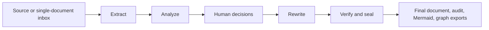

# Simplification plan

## Decision

Document Enhancer is one file-backed authoring workflow. The repository contains no legacy engine,
prompt-pack runtime, graph framework, RAG/catalog runtime, migration layer, or compatibility CLI.
The product creates a portable semantic graph as an output, not as a retrieval service.

Engineering shell: complete. Workflow quality enhancements: see
[WORKFLOW_ENHANCEMENT_PLAN.md](WORKFLOW_ENHANCEMENT_PLAN.md) and the product objective in
[AGENTS.md](AGENTS.md).

## Product contract

1. Drop one `.md`, `.txt`, `.docx`, or `.pdf` source in an inbox or pass it directly to `run`.
2. Parse it deterministically; use heuristic quality signals and optional bounded LLM structure
   recovery when appropriate.
3. Generate macro, section, rubric, and process-flow review with deterministic Mermaid.
4. Write only genuine business ambiguities into one editable `review/decisions.yaml`.
5. Rewrite from approved decisions, source evidence, and the selected reference-pack recipe.
6. Produce Markdown, DOCX, semantic JSON, ontology JSON, and graph JSONL.
7. Audit source retention, template coverage, graph references, and unresolved blockers; seal only a
   passing result.
8. Keep outputs portable for future RAG or ontology consumers without running any of them.

## Architecture



- `core/` owns the five phases and compact `run.json` state.
- `ingest/` owns deterministic Markdown, text, DOCX, PDF parsing and structure scoring.
- `references/` owns safe, validated policy/template/rubric content.
- `llm/` owns one bounded Gemini structured-output gateway; it is optional at runtime.
- A run directory is the only persistence system. Each run receives a unique ID and sealed output is
  immutable.

## Completion checklist

- [x] File-backed five-phase runner with one human decision pause.
- [x] Core-only CLI: run, continue, status, inspect, audit, validate-recipe, version, watch-inbox.
- [x] Heuristic parsing plus optional bounded structure recovery.
- [x] Macro, section, flow, rubric, Mermaid, ambiguity, rewrite, audit, and graph outputs.
- [x] Four document-type characterization coverage.
- [x] Portable semantic/graph export with no retrieval dependency.
- [x] Legacy graph, checkpoint, prompt-pack, RAG/catalog, Deep Agents, domain duplicates, generated
  schemas, compatibility mode, and their tests/scripts removed.
- [x] Finish source-tree cleanup, documentation synchronization, and full reduced gate.
- [x] Workflow quality enhancements tracked in WORKFLOW_ENHANCEMENT_PLAN.md.

## Acceptance evidence

```bash
uv sync --frozen
uv run ruff format --check .
uv run ruff check .
uv run ty check
uv run pytest -m "not live_model and not public_download"
uv run python scripts/verify_reference_pack.py reference_packs/enterprise_core
uv build
```
