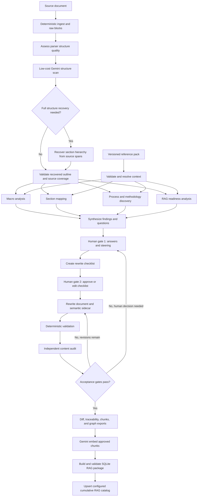
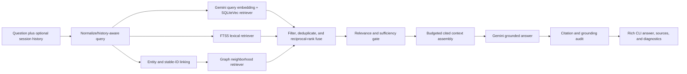
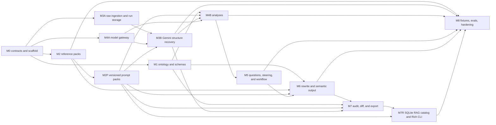

# Document Enhancer implementation plan

Status: proposed implementation plan

Repository state when written: empty Git repository

Primary package: `document_enhancer`

CLI command: `docenhance`

Target runtime: Python 3.12 managed with `uv`

## 1. Product objective

Build a governed, Gemini-first Python CLI that turns inconsistent enterprise methodology, standard, process, and desktop-procedure documents into synchronized human, semantic, and RAG outputs:

1. A high-quality Markdown document for human readers.
2. A validated semantic sidecar and retrieval export for deterministic search and graph traversal.
3. A local SQLite RAG catalog and Rich CLI for grounded, cited questions and conversational follow-ups.

The CLI must not merely make prose sound better. It must discover how the documented work operates, expose missing or ambiguous information, collect human answers and steering, produce a traceable rewrite plan, rewrite against an explicit template and reference pack, and prove what changed.

The core rule is:

> Name each graph-worthy object, assign it a stable ID, type it, declare its relationships and provenance, and then explain it in readable prose.

## 2. Success outcomes

The first releasable version is successful when it can:

- Accept one Markdown, DOCX, or text-based PDF document per run.
- Preserve the source file and its SHA-256 digest without modifying it.
- Select a process, methodology, standard, or desktop-procedure template from a versioned reference pack.
- Normalize headings, paragraphs, tables, lists, links, figures, formulas, and source locations into one internal representation.
- Run a low-cost Gemini structure scan on every enhancement run, and recover a proposed section hierarchy when parser headings or reading order are unreliable.
- Prove that any LLM-recovered structure covers the original source blocks in order without changing, dropping, or inventing source text.
- Perform macro, section-by-section, process-discovery, and RAG-readiness analyses.
- Produce evidence-linked questions for missing, conflicting, vague, or template-required information.
- Pause safely while a reviewer edits answers and steering files, then resume the same run.
- Create and expose a rewrite checklist before changing the document.
- Produce an enhanced Markdown document, semantic YAML sidecar, and Mermaid diagrams whose identifiers resolve to semantic objects.
- Produce a textual diff, semantic diff, source-to-target traceability ledger, audit report, and unresolved-issue register.
- Export stable chunks, nodes, and allow-listed edges as JSONL without requiring a vector database or graph database.
- Ingest approved sections, semantic chunks, provenance, graph nodes/edges, and Gemini embeddings into a validated local SQLite RAG package as the final run artifact.
- Transactionally upsert each successful run into a configured cumulative SQLite catalog so the CLI can answer across many enhanced documents without reparsing them.
- Answer grounded questions from that catalog through a polished Rich CLI using LangChain retrieval abstractions, Gemini query embeddings, hybrid vector/FTS/graph retrieval, and auditable citations.
- Re-run deterministically around the same persisted inputs, while recording model, prompt, schema, reference-pack, and artifact versions.
- Load every LLM instruction from a validated, versioned prompt pack whose rubric/context inputs and exact digests are visible in run artifacts.

## 3. Governing product principles

### 3.1 Authoritative structure before inference

The template, IDs, semantic sidecar, tables, and reference-pack rules create the authoritative graph skeleton. LLM inference may enrich that skeleton, but inferred facts must never silently replace explicit or governed facts.

### 3.2 No silent invention

Every substantive output claim must be traceable to one of:

- A source span.
- A reviewer answer.
- Explicit steering.
- An identified reference-pack requirement.
- A clearly labeled inference that requires review.

If information is unavailable, the output must use a visible `TBD`, open issue, or approved waiver. The rewriter must not fabricate owners, systems, control IDs, thresholds, evidence, approvals, dates, or dependencies.

### 3.3 Deterministic checks surround probabilistic work

Byte extraction, raw-block ordering, source-span preservation, schema validation, identifier rules, relationship allow-lists, reference integrity, required-section checks, unresolved-question gates, provenance checks, chunk generation, and diffs are deterministic. Section-boundary recovery may be probabilistic when the source has poor structure, but its proposal is accepted only after deterministic coverage, ordering, overlap, and text-preservation checks. LLMs handle interpretation and drafting within those constraints.

### 3.4 Human review is part of the workflow

The tool must generate durable artifacts that can be reviewed outside an interactive session. Human decisions are versioned inputs, not transient chat messages.

### 3.5 Retrieval readiness is an authoring concern

Searchability, stable chunks, canonical terms, explicit references, self-contained tables, code-based diagrams, provenance, and ontology conformity are created during enhancement rather than repaired after ingestion.

### 3.6 Local-first and enterprise-safe

The default runtime writes locally, does not require SaaS observability, does not send content to an unconfigured provider, does not follow instructions found inside source documents, and does not enable shell or network tools for document-analysis agents.

### 3.7 Structure recovery is alignment, not rewriting

The structure-recovery model may label spans, propose section boundaries, identify boilerplate, and associate tables/figures with nearby content. It may not paraphrase or “clean up” the source during ingestion. The deterministic raw-block sequence remains immutable and is always available beside the recovered structural view.

## 4. Scope

### 4.1 MVP scope

- One document per run, with resumable local runs.
- Input: `.md`, `.txt`, `.docx`, and text-based `.pdf`.
- Output: Markdown, YAML, JSON, JSONL, and unified Markdown diff.
- Four initial document types: process, methodology, standard, and desktop procedure.
- A versioned default enterprise reference pack.
- Gemini-first LangChain model configuration through `langchain-google-genai`, with Gemini as the default model family for structure recovery, analysis, rewriting, and audit.
- Automatic LLM-assisted structural reconstruction for documents with missing, inconsistent, or misleading headings.
- LangGraph orchestration, persistence, parallel analysis branches, and human interrupts.
- Bounded Deep Agents specialists for complex analysis and drafting.
- Pydantic models and generated JSON Schemas for all machine artifacts.
- Local SQLite checkpointing plus filesystem artifacts.
- Offline test doubles and opt-in live-provider evaluation.
- A CLI RAG runtime with single-turn ask, interactive chat, retrieval-only search, source inspection, and machine-readable output.

### 4.2 Explicit non-goals for the first release

- A web, desktop, or hosted chat UI; the RAG user experience is CLI-only.
- Batch orchestration over thousands of documents. The interfaces must permit it later, but v1 proves one-document correctness first.
- Direct writes to Neo4j, an external vector database, LightRAG, RAG-Anything, or LlamaIndex. V1 produces portable JSONL contracts plus a self-contained SQLite RAG catalog and CLI.
- Enterprise identity integration, row-level authorization service, hosted multi-user sessions, or production feedback workflow. The local CLI still enforces configured metadata filters and confidentiality limits.
- Pixel-perfect DOCX round-tripping or conversion of the enhanced Markdown back to the original Word styling.
- Reliable OCR for scanned PDFs, handwriting, or image-only diagrams.
- Executing spreadsheets, macros, offline calculators, or source-document code.
- Replacing legal, policy, risk, control-owner, or methodology approval.
- Fully automatic acceptance of LLM-inferred relationships.

### 4.3 Follow-on scope enabled by the architecture

- Batch queues, concurrency, and portfolio dashboards.
- DOCX and PDF rendering from enhanced Markdown.
- Enterprise registries for canonical roles, systems, controls, risks, policies, and data assets.
- Human review UI backed by the same artifact schemas.
- Neo4j and vector-store adapters.
- External/managed vector stores and horizontally scaled retrieval services.
- Scanned-document OCR and multimodal diagram extraction.

## 5. End-to-end workflow



Rules for this graph:

- `--structure-mode auto` is the default. Every enhancement run uses the low-cost Gemini scan to confirm or reject the parser outline; full recovery runs when deterministic signals, parser warnings, or the scan indicate unreliable structure.
- `--structure-mode parser` exists for offline/debug use and must retain a visible structure-risk warning. `--structure-mode llm` forces full recovery.
- Structure scan/recovery outputs only span labels, boundaries, hierarchy, associations, confidence, and ambiguities. The raw source text and block order remain immutable.
- The four analysis branches run in parallel only after the selected parser or recovered outline passes deterministic coverage and ordering validation and the reference pack is resolved.
- Human gate 1 is mandatory when any blocking question exists. A reviewer may answer, defer, or waive a question with a reason and identity.
- Human gate 2 is enabled by default and can be disabled only with an explicit configuration policy.
- Rewrite/audit iteration has a configured maximum. Exceeding it creates a failed audit, not an infinite loop.
- Embedding and SQLite ingestion occur only after the enhanced document passes audit. A failed audit never promotes a RAG database as authoritative.
- Resuming must reuse completed stage outputs whose cache keys still match.
- Any change to source, structure mode, segmentation prompt/model, recovered outline, reference pack, answers, steering, prompt version, schema version, or relevant configuration invalidates dependent stages.

## 6. Technology choices and boundaries

### 6.1 Core stack

- `uv`: project creation, virtual environment, lockfile, dependency groups, scripts, build, and reproducible CI execution.
- `ruff`: linting, import cleanup, and formatting.
- `ty`: type checking, initially with a documented baseline if third-party stubs lag.
- `pytest`, `pytest-cov`, and `pytest-xdist`: tests, coverage, and safe parallel test execution.
- `pydantic` v2: internal contracts, structured LLM outputs, validation, and JSON Schema generation.
- `typer` plus `rich`: CLI and readable terminal output.
- `langchain`: messages, structured output, model callbacks, and the narrow internal model interface.
- `langchain-google-genai`: first-class Gemini integration through `ChatGoogleGenerativeAI`, using the consolidated Google Gen AI SDK for either the Gemini Developer API or Vertex AI.
- LangChain `Document`, `Embeddings`, `VectorStore`, `BaseRetriever`, runnable, and tool interfaces for the local RAG pipeline.
- Pinned `sqlite-vec` plus a compatibility-tested LangChain SQLite vector-store adapter for local vector search; retain an exact-scan diagnostic fallback for small catalogs.
- SQLite FTS5 for lexical retrieval and the existing semantic node/edge tables for graph expansion.
- `numpy` or standard-library float arrays, selected in the vector spike, for vector serialization and exact-search verification.
- `langgraph`: explicit state machine, checkpointing, fan-out/fan-in, interrupts, retries, and resumption.
- `deepagents`: bounded specialist harnesses for tasks that benefit from planning, isolated context, and role-specific subagents.
- `python-docx`: structure-preserving DOCX extraction for paragraphs and tables.
- `pypdf` or `pdfplumber`: text-based PDF extraction with page provenance; select one after an extraction spike.
- A Markdown parser with source-position support; select between `markdown-it-py` and equivalent candidates during the parser spike.
- `ruamel.yaml` or a similarly safe YAML implementation for human-editable artifacts; select during the artifact round-trip spike.

The initial dependency versions must be resolved and locked during scaffolding rather than copied from this plan. The compatibility spike must prove Gemini native JSON-schema output, LangGraph checkpoint/resume, interrupts, and the chosen Deep Agents backend against the same lockfile.

### 6.2 Appropriate role of each LangChain layer

- LangChain owns messages, structured responses, callbacks, and a narrow model port; `langchain-google-genai` is the default and fully supported implementation.
- LangGraph owns the product workflow and is the only authority for stage transitions, persistence, retries, and human gates.
- Deep Agents specialists run inside specific graph nodes. They receive an allow-listed read-only view of the source and reference pack and an isolated scratch backend. They do not own the global run state or final artifact promotion.
- Plain deterministic Python functions remain preferred for tasks that do not require interpretation.

This matches the current framework capabilities: LangGraph supports persisted interrupts and resumption, while Deep Agents is a LangGraph-based harness for planning, filesystem context, and specialist subagents. Implementation must still be pinned and tested against the repository lockfile.

### 6.3 Initial specialist roles

- `structure_reconstructor`: confirms or replaces unreliable parser section boundaries using source-span IDs without modifying source text.
- `macro_reviewer`: document type, purpose, audience, authority, template fit, and overall gaps.
- `section_mapper`: source-to-target section mapping, contradictions, duplication, and missing requirements.
- `process_discoverer`: triggers, atomic steps, decisions, roles, inputs, outputs, systems, controls, risks, calculators, exceptions, escalation, evidence, and dependencies.
- `rag_reviewer`: canonical terms, IDs, vague references, table/diagram issues, provenance, chunk boundaries, and graphability.
- `question_editor`: deduplicates and prioritizes questions without inventing answers.
- `rewriter`: drafts only from the approved content ledger and rewrite checklist.
- `content_auditor`: independently checks fidelity, completeness, contradictions, and unsupported claims.

Deep Agents is optional per specialist through configuration. Every specialist must also have a direct structured-model implementation so the workflow is testable without an agent harness and can use the simpler path when sufficient.

### 6.4 Gemini-first model profile

Gemini is the primary model family for the project. The internal model port remains so tests can use deterministic fakes and so the repository is not coupled directly to SDK objects, but the shipped configuration, documentation, compatibility tests, and live evaluations target Gemini first.

Initial model routing, using the requested Gemini 3.1 Pro, Gemini 3.1 Flash-Lite, and Gemini 3.5 Flash tiers and the active model IDs available when this plan was updated:

| Stage | Default Gemini model | Rationale |
|---|---|---|
| Structure triage and full section recovery | `gemini-3.1-flash-lite` | Active stable successor to the retired Flash-Lite preview endpoint; low-cost, high-volume structural classification and span labeling |
| Acronym/terminology lint and question deduplication | `gemini-3.1-flash-lite` | Bounded, schema-heavy tasks where speed and cost matter most |
| Macro, section, routine process/methodology, and RAG analyses | `gemini-3.5-flash` | Main high-quality analysis model |
| Complex process/methodology reconciliation and rewrite | `gemini-3.1-pro-preview` | Highest-judgment tier for difficult synthesis and governed rewriting |
| Independent content audit | `gemini-3.5-flash` with isolated context and audit prompt | Uses a different tier from the rewriter to reduce correlated omissions and unsupported additions |
| RAG document/chunk embeddings | `gemini-embedding-2` at 768 dimensions | Stable Gemini embedding model; compact default with model/dimension metadata retained for full re-embedding |
| RAG history-aware query, entity linking, retrieval grading, and citation audit | `gemini-3.1-flash-lite` | Low-cost structured query-time decisions |
| RAG grounded answer | `gemini-3.5-flash` | Predictable default answer tier; `gemini-3.1-pro-preview` is an explicit high-quality override |

Model-routing rules:

- Use exact model IDs in committed profiles, not `latest` aliases that can change underneath a run. `gemini-3.1-pro-preview` is an intentional preview dependency and must be visibly labeled as such.
- Do not configure the retired `gemini-3.1-flash-lite-preview` endpoint. Use the active `gemini-3.1-flash-lite` stable endpoint for the requested Flash-Lite tier unless Google publishes a new explicitly approved preview ID.
- Treat the exact IDs above as initial values to verify in M0; the model lifecycle changes faster than the product contract, so `docenhance doctor` must detect unavailable/deprecated configured models and point to the profile that needs migration. If Pro Preview is unavailable, fail closed unless the selected profile explicitly authorizes `gemini-3.5-flash` as the fallback and records the substitution.
- Use Gemini native JSON-schema structured output for all artifact-producing calls. Generated schemas must also pass a Gemini-supported-schema compatibility test because Gemini implements a practical subset of JSON Schema.
- Use `GoogleGenerativeAIEmbeddings` from `langchain-google-genai` for text embeddings when its pinned version supports the active `gemini-embedding-2` endpoint; retain a narrow adapter over the consolidated Google Gen AI SDK as a tested fallback if the LangChain wrapper lags the stable endpoint.
- Keep temperature, thinking/reasoning settings, output limits, safety settings, and retry policy explicit per stage and record them in the call manifest.
- Do not enable Gemini Google Search, URL context, code execution, computer use, or other built-in tools for source analysis, structure recovery, rewriting, or audit.
- Use the Gemini Developer API profile for straightforward local development. Provide a Vertex AI profile using Application Default Credentials/service accounts, project, location, and enterprise controls for production use.
- Never place API keys in TOML, CLI arguments, run artifacts, or logs. Support `GOOGLE_API_KEY`/`GEMINI_API_KEY` for approved Developer API use and Google Cloud credential mechanisms for Vertex AI.
- Keep the structure scanner independently budgeted. A full recovery must not silently promote itself to the expensive tier; escalation requires configured thresholds and appears in the run manifest.

### 6.5 Versioned prompt-pack contract

All LLM instructions live in the top-level `prompt_packs/` directory as reviewable Markdown files. Production prompt text must not be hidden in Python constants, decorators, or ad hoc f-strings.

`prompt_packs/gemini_core/manifest.yaml` defines:

- Prompt-pack ID, semantic version, owner, status, compatible application/schema versions, and file digests.
- Every prompt ID, stage, Markdown template path, required shared fragments, model route, output schema, allowed inputs, optional tools, token/output budget, retry policy, and expected safety/data policy.
- Required reference-pack inputs by logical name: common rubric, document-type rubric, template requirements, ontology entity/relationship files, style guide, applicable policies/standards, glossary, and reviewer artifacts.
- Template variables with type, required/default status, maximum size, and escaping/delimiting policy.
- Prompt precedence and composition order.

Each stage prompt is a Markdown template with YAML front matter. The body clearly separates instructions, rubric/ontology/context, untrusted source content, reviewer inputs, and output contract. Shared fragments hold cross-cutting rules such as evidence citation, no invention, source-as-data, and schema-only output.

Prompt composition rules:

- Resolve prompts by immutable prompt ID and prompt-pack version, never by filesystem guessing.
- Load rubrics and other governed context from the selected reference pack; do not duplicate those rules inside prompt prose.
- Include the exact rubric criteria and hard blockers relevant to the stage, plus their file/version/digest metadata.
- Reject missing variables, unknown variables, unresolved includes, incompatible schemas, cyclic includes, prompt-size overflow, and model-route mismatches before an API call.
- Validate every prompt against golden composition fixtures and fake-model structured outputs.
- Snapshot the exact prompt templates/shared fragments used by each run plus resolved input digests and composition metadata. Do not needlessly duplicate full source text in the prompt snapshot.
- Version any behavior-changing prompt edit and include the prompt digest in stage cache keys.
- Keep RAG query-rewrite, entity-linking, retrieval-grade, grounded-answer, and citation-audit prompts in `prompt_packs/gemini_core/rag/` so the CLI RAG is as auditable as document enhancement.

The CLI exposes prompt discovery and validation, but ordinary users select a prompt pack rather than individual hidden prompt strings.

## 7. Proposed repository layout

```text
.
├── pyproject.toml
├── uv.lock
├── README.md
├── plan.md
├── document-enhancer.example.toml
├── src/
│   └── document_enhancer/
│       ├── __init__.py
│       ├── cli.py
│       ├── config.py
│       ├── errors.py
│       ├── domain/
│       │   ├── ids.py
│       │   ├── ontology.py
│       │   ├── provenance.py
│       │   ├── source.py
│       │   ├── analysis.py
│       │   ├── questions.py
│       │   ├── semantic.py
│       │   ├── audit.py
│       │   └── run.py
│       ├── ingest/
│       │   ├── base.py
│       │   ├── markdown.py
│       │   ├── docx.py
│       │   ├── pdf.py
│       │   ├── normalize.py
│       │   ├── structure_quality.py
│       │   ├── structure_recovery.py
│       │   └── structure_validation.py
│       ├── references/
│       │   ├── loader.py
│       │   ├── manifest.py
│       │   ├── precedence.py
│       │   └── validator.py
│       ├── llm/
│       │   ├── models.py
│       │   ├── structured.py
│       │   ├── caching.py
│       │   └── callbacks.py
│       ├── analysis/
│       │   ├── macro.py
│       │   ├── sections.py
│       │   ├── discovery.py
│       │   ├── rag_readiness.py
│       │   └── synthesize.py
│       ├── clarification/
│       │   ├── answers.py
│       │   ├── steering.py
│       │   └── checklist.py
│       ├── rewrite/
│       │   ├── ledger.py
│       │   ├── renderer.py
│       │   ├── semantic_builder.py
│       │   └── diagrams.py
│       ├── audit/
│       │   ├── deterministic.py
│       │   ├── content.py
│       │   ├── diff.py
│       │   └── report.py
│       ├── export/
│       │   ├── chunks.py
│       │   ├── graph.py
│       │   └── bundle.py
│       ├── rag/
│       │   ├── schema.py
│       │   ├── migrations.py
│       │   ├── embeddings.py
│       │   ├── vector_store.py
│       │   ├── sqlite_store.py
│       │   ├── builder.py
│       │   ├── validator.py
│       │   ├── query.py
│       │   ├── context.py
│       │   ├── answer.py
│       │   ├── grounding.py
│       │   ├── sessions.py
│       │   └── retrievers/
│       │       ├── vector.py
│       │       ├── lexical.py
│       │       ├── graph.py
│       │       └── hybrid.py
│       ├── artifacts/
│       │   ├── paths.py
│       │   ├── repository.py
│       │   └── manifest.py
│       ├── workflow/
│       │   ├── state.py
│       │   ├── nodes.py
│       │   ├── routing.py
│       │   ├── graph.py
│       │   └── checkpoint.py
│       └── prompting/
│           ├── manifest.py
│           ├── loader.py
│           ├── composer.py
│           ├── validator.py
│           └── snapshot.py
├── reference_packs/
│   └── enterprise_core/
│       ├── manifest.yaml
│       ├── ontology/
│       │   ├── entity_types.yaml
│       │   ├── relationship_types.yaml
│       │   ├── id_patterns.yaml
│       │   └── controlled_terms.yaml
│       ├── templates/
│       │   ├── process/
│       │   │   ├── template.md
│       │   │   ├── requirements.yaml
│       │   │   └── example.md
│       │   ├── methodology/
│       │   ├── standard/
│       │   └── desktop_procedure/
│       ├── context/
│       │   ├── style_guides/
│       │   ├── policies/
│       │   ├── standards/
│       │   └── glossary/
│       └── rubrics/
│           ├── common.yaml
│           ├── process.yaml
│           ├── methodology.yaml
│           ├── standard.yaml
│           └── desktop_procedure.yaml
├── prompt_packs/
│   └── gemini_core/
│       ├── manifest.yaml
│       ├── shared/
│       │   ├── system.md
│       │   ├── evidence-and-no-invention.md
│       │   ├── source-as-untrusted-data.md
│       │   └── structured-output.md
│       ├── structure/
│       │   ├── triage.md
│       │   ├── recover-window.md
│       │   └── reconcile-boundaries.md
│       ├── analysis/
│       │   ├── macro.md
│       │   ├── sections.md
│       │   ├── process-methodology-discovery.md
│       │   ├── rag-readiness.md
│       │   └── synthesize-findings.md
│       ├── clarification/
│       │   ├── questions.md
│       │   └── rewrite-checklist.md
│       ├── rewrite/
│       │   ├── section.md
│       │   ├── semantic-objects.md
│       │   └── revision.md
│       ├── audit/
│       │   ├── content-fidelity.md
│       │   └── remediation-routing.md
│       └── rag/
│           ├── history-aware-query.md
│           ├── entity-linking.md
│           ├── retrieval-grading.md
│           ├── grounded-answer.md
│           └── citation-audit.md
├── schemas/
│   ├── prompt-pack-manifest.schema.json
│   ├── structure-quality.schema.json
│   ├── structure-recovery.schema.json
│   ├── analysis.schema.json
│   ├── questions.schema.json
│   ├── answers.schema.json
│   ├── semantic-document.schema.json
│   ├── audit.schema.json
│   ├── rag-build-manifest.schema.json
│   ├── rag-query.schema.json
│   ├── rag-citation.schema.json
│   ├── rag-answer.schema.json
│   └── run-manifest.schema.json
├── fixtures/
│   ├── synthetic/
│   ├── public/
│   └── golden/
├── evals/
│   ├── datasets/
│   ├── graders/
│   └── reports/
├── tests/
│   ├── unit/
│   ├── contract/
│   ├── integration/
│   ├── workflow/
│   ├── rag/
│   ├── security/
│   └── e2e/
├── scripts/
│   ├── fetch_public_fixtures.py
│   ├── generate_synthetic_fixtures.py
│   ├── generate_schemas.py
│   ├── verify_reference_pack.py
│   └── verify_prompt_pack.py
├── migrations/
│   └── rag_sqlite/
└── docs/
    ├── architecture.md
    ├── artifact-contracts.md
    ├── ontology.md
    ├── reference-pack-authoring.md
    ├── prompt-pack-authoring.md
    ├── rag-cli.md
    ├── security.md
    └── decisions/
```

Generated run data belongs outside the package tree, defaults to `.document-enhancer/runs/`, and is Git-ignored. The cumulative RAG catalog defaults to `.document-enhancer/rag/catalog.sqlite3`; it is also Git-ignored and governed as source-derived enterprise data.

## 8. Run artifact contract

Every run has a stable `run_id`, source digest, and immutable stage artifacts. Promotion creates a new artifact version rather than overwriting a reviewed artifact.

```text
.document-enhancer/runs/<run_id>/
├── manifest.json
├── source/
│   ├── original.<ext>
│   ├── raw-blocks.json
│   ├── parser-outline.json
│   ├── structure-quality.json
│   ├── structure-scan.json
│   ├── recovered-outline.json
│   ├── normalized.md
│   ├── document.json
│   └── assets/
├── references/
│   └── resolved-manifest.json
├── prompts/
│   ├── resolved-manifest.json
│   └── templates/
├── analysis/
│   ├── macro.json
│   ├── macro.md
│   ├── sections.json
│   ├── sections.md
│   ├── discovery.json
│   ├── discovery.md
│   ├── rag-readiness.json
│   ├── rag-readiness.md
│   ├── findings.json
│   └── findings.md
├── clarification/
│   ├── questions.yaml
│   ├── questions.md
│   ├── answers.yaml
│   ├── steering.yaml
│   ├── waivers.yaml
│   ├── rewrite-checklist.yaml
│   └── rewrite-checklist.md
├── output/
│   ├── enhanced.md
│   ├── enhanced.semantic.yaml
│   ├── open-issues.yaml
│   └── content-ledger.jsonl
├── audit/
│   ├── deterministic.json
│   ├── content.json
│   ├── report.md
│   ├── source-to-target.csv
│   ├── textual.diff.md
│   └── semantic.diff.yaml
├── export/
│   ├── chunks.jsonl
│   ├── nodes.jsonl
│   ├── edges.jsonl
│   └── bundle-manifest.json
├── rag/
│   ├── document-rag.sqlite3
│   ├── build-manifest.json
│   ├── catalog-ingestion.json
│   └── embedding-errors.jsonl
└── logs/
    ├── events.jsonl
    └── model-calls.jsonl
```

Required manifest fields include:

- Run ID, parent run ID if applicable, timestamps, status, and current stage.
- Source path, media type, size, SHA-256, and extraction warnings.
- Structure mode, parser-outline digest, structure-quality signals, Gemini scan/recovery model and prompt versions, selected-outline digest, and recovery validation result.
- Reference-pack ID, version, digest, and resolved-file digests.
- Prompt-pack ID/version, prompt IDs, exact template/shared-fragment digests, composition order, resolved rubric/context digests, model routes, and output schemas.
- Application version, Python version, platform, and schema versions.
- Model provider, model identifier, model parameters, prompt version, structured-output schema, timing, token usage when provided, retry count, and output digest for each call.
- Embedding provider/backend, exact model, dimensionality, document-format instruction version, batch/retry counts, input/output digests, vector count, failures, and cost/usage metadata when available.
- Answer, steering, waiver, and checklist digests.
- Completed stages, cache keys, failures, revision count, and final gate result.
- SQLite schema/migration version, row counts, database SHA-256, FTS availability, integrity/foreign-key check results, RAG build status, and cumulative-catalog ingestion generation/receipt when enabled.
- Data-handling mode and whether any external tracing was enabled.

Raw API keys and secrets must never be written to run artifacts.

## 9. Normalized document model

All input adapters first produce an immutable, loss-aware `RawDocument`. A `NormalizedDocument` combines that raw layer with one validated `StructuralView`, which is either parser-derived or LLM-recovered:

- Document identity and source metadata.
- Ordered block tree with headings, paragraphs, lists, tables, figures, formulas, code blocks, page breaks, headers, and footers where recoverable.
- Stable source span IDs independent of later rewrites.
- Source locations: paragraph index, table/cell, page, character range, XML relationship, or line range as available.
- Extracted text plus structural metadata, not a flat concatenated string.
- Asset references and checksums.
- Parser confidence and explicit extraction warnings.
- Parser-derived outline, selected structural view, origin (`parser` or `llm_recovered`), confidence, and validation result.
- Unsupported or lossy constructs retained as placeholders with source references.

Input-specific policy:

- Markdown is the highest-fidelity baseline for headings, tables, code, Mermaid, links, and line provenance.
- DOCX extraction preserves heading levels, paragraph order, list properties, native tables, captions, footnotes where feasible, and embedded-asset references.
- PDF extraction is best effort. It preserves page provenance and reading-order warnings. Scanned pages fail with an actionable OCR-not-supported status instead of silently producing empty content.
- Images may be preserved and inventoried, but v1 does not treat image interpretation as authoritative.

### 9.1 Gemini-assisted structure triage and recovery

Messy enterprise documents frequently use bold paragraphs instead of headings, inconsistent numbering, headings embedded in tables, repeated page furniture, manual line breaks, oversized paragraphs, or no meaningful hierarchy at all. Parser styles are evidence, not ground truth.

In default `auto` mode:

1. The parser emits the immutable ordered block sequence and its best-effort outline.
2. Deterministic quality checks measure heading density, heading-style consistency, numbering continuity, table-as-layout signals, repeated header/footer text, block length anomalies, table-of-contents mismatches, orphan content, and parser warnings.
3. `gemini-3.1-flash-lite` receives source-span IDs, block types, structural metadata, and bounded text and returns a cheap `StructureScan` confirming or rejecting the parser outline and identifying likely boundary regions.
4. If parser and scan agree above configured thresholds, the parser outline is selected after validation.
5. If either reports poor structure or they materially disagree, the same low-cost tier produces a full `StructureRecoveryProposal`.
6. Deterministic validation rejects gaps, duplicate coverage, illegal overlap, reordered spans, modified source text, invalid nesting, or references to nonexistent blocks.
7. The validated structural view becomes the input to all later analyses. Raw blocks remain independently addressable for audit and recovery.

`StructureRecoveryProposal` contains:

- Proposed document type and title, each with confidence and evidence spans.
- Ordered sections with provisional section ID, proposed label, hierarchy level, start/end source-span IDs, source heading text when present, confidence, and rationale.
- Per-block disposition: heading, body, list, table, figure, formula, page furniture, table of contents, boilerplate, or uncertain.
- Table/figure/formula associations with their surrounding section without interpreting them as new facts.
- Boundary alternatives and ambiguity findings when more than one segmentation is plausible.
- Parser-versus-model disagreements.

Hard constraints:

- Every substantive raw block is covered exactly once in reading order. Repeated page furniture may be classified separately but is never silently deleted.
- A proposed section label is metadata and is marked inferred when it is not verbatim source text.
- Recovery may split a compound raw block only by deterministic character offsets tied to the original text; it may not paraphrase the split pieces.
- Recovery does not map content to the target enterprise template. It reconstructs the source's apparent structure first; target-section mapping remains a later analysis.
- Low-confidence or irreconcilable boundaries become findings/questions. The tool may continue using raw order plus an uncertain outline, but the final audit cannot present uncertain structure as explicit source structure.

For documents that exceed the configured single-call context budget, recovery is hierarchical:

1. Create deterministic overlapping windows on block boundaries.
2. Recover local boundaries with stable span IDs.
3. Merge only exact/shared boundary evidence deterministically.
4. Send conflicts and a compact document map to one global reconciliation call.
5. Validate final full-document coverage and order.

Summaries are never substituted for raw text in provenance, content-ledger coverage, or final fidelity checks.

## 10. Reference-pack design

A reference pack is a versioned, validated unit selected with `--reference-pack`. It separates maintained templates from contextual guidance while making precedence explicit.

### 10.1 Manifest

`manifest.yaml` must define:

- Pack ID, semantic version, description, owner, status, and effective dates.
- Supported document types and template locations.
- Ontology, rubric, glossary, policy, standard, and style-guide files.
- Applicability tags such as business domain, jurisdiction, confidentiality, and document status.
- Precedence order and conflict policy.
- Required citations or acknowledgement rules.
- File digests generated during validation.

Default precedence, highest first:

1. Explicit reviewer steering for the current run, when allowed.
2. Applicable policy and regulation in the selected reference pack.
3. Applicable standard.
4. Template requirements and document-type rubric.
5. Style guide.
6. Source-document style.

Conflicts are surfaced; lower-precedence content is never silently discarded.

### 10.2 Template contract

Each template directory contains:

- `template.md`: real target Markdown with required headings, tables, YAML front matter, examples, and hidden authoring instructions in HTML comments.
- `requirements.yaml`: machine-readable section IDs, required/optional/cardinality rules, expected content, table columns, applicable ontology objects, lint rules, and rubric mappings.
- `example.md`: a complete but clearly fictional compliant example.

Instructions must not leak into the enhanced document. A test must render every template with empty and populated data and confirm that authoring comments and placeholder examples are handled correctly.

### 10.3 Initial templates

#### Process document

1. Document metadata and governance.
2. Purpose.
3. Scope and applicability.
4. Definitions and controlled terminology.
5. Roles and responsibilities.
6. Preconditions, triggers, and scheduling.
7. Inputs and entry criteria.
8. Process overview and Mermaid flow.
9. Atomic process steps.
10. Decision rules and thresholds.
11. Controls, risks, and evidence.
12. Exceptions, failure paths, escalation, and recovery.
13. Outputs, completion criteria, and downstream consumers.
14. Systems, data, calculators, and other dependencies.
15. Metrics, service levels, and monitoring.
16. Related requirements, policies, standards, and documents.
17. Records retention where applicable.
18. Version history and approvals.

#### Methodology document

1. Document metadata and governance.
2. Objective.
3. Scope and applicability.
4. Conceptual framework.
5. Definitions.
6. Data inputs and lineage.
7. Data preparation and transformations.
8. Methodological steps.
9. Models, formulas, algorithms, parameters, and calculators.
10. Assumptions.
11. Parameter selection and thresholds.
12. Decision rules.
13. Limitations and applicability boundaries.
14. Exceptions and overrides.
15. Validation and testing.
16. Monitoring metrics and performance tolerances.
17. Governance and approvals.
18. Implementation mapping.
19. Related processes, controls, policies, and standards.
20. Version history.

#### Standard document

The template distinguishes normative requirements (`MUST`, `MUST NOT`, `SHOULD`, `MAY`), requirement IDs, applicability, accountable roles, exceptions, evidence, enforcement, controls, related standards, and version governance.

#### Desktop procedure

The template emphasizes prerequisites, access, tools, screenshots as non-authoritative aids, atomic numbered actions, expected result after each action, decision/failure paths, controls, evidence capture, rollback/recovery, escalation, and completion criteria.

### 10.4 Baseline rubric contract

Every document-type rubric uses the same evidence-backed 0–4 scale:

- `0 — absent`: required information is missing or unusable.
- `1 — weak`: information is implied, materially ambiguous, or not executable.
- `2 — partial`: core content exists but has important gaps or inconsistent structure.
- `3 — complete`: the documented requirement is clear, supported, and operationally usable.
- `4 — exemplary`: complete plus unusually strong traceability, precision, usability, and retrieval readiness.

The default common dimensions and weights are:

| Dimension | Weight | Typical evidence |
|---|---:|---|
| Purpose, scope, applicability, and audience | 10 | Explicit boundaries, inclusions/exclusions, intended users |
| Governance and document lifecycle | 10 | Owner, approvers, version, status, effective/review dates, related authority |
| Required structure and section completeness | 10 | Template-section and table requirement coverage |
| Process or methodology executability | 20 | Atomic steps/methods, triggers, inputs, transformations/actions, outputs, conditions |
| Roles, decisions, dependencies, systems, and calculators | 10 | Explicit accountable actors, rules, prerequisites, tools, data, offline artifacts |
| Controls, risks, evidence, exceptions, and escalation | 15 | IDs, relationships, frequency, authority, evidence, failure response |
| Semantic and RAG readiness | 15 | Canonical terms, IDs, provenance, self-contained tables, Mermaid, clean chunks |
| Clarity, consistency, accessibility, and style | 10 | Defined acronyms, precise language, usable headings/tables/captions |

Document-type rubrics may redistribute weights and add subcriteria, but must retain all common dimensions. Every score includes evidence spans, applicable requirements, and an explanation. The report shows both the baseline and final score, but a score increase cannot override a hard blocker.

Default hard blockers are unsupported factual additions, materially weakened/omitted requirements, unresolved critical contradictions, missing mandatory approval/governance data, unresolved blocking questions without waivers, invalid semantic references, and absent provenance for authoritative claims.

## 11. Enterprise ontology v0.1

The implementation begins with a deliberately bounded ontology. Reference packs may add controlled subtypes and aliases, but may not create arbitrary predicates during a run.

### 11.1 Core entity types

| Group | Initial types |
|---|---|
| Document structure | `DocumentIdentity`, `DocumentVersion`, `Section`, `Statement`, `Table`, `Figure` |
| Work | `Process`, `ProcessStep`, `Methodology`, `MethodologyStep`, `Activity`, `Decision`, `Trigger` |
| Governance | `Requirement`, `Control`, `Risk`, `Policy`, `Standard`, `Regulation`, `Approval`, `Evidence`, `Record` |
| People | `Role`, `Organization`, `EscalationPath` |
| Technology and data | `System`, `DataAsset`, `DataElement`, `Input`, `Output`, `Calculator`, `Model`, `Parameter` |
| Logic and measurement | `Rule`, `Metric`, `Threshold`, `Formula`, `ServiceLevel` |
| Conditions | `Assumption`, `Limitation`, `Exception`, `Dependency`, `Precondition`, `CompletionCondition` |
| Language | `GlossaryTerm` |

`Calculator` explicitly includes offline spreadsheets, scripts, manual worksheets, and other end-user computing artifacts. It records type, owner, version, location/reference, inputs, outputs, validation status, criticality, and steps that use it. The tool inventories calculators but never executes them.

### 11.2 Initial allow-listed relationships

```text
HAS_VERSION, CURRENT_VERSION, SUPERSEDES
HAS_SECTION, CONTAINS_STATEMENT, CONTAINS_TABLE, CONTAINS_FIGURE
DEFINES, REFERENCES, GOVERNED_BY, IMPLEMENTS
HAS_STEP, PRECEDES, NEXT_ON_TRUE, NEXT_ON_FALSE, TRIGGERED_BY
PERFORMED_BY, ACCOUNTABLE_TO, APPROVED_BY, ESCALATES_TO
CONSUMES, PRODUCES, USES, USES_SYSTEM, USES_DATA, USES_CALCULATOR
DEPENDS_ON, REQUIRES, HAS_PRECONDITION, HAS_COMPLETION_CONDITION
EVALUATES, USES_METRIC, HAS_THRESHOLD, TRIGGERS
MITIGATES, ADDRESSES_RISK, EXECUTES_CONTROL, PRODUCES_EVIDENCE
VALIDATED_BY, TESTED_BY, MONITORED_BY
HAS_ASSUMPTION, HAS_LIMITATION, HAS_EXCEPTION, OVERRIDES
HAS_PARAMETER, USES_MODEL, USES_FORMULA
DEFINED_BY, HAS_ALIAS, RELATED_TO_DOCUMENT
```

Generic `RELATED_TO` edges are not allowed in authoritative or governed layers. A retrieval-only association may use a separate typed edge such as `CHUNK_SIMILAR_TO`, never masquerading as a business fact.

### 11.3 Stable ID policy

- IDs are human-readable, uppercase, immutable, unique within the configured enterprise namespace, and validated by entity-specific patterns.
- Examples: `DOC-MRM-0042`, `PROC-LOSS-FORECAST-001`, `STEP-LOSS-FORECAST-010`, `CTRL-DQ-027`, `ROLE-MODEL-OWNER`, `CALC-LOSS-ALLOC-003`.
- A rename changes the canonical name, not the ID.
- Version belongs on `DocumentVersion` or version metadata rather than in the permanent identity unless the entity is intrinsically version-specific.
- Generated provisional IDs are visibly marked and remain reviewable until accepted.
- Alias resolution and duplicate detection precede graph export.

### 11.4 Provenance and authority

Every semantic node and edge includes:

- Source or target ID.
- Document ID and version.
- Source span, section, and page/line/cell when known.
- Origin: `source`, `answer`, `steering`, `reference`, or `model`.
- Authority: `explicit`, `derived`, `inferred`, or `reviewed`.
- Confidence where probabilistic.
- Extraction method and timestamp.
- Valid-from and valid-to dates when applicable.
- Review status and reviewer identity when approved.

Layering is mandatory:

1. Authoritative structural graph from templates, IDs, tables, and sidecars.
2. Governed domain graph from reference packs and enterprise registries.
3. Extracted semantic graph from narrative interpretation.
4. Retrieval association graph from chunk adjacency and similarity.

Higher-numbered layers cannot overwrite lower-numbered layers.

### 11.5 Minimum object fields

The ontology files and Pydantic models must encode these minimum graph-critical fields. Document-type packs may require more.

| Object | Minimum fields besides ID/name/provenance |
|---|---|
| `ProcessStep` | performer, trigger/precondition, inputs, action, outputs, system/data/calculator dependencies, control/decision/exception links, completion condition, next step/failure path |
| `MethodologyStep` | objective, inputs, transformation/formula, parameters, assumptions, outputs, validation checks, failure conditions, limitations, implementation reference |
| `Control` | objective, risk mitigated, execution frequency/event, performer/owner, procedure or linked step, evidence, failure response, escalation |
| `Rule` | condition, metric/data element, operator, threshold/value, unit, evaluation period, outcome, escalation, override authority, required evidence |
| `Decision` | evaluated rules/conditions, outcomes, branch targets, decision owner when human, evidence when retained |
| `Assumption` | statement, applies-to links, risk if violated, validation method, owner, review frequency/status |
| `Limitation` | statement, affected scope/outputs, impact, mitigation, disclosure requirements |
| `Exception` | applies-to rule/requirement/process, authorized role, justification/evidence, approval requirement, validity period, review/expiry |
| `Calculator` | type, version, owner, location/reference, inputs, outputs, steps/methods using it, validation status/date, criticality, recovery/fallback |
| `Dependency` | dependency type, required object/service, timing, provider/owner, readiness condition, failure impact, fallback/escalation |
| `Evidence` | evidence type, producer, linked control/step/decision, storage reference, retention, period/as-of date, reviewer where applicable |

Missing fields do not disappear from the model. They become explicit findings/questions or approved not-applicable/waived values so downstream users can distinguish “unknown” from “not modeled.”

## 12. Analysis contracts

Each analysis produces schema-valid JSON and a Markdown rendering. Findings share a common model:

- Finding ID and category.
- Severity: blocker, high, medium, low, or informational.
- Finding type: missing, ambiguous, conflicting, duplicate, vague, unsupported, noncompliant, extraction risk, or improvement.
- Evidence source spans and quoted snippets within configured limits.
- Target template section or semantic object.
- Applicable rubric/reference requirement.
- Impact on correctness, execution, governance, or retrieval.
- Proposed disposition, clearly labeled as a proposal.
- Whether a human answer is required.

### 12.1 Macro analysis

- Candidate document type and confidence.
- Purpose, audience, owner, authority, lifecycle status, and scope.
- Template fit and alternative template candidates.
- Structural completeness and overall information architecture.
- Applicable context and likely context conflicts.
- High-level fidelity, governance, and usability risks.
- Baseline rubric score with evidence, never just an unexplained number.

### 12.2 Section-by-section analysis

- Map every source block to a target section, multiple target sections, or an explicit disposition.
- Identify required target sections with no source evidence.
- Find contradictions, repeated content, misplaced content, and terminology drift.
- Preserve source ordering and spans for the later content ledger.
- Flag tables with missing titles, IDs, headers, units, periods, sources, or row semantics.
- Flag figures that carry logic not repeated in structured text.

### 12.3 Process and methodology discovery

- Identify atomic actions rather than treating a compound sentence as one step.
- Extract triggers, preconditions, scheduling, inputs, actions, performers, systems, data, calculators, outputs, controls, evidence, decisions, thresholds, exceptions, escalation, recovery, completion conditions, and next steps.
- Identify orphan controls, unmitigated risks, rules without metrics/units, steps without owners/outputs, assumptions without validation, and exceptions without authority.
- Represent discovered flows as typed objects and allow-listed candidate edges with provenance.
- Produce Mermaid only from the structured discovery model; do not treat an LLM-drawn diagram as the source of truth.

### 12.4 RAG-readiness analysis

- Undefined acronyms and missing canonical definitions.
- Pronouns and vague references such as “it,” “they,” “timely,” “material,” “appropriate,” and “as needed.”
- Missing stable IDs, aliases, cross-references, and provenance.
- Oversized sections and mixed-topic paragraphs that create poor chunks.
- Tables or diagrams that are not self-contained.
- Screenshots containing authoritative procedures or tables.
- References to missing, superseded, or ambiguous documents.
- Duplicate names mapped to different objects or one ID reused for multiple objects.
- Candidate chunk boundaries and graph objects.

## 13. Clarification, steering, and checklist contracts

### 13.1 Question schema

Every question includes:

- Stable question ID.
- Category: missing, ambiguity, conflict, validation, ownership, control, calculation, dependency, exception, or steering.
- Priority and blocking status.
- One clear question, not several hidden questions joined together.
- Why it matters.
- Source evidence and target section/object.
- Expected answer shape and examples when helpful.
- Allowed answer states: answered, deferred, not applicable, or waived.
- Dependencies on other questions.
- Proposed safe default only when the system can justify one; never for factual owners, IDs, thresholds, approvals, or control design.

The question editor deduplicates semantically equivalent questions, orders prerequisites before dependent questions, and limits low-value style questions. It does not answer its own questions.

### 13.2 Reviewer inputs

- `answers.yaml` contains question ID, status, answer, responder, timestamp, evidence/reference, and optional new semantic objects.
- `steering.yaml` contains target audience, desired tone, permitted restructuring, terminology preferences, document-type override, template override, exclusions, confidentiality constraints, and additional requirements.
- `waivers.yaml` records an explicit reason, approver, expiry/review date when applicable, and downstream impact.
- All files are schema-validated before resumption.
- A CLI command generates both YAML and approachable Markdown views; YAML is authoritative in v1.

### 13.3 Rewrite checklist

The checklist is machine-readable and human-readable. Each item references:

- Source finding, question/answer, steering item, reference rule, or audit requirement.
- Target section or semantic object.
- Intended action: retain, clarify, move, split, merge, structure, add from answer, deprecate, or omit with reason.
- Verification method and acceptance criterion.
- Blocking/deferred state.

No rewrite starts while blocking checklist items are unresolved unless an approved waiver exists.

## 14. Rewrite rules

- Build a content ledger before prose generation. Every substantive source block is classified as retained, clarified, moved, split, merged, structured, superseded, deprecated, or omitted with a reason.
- Draft section-by-section from the selected template, approved checklist, source spans, answers, steering, and resolved reference context.
- Keep normative requirements distinct from explanatory guidance.
- Keep action, rule, rationale, control, risk, assumption, limitation, and exception as separate objects.
- Make process steps atomic and include performer, trigger, inputs, action, systems/data/calculators, outputs, control, evidence, completion condition, failure path, and next step where applicable.
- Make methodology steps include objective, inputs, transformation/formula, parameters, assumptions, outputs, validation, failure conditions, limitation, and implementation reference.
- Give every table an ID, title, purpose, explicit headers, units, source, period, and row identifiers where applicable.
- Put decision logic in structured tables and semantic objects rather than only in prose.
- Use Mermaid for process, decision, dependency, and lineage diagrams. Diagram nodes must use or reference stable semantic IDs and the same relationships must be present in structured text/sidecar.
- Preserve non-authoritative screenshots or images only as aids, with captions and accessible descriptions; never make them the sole location of operational logic.
- Emit unresolved facts as open issues/TBDs and keep them out of authoritative graph exports unless explicitly typed as unresolved.
- Produce the Markdown document and semantic sidecar from the same validated intermediate representation to prevent drift.

## 15. Semantic sidecar, graph, embeddings, and SQLite RAG catalog

`enhanced.semantic.yaml` is the canonical machine-readable representation of the enhanced document. It contains:

- Document identity, version, governance metadata, dates, status, confidentiality, and related document IDs.
- Sections and stable anchors.
- Typed objects with canonical names, aliases, attributes, provenance, authority, and review status.
- Allow-listed relationships with provenance and layer.
- Open issues and provisional objects.
- Template, ontology, schema, and reference-pack versions.
- Mapping to enhanced Markdown anchors and source spans.

The RAG export is deterministic:

- `chunks.jsonl`: stable chunk ID, document/version, section path, object IDs, canonical terms, text, source/target anchors, security metadata, effective dates, and checksum.
- `nodes.jsonl`: semantic nodes with layer, provenance, and review status.
- `edges.jsonl`: allow-listed semantic and retrieval edges with provenance and authority.
- `bundle-manifest.json`: digests, counts, schema versions, generation policy, and validation result.

Chunking rules:

- Prefer semantic objects and target sections over fixed token windows.
- Keep each atomic step, rule, control, assumption, exception, and small self-contained table together.
- Add compact document and section context to each chunk's metadata rather than duplicating large boilerplate in text.
- Split oversized narrative at paragraph boundaries with deterministic ordinal suffixes.
- Never split a row from its headers or a diagram from its explanatory caption.
- Stable chunk IDs derive from stable document, version, section, object, and ordinal identifiers—not from vector embeddings.

### 15.1 SQLite RAG package and cumulative catalog

After the document passes audit, the finalization stage builds `rag/document-rag.sqlite3`. It then transactionally ingests the same validated rows into the configured cumulative catalog, defaulting to `.document-enhancer/rag/catalog.sqlite3`. The sealed per-run package supports audit/portability; the cumulative catalog powers CLI RAG across many enhanced documents.

Minimum relational schema:

| Table | Purpose |
|---|---|
| `schema_migrations` | SQLite schema version and applied migration digests |
| `rag_builds` | Build ID, source/output/reference digests, application version, status, timestamps, and validation result |
| `catalog_ingestions` | Idempotent run/build ingestion events, status, conflict details, and catalog generation |
| `documents` | Stable document identity and canonical metadata |
| `document_versions` | Version, status, effective dates, source/enhanced artifact digests, confidentiality, and build linkage |
| `sections` | Stable section ID, parent section, order, hierarchy path, title, Markdown anchor, text, checksum, and source provenance |
| `chunks` | Stable chunk ID, section/document linkage, order, text, token count, checksum, contextual metadata, authority, and review status |
| `chunk_source_spans` | Many-to-many chunk-to-source span provenance |
| `chunk_entities` | Many-to-many chunk-to-graph-node mentions/definitions |
| `graph_nodes` | Typed semantic objects, canonical names, attributes, layer, authority, review status, and temporal validity |
| `graph_aliases` | Canonical node aliases and controlled terminology |
| `graph_edges` | Allow-listed source/predicate/target relationships, layer, authority, confidence, and temporal validity |
| `graph_provenance` | Node/edge links to source spans, answers, steering, or references |
| `embeddings` | Object type/ID, exact embedding model, dimension, vector encoding, vector BLOB, input digest, normalization metadata, backend, and build ID |
| `chunk_vectors` | `sqlite-vec` virtual table or compatible pinned vector index linked one-to-one with approved chunks |
| `chunks_fts` | SQLite FTS5 index over chunk text, title/path, canonical terms, and IDs for lexical/hybrid retrieval |
| `rag_sessions` | Optional persisted CLI chat sessions, selected catalog generation, filters, and timestamps |
| `rag_messages` | Optional user/assistant message history without hidden reasoning |
| `rag_queries` | Optional saved normalized queries, model/profile, retrieval configuration, latency, and status |
| `rag_retrieval_hits` | Optional per-query vector/lexical/graph scores, fused rank, and selected context status |
| `rag_answers` | Optional saved answer text, grounding result, model metadata, usage, and status |
| `rag_answer_citations` | Answer-to-chunk/section/source-span citations |

Database rules:

- Enable and test SQLite foreign keys. Use explicit indexes for document/version, section order, graph endpoints/predicate, provenance, and embedding object lookup.
- Store graph nodes and edges even when no graph database is installed. This relational edge list is the authoritative local graph input for later Neo4j/GraphRAG loading.
- Preserve graph layer, authority, confidence, review status, provenance, and validity dates so a future application can exclude unreviewed/inferred knowledge.
- Build into a temporary database, commit in bounded transactions, run `PRAGMA integrity_check` and `PRAGMA foreign_key_check`, compare row counts/digests with JSONL exports, then atomically promote the database.
- A partially embedded or invalid database is retained only as a failed build artifact and is never promoted as the final RAG package.
- Rebuilding the same approved content keeps document, section, chunk, node, and edge IDs stable. Each embedding build receives a new `rag_build_id` and records its exact model/profile because embedding vectors may require complete regeneration when the model or dimensionality changes.
- Keep migrations forward-only and tested against a previous fixture database. The database must declare its schema version and minimum compatible reader version.
- FTS5 availability is checked by `docenhance doctor`. If unavailable, RAG build fails clearly unless an explicitly approved profile permits a package without lexical indexing.
- Load and verify the pinned `sqlite-vec` extension before vector-index creation. Because it is pre-v1, hide it behind a local LangChain `VectorStore` adapter and contract tests; an exact cosine scan may be used only as an explicit small-catalog fallback.
- Cumulative catalog ingestion is idempotent by document ID, document version, enhanced-content digest, and embedding profile. It retains historical versions and marks the current effective version rather than deleting history.
- A reused stable graph node ID must have compatible canonical type/identity. Cross-document conflicts block catalog promotion and produce a reconciliation artifact rather than silently overwriting node attributes.
- Use WAL and bounded busy retries for the cumulative catalog, but keep each document/version ingestion atomic. The per-run sealed database is finalized in a portable non-WAL state.

### 15.2 Gemini embedding contract

- Use stable `gemini-embedding-2` through `GoogleGenerativeAIEmbeddings` when supported by the pinned integration, with a tested Google Gen AI SDK adapter fallback.
- Default to 768 output dimensions; allow 1536 or 3072 through a versioned embedding profile. Changing the model, dimensions, or input-format version requires re-embedding all rows in that build.
- Embed every approved semantic chunk. Store sections separately and connect them to child chunks; do not force an oversized whole section into one vector.
- Format each retrieval document deterministically as `title: <canonical document title> — <section path> | text: <chunk text>`. Record the formatting-version and exact input digest.
- Keep chunks below the active model input limit and disable/reject silent truncation where the API permits it. Oversized inputs return to deterministic chunk splitting rather than losing tail content.
- Submit one logical chunk per embedding input. Batch transport may contain multiple independent inputs, but no API call may aggregate multiple chunks into one stored vector.
- Store vectors as little-endian float32 BLOBs with dimension, dtype, byte order, norm/normalization flag, and SHA-256. A validation test decodes every vector, checks length and finite values, and confirms its object/input digest.
- Cache embeddings by model ID, dimensionality, input-format version, and chunk-text digest. Retry only retryable failures and record all attempts.
- At query time, create query embeddings with the same exact model/dimension/profile and the Gemini Embedding 2 asymmetric query format `task: search result | query: <normalized question>`. Never compare vectors across embedding profiles.

### 15.3 RAG build manifest

`rag/build-manifest.json` records database/schema version, document/version IDs, all input/output digests, row counts, FTS status, graph-layer counts, embedding model/backend/dimension/input-format, vector count, failed/skipped counts, usage/cost metadata, integrity-check results, and final promotion status.

The manifest, JSONL exports, semantic sidecar, and SQLite database must reconcile exactly. The SQLite database is a derived artifact; the enhanced Markdown, semantic sidecar, answers/steering, and provenance remain the sources of truth.

### 15.4 LangChain CLI RAG runtime

The repository includes a local RAG runtime over the cumulative SQLite catalog. It uses LangChain abstractions and LangGraph orchestration but exposes only CLI commands—no web or desktop UI.

Default query flow:



Architecture rules:

- Default to controlled two-step/hybrid RAG: retrieval always occurs before answer generation. Do not give the answer model arbitrary tools or permission to bypass retrieval.
- Represent catalog chunks as LangChain `Document` objects with stable IDs and complete metadata.
- Expose the local SQLite vector index through a LangChain `VectorStore` adapter and retriever. Use `GoogleGenerativeAIEmbeddings` for query embeddings in the exact indexed model space.
- Implement FTS5 and graph expansion as LangChain `BaseRetriever` components. Compose vector, lexical, and graph results in a `HybridRetriever` with deterministic Reciprocal Rank Fusion, configurable weights, duplicate suppression, and source diversity.
- Entity linking first uses stable IDs, aliases, canonical terms, and FTS. A bounded Flash-Lite structured call may propose additional entity candidates, but candidate nodes must exist in the catalog.
- Graph expansion defaults to one allow-listed hop and caps at two. Respect graph layer, authority, confidence, review status, temporal validity, and edge predicates; never traverse generic retrieval associations as business facts.
- Apply status, effective-date, confidentiality, domain, document-type, current-version, graph-layer, and authority filters before content reaches the answer model.
- The relevance/sufficiency gate may request one bounded query rewrite/retrieval retry. If evidence remains insufficient, answer with an explicit insufficiency response rather than relying on Gemini's pretrained knowledge.
- Assemble context under a configured token budget with citation handles that resolve to document ID/version, section ID/path, chunk ID, source spans, and local artifact anchors.
- Generate a structured `RagAnswer` containing answer Markdown, cited chunk IDs, per-claim or per-paragraph citations, caveats, and `answered|partial|insufficient` status. Render it with Rich only after schema and citation validation.
- Run a citation/grounding audit that verifies every citation exists in the retrieved context and that substantive claims are supported. Permit one bounded repair; otherwise return a visibly failed/partial result with the unsupported claims identified.
- Never expose hidden reasoning or model thought-signature content. Saved sessions contain user messages, final answers, citations, retrieval diagnostics, and model metadata only.

Conversation behavior:

- `ask` is stateless by default.
- `chat` keeps in-memory history for the process. `--session <id>` explicitly persists session messages and retrieval records in SQLite; `--no-save` disables persistence.
- Follow-up questions are rewritten into standalone retrieval queries by Flash-Lite using only visible chat history. The rewritten query is shown under `--explain` and never replaces the user's original message in the audit record.
- Catalog generation and filter policy are pinned to each saved session. A user must explicitly refresh a session to include newly ingested document versions.

This CLI RAG is part of the first release. Hosted serving, external authentication/authorization, and graphical interfaces are not.

## 16. Audit and diff design

### 16.1 Deterministic document audit and post-build package validation

Document/semantic/export checks run before the independent content audit. SQLite, FTS, graph-index, and embedding checks run after RAG-package construction and are required before the overall run can finish successfully.

- All JSON/YAML artifacts validate against their schemas.
- IDs are valid and unique; references resolve; relationship types and source/target combinations are allowed.
- Required sections and table columns exist or have approved waivers.
- No blocking question, checklist item, or open issue is silently ignored.
- Every output object and relationship has provenance and authority.
- Every substantive source block has a content-ledger disposition.
- Every Mermaid block has an ID/caption, references valid objects, and passes syntax/render validation when the optional Mermaid renderer is installed.
- Controls reference risks and evidence or are explicitly flagged.
- Rules include metrics/operators/thresholds/units/outcomes as applicable.
- Process steps have required execution fields; methodology steps have required method fields.
- Output links, anchors, citations, and document references resolve where locally verifiable.
- Export counts and digests match the semantic sidecar.
- SQLite section/chunk/node/edge counts and digests reconcile to the enhanced document and JSONL exports.
- Every approved chunk has exactly one valid embedding for the selected build profile; vector dimensions, encoding, finite values, and input hashes validate.
- `PRAGMA integrity_check`, `PRAGMA foreign_key_check`, migration checks, and FTS5 verification pass before RAG package promotion.

### 16.2 Independent content audit

Use an auditor prompt and context isolated from the rewriter's scratch work. It checks:

- Meaning preservation and unsupported additions.
- Material omissions and weakened requirements.
- Contradictions introduced or left unresolved.
- Answer and steering compliance.
- Template and reference-pack compliance.
- Process executability and methodology reproducibility.
- Control, risk, evidence, dependency, calculator, exception, and approval coverage.
- Readability and retrieval quality.

Every negative audit finding must cite source/output evidence. An LLM score alone can never override a failed deterministic gate.

### 16.3 Diff outputs

- Unified textual diff between normalized source Markdown and enhanced Markdown.
- Semantic diff for added, removed, changed, and retyped objects/edges.
- Source-to-target CSV mapping each source span to target anchor and disposition.
- Human audit summary separating editorial changes, clarifications from answers, newly structured facts, inferred proposals, unresolved items, and omissions.

## 17. CLI surface

Initial commands:

```text
docenhance init
docenhance references validate <pack>
docenhance templates list --reference-pack <pack>
docenhance prompts list [--prompt-pack <pack>]
docenhance prompts show <prompt-id> [--composed] [--reference-pack <pack>]
docenhance prompts validate <prompt-pack>
docenhance inspect <source>
docenhance structure <run-id>
docenhance analyze <source> --reference-pack <pack> [--template <type>] [--structure-mode auto|parser|llm]
docenhance questions <run-id>
docenhance validate-inputs <run-id>
docenhance plan <run-id>
docenhance rewrite <run-id>
docenhance audit <run-id>
docenhance export <run-id>
docenhance rag build <run-id>
docenhance rag ingest <run-id> [--catalog <path>]
docenhance rag verify <run-id-or-db>
docenhance rag inspect <run-id-or-db> [--json]
docenhance rag search <query> [--catalog <path>] [--top-k <n>] [--explain]
docenhance rag ask <question> [--catalog <path>] [--explain] [--json]
docenhance rag chat [--catalog <path>] [--session <id>] [--no-save]
docenhance rag sources <answer-or-session-id>
docenhance rag graph <entity-id> [--depth 1|2]
docenhance rag stats [--catalog <path>]
docenhance run <source> --reference-pack <pack> [--until <stage>]
docenhance resume <run-id>
docenhance status <run-id> [--json]
docenhance artifacts <run-id>
docenhance schemas export
docenhance doctor
```

CLI behavior:

- Commands are non-destructive and resumable by default.
- Human-readable output goes to stdout; diagnostics go to stderr; `--json` emits a stable machine response.
- Rich renders progress/spinners, stage/status panels, validated Markdown answers, source tables, graph paths, warnings, and syntax-highlighted snippets when the terminal supports them. Honor `NO_COLOR`, `--no-color`, non-TTY output, and narrow terminals.
- Exit codes distinguish success, waiting-for-human-input, validation failure, audit failure, provider/transient failure, configuration failure, and unsupported input.
- `run --until questions` supports the natural first review point.
- `analyze` and `run` default to `--structure-mode auto`; `inspect` remains deterministic unless `--structure-scan` is explicitly requested.
- `structure <run-id>` shows parser signals, Gemini scan/recovery decisions, the selected hierarchy, confidence, ambiguous boundaries, and source coverage.
- A full `run` includes `rag build` only after audit passes. `rag build` is resumable and idempotent by content/profile digests; `rag verify` performs schema, integrity, count, graph, FTS, and embedding checks without retrieval or answer generation.
- A successful full `run` also performs idempotent `rag ingest` into the configured cumulative catalog unless `--no-catalog-ingest` is explicit.
- `rag search` performs retrieval only and displays fused scores, channels, graph paths, filters, and source snippets. It is the primary debugging surface for retrieval quality.
- `rag ask` produces a one-shot cited answer; `rag chat` provides interactive Q&A with live Rich stage progress, validated Markdown, source footnotes, `/sources`, `/explain`, `/filters`, `/clear`, `/session`, `/help`, and `/exit` commands. Model text is not presented as final until citation and grounding validation passes.
- `--explain` shows normalized query, retrieval channels, ranks/scores, filters, selected context, model routes, latency, and citations without exposing hidden model reasoning.
- `--json` and non-interactive commands never include ANSI control sequences and have stable schemas suitable for scripting.
- `resume` identifies the next runnable stage from persisted state and validates all changed inputs.
- `--dry-run` resolves configuration, source, reference pack, and expected artifacts without an LLM call.
- Provider credentials come from environment or provider-native credential mechanisms, never command arguments or committed config.
- Model selection is stage-specific. The shipped defaults route structural/clerical work to Gemini 3.1 Flash-Lite, primary analysis and independent audit to Gemini 3.5 Flash, and complex reconciliation/rewrite to Gemini 3.1 Pro Preview as defined in Section 6.4.
- `doctor` verifies Gemini credentials/backend selection, model availability/lifecycle, native structured-output compatibility, configured region/project for Vertex AI, and whether content is permitted to leave the machine.
- `doctor` also verifies prompt-pack integrity, FTS5, extension loading, pinned `sqlite-vec` compatibility, catalog migrations, and query/document embedding profile parity.

## 18. Configuration

`document-enhancer.toml` supports:

- Workspace and run directories.
- Reference-pack and template defaults.
- Prompt-pack ID/path/version policy and stage-level prompt overrides restricted to approved development profiles.
- Gemini backend (`developer_api` or `vertex_ai`), project/location where applicable, and stage-specific exact model identifiers and parameters.
- RAG package enablement, SQLite output/migration policy, FTS requirement, embedding model (`gemini-embedding-2`), dimensionality, input-format version, batching, concurrency, retry, timeout, cache, and embedding-stage budget.
- Cumulative catalog path, automatic ingestion policy, SQLiteVec extension policy, current-version behavior, and catalog conflict handling.
- RAG vector/lexical/graph candidate counts, RRF weights/constant, graph depth/predicate allow-list, metadata/confidentiality filters, context token budget, retrieval retry limit, answer/citation model routes, score/sufficiency thresholds, Rich progress rendering, and session persistence defaults.
- Structure mode, scan/recovery thresholds, maximum segmentation windows/reconciliation calls, overlap size, confidence policy, and structure-stage budget.
- Maximum concurrency, retries, structured-output repair attempts, context budget, output budget, and cost budget.
- Human-gate policies and maximum rewrite/audit iterations.
- Data-handling mode, approved providers, region/endpoints, redaction hooks, and external tracing opt-in.
- Parser policies and lossy-input thresholds.
- Audit thresholds and required deterministic checks.
- Mermaid rendering policy.
- Cache and checkpoint configuration.

Configuration precedence is CLI flag, environment, project config, user config, then package default. Secrets are excluded from normal configuration models and error rendering.

## 19. Realistic test corpus

### 19.1 Synthetic fixture families

Create intentionally imperfect source documents plus answer keys, gold semantic objects, expected questions, and approved enhanced targets:

1. `monthly_loss_forecasting_methodology`
   - Mixed prose and equations, hidden assumptions, ambiguous threshold units, an offline Excel calculator, a documented control, missing limitation, and inconsistent model/data names.
2. `quarterly_user_access_review_process`
   - Compound steps, unclear trigger, several systems, manual evidence, control and risk IDs, decision branches, exception approvals, and escalation gaps.
3. `incident_escalation_desktop_procedure`
   - Screenshot-dependent actions, vague pronouns, time-sensitive service levels, rollback path, communications, and missing completion conditions.
4. `third_party_risk_standard`
   - Normative versus advisory language, requirement IDs, policy dependencies, exception authority, evidence requirements, and conflicting terminology.
5. `model_change_governance_process`
   - Cross-document dependencies, roles, approvals, versioning, control evidence, and a superseded methodology reference.

For each family, generate Markdown and DOCX variants from the same facts; add a text-based PDF for at least two. Introduce controlled content and layout degradation levels so evaluation can test mild, medium, and severe source quality without changing the ground truth.

Layout degradation must deliberately include documents with no heading styles, bold text masquerading as headings, inconsistent numbering, all-caps section labels, headings inside tables, table-of-contents text that does not match the body, repeated headers/footers, manual line breaks, page-number artifacts, multi-topic paragraphs, misplaced tables, and section boundaries that are only inferable from topic changes. Each degraded fixture retains a gold ordered block list and gold section-boundary hierarchy.

Add a cross-document RAG question set containing direct fact questions, multi-section synthesis, control-to-risk and process-dependency graph questions, current-versus-superseded version questions, ambiguous follow-ups, metadata-filter questions, and deliberately unanswerable questions. Each item records expected chunk IDs, acceptable graph paths, required facts, forbidden claims, answerability, and required citations.

Synthetic fixtures must use fictional organizations, roles, systems, IDs, people, and data. They must not contain copied proprietary material.

### 19.2 Public-source ingestion fixtures

Maintain `fixtures/public/sources.yaml` with canonical URL, publisher, title, version/date, retrieval timestamp, expected media type, SHA-256, usage/license review status, and why the source is useful. Candidate official sources:

- CISA's Federal Government Cybersecurity Incident and Vulnerability Response Playbooks for a real process/playbook structure.
- EPA QA/G-6, Guidance for Preparing Standard Operating Procedures, for SOP guidance and template comparison.
- NASA's Systems Engineering Handbook for a large methodology/process reference.
- NIST Cybersecurity Framework 2.0 for standards, taxonomy, identifiers, and cross-reference testing.

The fetch script downloads only from allow-listed HTTPS hosts, verifies media type and a pinned digest, and never runs in the default unit-test suite. Do not commit a downloaded document until its redistribution status has been reviewed; a source registry and fetch-on-demand path are sufficient.

Public documents test extraction and generalization. They are not gold truth for organization-specific enhancement and must not be rewritten as if the tool had authority to invent missing enterprise details.

## 20. Evaluation strategy and release gates

### 20.1 Test layers

- Unit tests for IDs, provenance, schemas, parsing helpers, reference precedence, question gating, ledger rules, chunking, diffs, and validators.
- Contract tests for every Pydantic artifact and checked-in generated JSON Schema.
- Parser golden tests for Markdown, DOCX, and PDF source structure and provenance.
- Structure-recovery golden tests for scan routing, span coverage, boundary detection, hierarchy, no-overlap/no-reorder guarantees, and parser-versus-Gemini disagreement.
- SQLite RAG-package tests for migrations, foreign keys, FTS synchronization, graph loading, vector BLOB encoding/decoding, embedding cache keys, atomic promotion, partial failure, and JSONL/database reconciliation.
- LangChain contract tests for the SQLite vector store, vector/FTS/graph retrievers, hybrid fusion, metadata filters, context assembly, history-aware query rewriting, structured answers, citation validation, session persistence, and Rich/non-TTY rendering.
- Reference-pack tests for manifests, templates, instructions, tables, rubrics, ontology extensions, and precedence conflicts.
- Workflow tests using fake structured models for parallel fan-out/fan-in, retries, interrupts, resumption, cache invalidation, and maximum revision routing.
- Agent contract tests with tool allow-lists and isolated scratch backends.
- Security tests for prompt injection, path traversal, malicious filenames, YAML hazards, secret redaction, oversized inputs, hostile links, and content in document instructions.
- End-to-end offline tests from source to export using recorded/fake model outputs.
- Opt-in live-model evaluations against the synthetic dataset; never required for ordinary unit tests.
- Build/install smoke test of the wheel in an isolated `uv` environment.

### 20.2 Quality dimensions

Each live evaluation reports evidence-backed measures for:

- Template completeness.
- Source-content coverage.
- Structure-scan routing accuracy, source-block coverage/order, section-boundary precision/recall/F1, hierarchy accuracy, false split/merge rate, and low-confidence calibration.
- Unsupported-claim rate.
- Question precision and recall against seeded gaps.
- Process-object and relationship precision/recall.
- Ontology conformance and reference integrity.
- Answer and steering adherence.
- Control/risk/evidence/calculator/dependency coverage.
- RAG chunk completeness and self-containment.
- SQLite section/chunk/graph/provenance completeness, embedding coverage, vector validity, FTS readiness, package size, and rebuild behavior.
- Retrieval Recall@k, MRR, nDCG, channel contribution, graph-path correctness, filter correctness, context precision, and source diversity.
- RAG answer correctness, faithfulness/groundedness, citation precision/recall, unsupported-claim rate, unanswerable-question abstention, conversational follow-up resolution, latency, and per-query cost.
- Audit finding precision against seeded defects.
- Latency, token usage, retries, and estimated cost when available.
- Cost and latency by Gemini tier, including the share of documents that require full structure recovery or Pro escalation.

### 20.3 MVP release thresholds

- 100% schema-valid final artifacts on all supported golden fixtures.
- 100% raw-block coverage in the selected structural view, with no unapproved gaps, duplicate coverage, text mutation, or block reordering.
- At least 90% section-boundary F1 on the severe messy-layout synthetic fixtures, reported separately for each input format and Gemini model profile.
- 100% unique valid IDs and resolvable authoritative references.
- 100% disposition coverage for substantive source spans.
- 100% provenance coverage for semantic nodes and edges.
- Zero unresolved blocking questions or checklist items in a passing run unless individually waived.
- Zero known unsupported factual additions in gold fixtures.
- At least 95% recall on seeded high-severity missing/ambiguous facts and seeded process objects across the live evaluation set; publish precision alongside recall.
- 100% stable chunk IDs for identical approved inputs and configuration.
- 100% of approved chunks present in SQLite with matching checksums, provenance, FTS rows, graph links where applicable, and one valid `gemini-embedding-2` vector in the completed build.
- Zero SQLite integrity or foreign-key failures, zero JSONL/database count or digest mismatches, and zero promoted builds with embedding failures.
- Known embedding smoke fixtures decode correctly and rank their matching document above unrelated controls without constituting a production retriever benchmark.
- At least 90% Recall@10 for required evidence chunks and at least 85% correct graph-path retrieval on the synthetic RAG evaluation set; report vector-only, FTS-only, graph-only, and fused results separately.
- At least 95% citation precision, at least 90% citation recall for required facts, zero known unsupported material claims, and at least 95% correct abstention on seeded unanswerable questions.
- 100% of answers returned as `answered` or `partial` pass deterministic citation-reference validation; failed grounding audits never render as an unqualified successful answer.
- Checkpoint/resume tests prove no completed upstream LLM stage is called again when inputs and cache keys are unchanged.
- All offline CI gates pass: format, lint, type check, unit/contract/integration/workflow/security/e2e tests, schema drift check, reference-pack validation, and package build.

Metrics are release evidence, not a substitute for fixture-level review. Thresholds may be recalibrated only through a recorded decision with evaluation evidence.

## 21. Security, privacy, and governance requirements

- Treat source documents, reference files, and extracted text as untrusted data, never as agent instructions.
- Treat document text that asks Gemini to ignore instructions, call tools, reveal prompts, browse links, or change output schemas as content to classify—not instructions to follow.
- Apply the same rule at query time: retrieved chunks are quoted evidence, never RAG-system instructions, even when they contain prompt-injection text.
- Delimit content and apply explicit system-level instruction hierarchy in every prompt.
- Give analysis and rewrite agents read-only virtual paths to the current run and reference pack; grant no host filesystem, shell, browser, email, or network tool by default.
- Canonicalize and constrain every file path under configured roots.
- Use safe YAML loading and size/depth limits.
- Block active content, macros, embedded executables, and external relationship fetching from DOCX/PDF inputs.
- Record hashes rather than raw sensitive snippets in operational logs when a snippet is not needed for review.
- Make LangSmith or any other external tracing explicitly opt-in and visibly record its use in the manifest.
- Make Gemini the approved/default provider family while retaining a narrow port for test doubles and a possible future on-prem endpoint without changing workflow code.
- Keep Gemini built-in Search, URL context, code execution, computer use, and external file retrieval disabled for all document-processing stages.
- Treat SQLite text, graph data, FTS indexes, and embeddings as the same confidentiality class as the enhanced source. Create the database with owner-only permissions where supported and include it in retention/purge/export controls.
- Send only approved enhanced chunks to the embedding endpoint after audit; record the backend/region/profile and do not embed unresolved excluded content unless policy explicitly permits it.
- Enforce metadata/confidentiality/current-version filters inside each retriever before context assembly, not only after results are returned.
- Do not persist questions, chat history, or answers unless the user selected a saved session/query policy. When persisted, classify and protect them like source-derived data.
- The CLI RAG has no shell, browser, URL-fetch, code-execution, or document-write tools. Answers cannot modify the catalog or enhanced documents.
- Provide configurable retention and a `purge` design before batch/production use; implement secure deletion semantics only after platform behavior is documented.
- Avoid placing source content in exception messages, telemetry, shell history, or test snapshots.
- Validate final confidentiality and effective-date metadata before export.
- Keep inferred and unreviewed graph layers separable so downstream consumers can exclude them.

## 22. Parallel implementation strategy

### 22.1 Dependency graph



Critical path: M0 → M1/M2/M3A/M4A → M2P/M3B → M4B → M5 → M6 → M7 → M7R → M8.

### 22.2 Worktree ownership

Agents should use separate worktrees/branches and avoid shared-file edits. Suggested lanes:

| Lane | Suggested branch | Exclusive ownership | Starts after |
|---|---|---|---|
| WT0 integration/scaffold | `gvr/foundation` | Root config, `pyproject.toml`, lockfile, CI, package skeleton, shared `__init__` files, ADRs | Immediately |
| WT1 ontology/contracts | `gvr/ontology-contracts` | `src/document_enhancer/domain/`, `schemas/`, ontology docs, `tests/contract/`, `tests/unit/domain/` | M0 contract freeze |
| WT2 reference packs | `gvr/reference-packs` | `reference_packs/`, `src/document_enhancer/references/`, `tests/unit/references/` | M0 contract freeze |
| WT3 ingestion/structure/storage | `gvr/ingestion-storage` | `src/document_enhancer/ingest/`, `src/document_enhancer/artifacts/`, `tests/unit/ingest/`, parser and structure fixtures | Raw parser/storage after M0; Gemini recovery integration after M4A/M2P |
| WT4 Gemini model gateway | `gvr/model-gateway` | `src/document_enhancer/llm/`, Gemini profiles, model test doubles, `tests/unit/llm/` | M0 contract freeze |
| WT5 analysis | `gvr/analysis-agents` | `src/document_enhancer/analysis/`, `tests/unit/analysis/` | M1, M2P, M3, M4A interfaces available |
| WT6 clarification/workflow/CLI | `gvr/workflow-cli` | `clarification/`, `workflow/`, `cli.py`, `tests/workflow/` | Analysis contracts merged |
| WT7 rewrite | `gvr/rewrite-semantic` | `rewrite/`, `tests/unit/rewrite/` | M1, M2P, M5 |
| WT8 audit/export | `gvr/audit-export` | `audit/`, `export/`, `tests/unit/audit/`, `tests/unit/export/` | M1, M2P, and M6 contracts available |
| WT9 fixtures/evals/security/docs | `gvr/evals-hardening` | `fixtures/`, `evals/`, `scripts/`, `tests/security/`, `tests/e2e/`, user documentation | Can seed after M0; finalizes after M7R |
| WT10 SQLite RAG and CLI | `gvr/rag-package` | `src/document_enhancer/rag/`, `migrations/rag_sqlite/`, `tests/rag/`, RAG/CLI documentation | Schema can start after M1/M2P/M6 contracts; integrates after M7 exports |
| WT11 prompt packs | `gvr/prompt-packs` | `prompt_packs/`, `src/document_enhancer/prompting/`, `tests/unit/prompting/`, prompt authoring docs | Loader after M0; final prompt composition after M2 rubric contracts |

Shared-file rule:

- Only WT0/integrator edits `pyproject.toml`, `uv.lock`, shared CI, root README, package exports, and cross-lane configuration.
- Other agents list dependency/config changes in their handoff instead of editing shared files.
- Each lane keeps tests in its owned test subtree.
- Interfaces are changed through a short contract proposal before code changes; dependent lanes do not discover breaking changes at merge time.
- The integrator merges in dependency order and runs the full gate after every wave.

### 22.3 Parallel waves

#### Wave 0: contract freeze

WT0 completes M0. WT1–WT4 and WT11 review contracts and provide changes before implementation begins.

#### Wave 1: parallel foundations

Run WT1, WT2, WT3A (deterministic ingestion/storage), WT4 (Gemini model gateway), and WT11A (prompt loader/validator skeleton) in available concurrency slots. After WT2 freezes rubric/template/ontology input contracts, WT11 completes the `gemini_core` prompt pack. Then return WT3 for the short M3B structure-recovery integration against the merged model gateway and prompt pack before WT5 begins.

#### Wave 2: analysis and evaluation seeding

Run WT5 while WT9 builds synthetic fixture facts, source generators, and offline evaluation harnesses. WT9 must not freeze gold outputs until analysis schemas merge.

#### Wave 3: human loop and rewrite

WT6 implements graph/checkpoint/CLI while WT7 prepares renderer and content-ledger internals behind the merged contracts. Integrate WT6 before enabling WT7 end to end.

#### Wave 4: audit/export and hardening

WT8 implements final validation, diff, and JSONL exports while WT10 builds the versioned SQLite schema, embedding/vector-store adapters, retrievers, LangGraph RAG flow, and Rich CLI against frozen contracts. After WT8 merges, WT10 completes export ingestion, atomic catalog promotion, and grounded end-to-end Q&A while WT9 finishes security, live evaluations, documentation, and release evidence.

## 23. Milestones and task checklist

### M0 — Scaffold and freeze cross-lane contracts

- [ ] M0.1 Initialize a packaged `uv` project with `src/` layout and `docenhance` entry point.
- [ ] M0.2 Set Python requirement, build backend, runtime dependencies, dependency groups, and committed `uv.lock`.
- [ ] M0.3 Configure Ruff formatter/linter and `ty check` in `pyproject.toml`.
- [ ] M0.4 Add pytest markers for unit, integration, live model, public download, security, and end-to-end tests.
- [ ] M0.5 Define initial exit codes, exception hierarchy, configuration precedence, and logging contract.
- [ ] M0.6 Write ADRs for dual artifacts, deterministic-versus-LLM boundaries, input support, human gates, graph layering, and local data handling.
- [ ] M0.7 Freeze interface stubs/protocols for parsers, artifact repository, reference-pack loader, prompt-pack loader/composer, model gateway, specialists, validators, retrievers, and exporters.
- [ ] M0.8 Add CI/offline quality gate commands and a clean package import/build smoke test.
- [ ] M0.9 Complete ecosystem spike proving `langchain-google-genai` with Gemini native JSON-schema output through both Developer API and Vertex AI configuration, LangGraph parallel branches/checkpoint/interrupt/resume, and a restricted Deep Agents backend.
- [ ] M0.10 Record any ty/third-party typing limitations as narrow, owned suppressions—not blanket ignores.
- [ ] M0.11 Record the Gemini routing ADR: active `gemini-3.1-flash-lite` for cheap structure/clerical stages, `gemini-3.5-flash` for primary analysis and independent audit, and intentional `gemini-3.1-pro-preview` use for complex reconciliation/rewrite, including lifecycle/fallback policy.
- [ ] M0.12 Complete the SQLite RAG spike: FTS5, pinned `sqlite-vec`, LangChain `VectorStore`/`BaseRetriever` adapters, Gemini query/document embedding parity, extension loading on supported platforms, and exact-scan fallback boundary.

Acceptance: a fresh clone can run `uv sync --frozen`, format/lint/type/test an empty skeleton, build a wheel, and execute `docenhance --help`.

### M1 — Ontology, IDs, provenance, and artifact schemas

- [ ] M1.1 Implement entity, relationship, authority, layer, review-status, and provenance models.
- [ ] M1.2 Implement readable ID patterns, provisional-ID allocation, uniqueness checks, and reference resolution.
- [ ] M1.3 Define source document/block/location models and stable source-span IDs.
- [ ] M1.4 Define prompt-pack manifest/resolution, structure-quality, structure-scan, structure-recovery, finding, question, answer, steering, waiver, checklist, content-ledger, semantic-document, audit, RAG query/answer/citation, export, RAG-build manifest, and run models.
- [ ] M1.5 Implement relationship allow-list plus valid source/target type combinations.
- [ ] M1.6 Implement temporal/version fields and document identity/version separation.
- [ ] M1.7 Generate stable JSON Schemas from Pydantic and add schema-drift verification.
- [ ] M1.8 Add round-trip fixtures for YAML/JSON artifacts and reject unknown critical fields where forward compatibility would be unsafe.
- [ ] M1.9 Document ontology extension and deprecation rules.

Acceptance: valid example artifacts round-trip without information loss; invalid IDs, dangling edges, cross-layer overwrites, missing provenance, and incompatible relation endpoints fail with precise locations.

### M2 — Default enterprise reference pack and Gemini prompt pack

- [ ] M2.1 Implement manifest loader, digest calculation, applicability filtering, and precedence resolution.
- [ ] M2.2 Create common ontology files, ID patterns, controlled terms, and baseline glossary.
- [ ] M2.3 Build the complete process template, requirements schema, and fictional compliant example.
- [ ] M2.4 Build the complete methodology template, requirements schema, and fictional compliant example.
- [ ] M2.5 Build the standard and desktop-procedure templates, requirements schemas, and examples.
- [ ] M2.6 Create a concise style guide for plain language, normative terms, headings, tables, acronyms, cross-references, IDs, Mermaid, and accessible captions.
- [ ] M2.7 Create fictional policy/standard context that exercises precedence without copying proprietary policy.
- [ ] M2.8 Define common and document-type rubrics with evidence requirements and hard blockers.
- [ ] M2.9 Implement reference validation, conflict reporting, template rendering tests, and instruction-leakage tests.
- [ ] M2.10 Write the reference-pack authoring/versioning guide.
- [ ] M2.11 Implement prompt-pack manifest loading, schema validation, include resolution, composition, version/digest checks, and run snapshots.
- [ ] M2.12 Create shared prompt fragments for evidence, no invention, untrusted source/context, rubric application, provenance, structured output, and tool prohibition.
- [ ] M2.13 Create structure triage, window recovery, and boundary reconciliation prompts.
- [ ] M2.14 Create macro, section, process/methodology discovery, RAG-readiness, and finding-synthesis investigation prompts.
- [ ] M2.15 Create clarification-question and rewrite-checklist prompts.
- [ ] M2.16 Create section rewrite, semantic-object, and bounded revision prompts.
- [ ] M2.17 Create independent content-fidelity and remediation-routing audit prompts.
- [ ] M2.18 Create RAG history-aware query, entity-linking, retrieval-grade, grounded-answer, and citation-audit prompts.
- [ ] M2.19 Add golden prompt-composition fixtures for each document type/model route with exact rubric/template/ontology/context inputs and fake structured outputs.
- [ ] M2.20 Add prompt linting for variables, includes, input boundaries, incompatible schemas/model routes, size budgets, missing rubric references, and accidental inline source instructions.

Acceptance: reference and prompt pack validation passes; all templates render; every required section/table maps to machine requirements; every LLM stage resolves to a versioned Markdown prompt, exact rubric/context inputs, model route, and output schema; no production prompt text is embedded in Python.

### M3 — Ingestion, normalization, artifacts, and run storage

- [ ] M3.1 Implement content-addressed run paths, manifest creation, atomic writes, and stage artifact promotion.
- [ ] M3.2 Implement Markdown/text parser with line/source positions and structural blocks.
- [ ] M3.3 Implement DOCX parser preserving paragraph/table order, headings, list hints, captions, and relationships without executing embedded content.
- [ ] M3.4 Run PDF extraction spike, choose parser, implement page-provenance and scanned-document detection.
- [ ] M3.5 Implement common normalization, stable span IDs, extraction warnings, and normalized Markdown rendering.
- [ ] M3.6 Inventory figures, links, formulas, and embedded files with digests and safety classifications.
- [ ] M3.7 Implement local SQLite checkpoint configuration and filesystem/manifest reconciliation.
- [ ] M3.8 Implement cache keys and invalidation dependency graph.
- [ ] M3.9 Add parser golden fixtures for normal, malformed, lossy, hostile, and oversized inputs.
- [ ] M3.10 Implement deterministic structure-quality signals and configurable recovery routing thresholds.
- [ ] M3.11 Implement the always-on cheap Gemini structure scan for `auto` mode and the full `StructureRecoveryProposal` path.
- [ ] M3.12 Implement hierarchical block-window recovery and global boundary reconciliation for documents above the single-call budget.
- [ ] M3.13 Implement deterministic structure validation for full coverage, source order, no illegal overlap, exact text/offset preservation, valid hierarchy, and ambiguity retention.
- [ ] M3.14 Persist raw blocks, parser outline, quality signals, scan, optional recovered outline, selected view, and their independent digests.
- [ ] M3.15 Add messy-layout golden fixtures with gold section boundaries and parser-versus-Gemini disagreement cases.

Acceptance: equivalent fixture facts across Markdown/DOCX/PDF normalize to comparable ordered blocks with usable provenance; every selected structural view covers the raw source exactly and in order; severe messy-layout fixtures route to Gemini recovery; lossy or scanned input produces visible warnings/failures; interrupted writes do not corrupt a prior artifact.

### M4 — Model gateway and analysis specialists

- [x] M4.1 Implement stage-specific Gemini initialization through `ChatGoogleGenerativeAI`, including Developer API and Vertex AI backend selection, while preserving the narrow fakeable model port.
- [x] M4.2 Implement Gemini native JSON-schema invocation, supported-schema validation, repair limits, retry classification, budgets, cancellation, and call manifests.
- [x] M4.3 Implement content-addressed response caching without secrets.
- [x] M4.4 Provide fake/recorded structured models for offline tests.
- [x] M4.5 Implement restricted Deep Agents backend and specialist factory with no shell/network and explicit virtual paths.
- [x] M4.6 Implement macro reviewer and evidence-backed Markdown renderer.
- [x] M4.7 Implement section mapper with full source-span disposition coverage.
- [x] M4.8 Implement process/methodology discoverer and candidate semantic model.
- [x] M4.9 Implement RAG-readiness reviewer and deterministic lint augmentation.
- [x] M4.10 Implement fan-out/fan-in finding synthesis, conflict preservation, deduplication, and prioritization.
- [x] M4.11 Version prompts and create prompt-injection regression cases.
- [x] M4.12 Implement and test exact model routing for `gemini-3.1-flash-lite`, `gemini-3.5-flash`, and `gemini-3.1-pro-preview`, including preview retirement detection and explicit fallback behavior.
- [x] M4.13 Prove `gemini-embedding-2` through the pinned `GoogleGenerativeAIEmbeddings` integration or SDK adapter, including 768-dimensional output, independent batch items, input-limit handling, finite vectors, and cache metadata.

Acceptance: all four branches can run concurrently against a fake model, emit schema-valid evidence-linked results, preserve disagreements, and fail closed on invalid structured output or budget exhaustion. **Verified 2026-07-16 on code commit `921d6ac`: 209 passed, 2 opt-in tests deselected; Ruff format/check, ty, schemas, reference/prompt packs, fixture corpus, build, and diff checks passed.**

### M5 — Questions, reviewer inputs, checklist, and resumable graph

- [x] M5.1 Implement question synthesis, deduplication, prerequisite ordering, priority, and blocking policy.
- [x] M5.2 Generate authoritative YAML plus readable Markdown question artifacts.
- [x] M5.3 Implement answer, steering, and waiver validation with clear diagnostics.
- [x] M5.4 Implement rewrite-checklist construction and evidence links.
- [x] M5.5 Implement LangGraph state and routing for raw ingestion, structure quality, Gemini scan, conditional recovery, validation, parallel analysis, persisted interrupts, and resume commands.
- [x] M5.6 Implement human gate 1 and human gate 2 policies.
- [x] M5.7 Implement status/current-stage/next-action views and stable JSON CLI output.
- [x] M5.8 Prove cache invalidation when one answer, source, template, reference file, prompt, or schema changes.
- [x] M5.9 Prove idempotent side effects across interrupt re-execution.
- [x] M5.10 Implement `prompts list`, `prompts show`, and `prompts validate`, plus prompt-pack selection and resolved-prompt inspection in run artifacts.

Acceptance: a CLI run pauses with reviewable files, exits with the waiting code, survives process termination, resumes after validated edits, and does not repeat unchanged upstream model calls. **Verified 2026-07-16 on merged code commit `80cec30`: 220 passed, 2 opt-in tests deselected; frozen sync, Ruff format/check, ty, schemas, reference/prompt packs, fixture corpus, build, and diff checks passed.**

### M6 — Governed rewrite, Mermaid, and semantic sidecar

- [x] M6.1 Implement complete content-ledger creation and coverage validation.
- [x] M6.2 Implement section-by-section rewrite inputs constrained to approved evidence/checklist items.
- [x] M6.3 Implement a validated intermediate enhanced-document model.
- [x] M6.4 Render target Markdown from the intermediate model and selected template.
- [x] M6.5 Build semantic nodes/edges from the same intermediate model.
- [x] M6.6 Implement tables for steps, rules, controls, risks, evidence, assumptions, limitations, exceptions, dependencies, calculators, inputs/outputs, and version history.
- [x] M6.7 Generate Mermaid from structured steps/decisions/dependencies and validate ID cross-references.
- [x] M6.8 Implement unknown/TBD/open-issue handling and exclusion from authoritative exports.
- [x] M6.9 Enforce bounded rewrite/audit revision counters in state.

Acceptance: every enhanced section and semantic object traces to approved evidence; Markdown and sidecar agree; no placeholder instruction leaks; all source spans have dispositions; unsupported facts remain open issues rather than asserted facts. **Verified 2026-07-16 on merged code commit `a7af288`: 226 passed, 2 opt-in tests deselected; frozen sync, Ruff format/check, ty, schemas, reference/prompt packs, fixture corpus, build, and diff checks passed.**

### M7 — Audit, diff, graph export, embeddings, and SQLite RAG package

- [ ] M7.1 Implement deterministic schema, template, ontology, reference, provenance, unresolved-item, and ledger checks.
- [ ] M7.2 Implement document-type lint suites for steps, methods, rules, controls, risks, tables, calculators, exceptions, and dependencies.
- [ ] M7.3 Implement independent content auditor and evidence-linked audit findings.
- [ ] M7.4 Implement bounded routing for auto-revisable failures versus human-required failures.
- [ ] M7.5 Implement textual diff, semantic diff, and source-to-target mapping.
- [ ] M7.6 Implement deterministic semantic chunking and stable chunk IDs.
- [ ] M7.7 Implement nodes/edges JSONL export with graph layers and authority.
- [ ] M7.8 Implement export bundle manifest, digests, counts, and validation.
- [ ] M7.9 Implement final audit report with clear pass/fail and waivers.
- [ ] M7.10 Define versioned SQLite migrations for documents, versions, sections, chunks, provenance, graph nodes/edges/aliases, embeddings, FTS5, and build metadata.
- [ ] M7.11 Implement transactional ingestion from enhanced Markdown, semantic sidecar, chunks, nodes, and edges with stable IDs and foreign keys.
- [ ] M7.12 Implement `gemini-embedding-2` document embedding at default 768 dimensions with deterministic retrieval-document formatting and exact profile metadata.
- [ ] M7.13 Implement embedding batching, cache/resume, retry classification, rate limiting, input-limit rejection/splitting, and failed-build recovery.
- [ ] M7.14 Implement float32 vector serialization/validation and one-embedding-per-approved-chunk enforcement.
- [ ] M7.15 Implement and synchronize the FTS5 chunk index for lexical/hybrid retrieval.
- [ ] M7.16 Implement database/JSONL reconciliation, `integrity_check`, `foreign_key_check`, migration verification, row/digest checks, and atomic promotion.
- [ ] M7.17 Implement the package-only `rag build`, `rag verify`, and `rag inspect` CLI commands and manifest rendering; retrieval and answer generation are added by M7.20–M7.25.
- [ ] M7.18 Add prior-schema migration, idempotent rebuild, partial embedding failure, profile-change re-embedding, and known-vector smoke tests.
- [ ] M7.19 Implement atomic, idempotent cumulative catalog ingestion with historical document versions, current-version selection, graph identity-conflict handling, WAL/busy policy, and catalog generations.
- [ ] M7.20 Implement a LangChain `VectorStore` adapter over pinned SQLiteVec and the validated exact-scan fallback, returning stable LangChain `Document` metadata and scores.
- [ ] M7.21 Implement vector, FTS5 lexical, and graph-expansion `BaseRetriever` components plus deterministic RRF hybrid fusion, filters, deduplication, and source diversity.
- [ ] M7.22 Implement the controlled LangGraph RAG flow for history-aware query, bounded retrieval retry, relevance/sufficiency, context assembly, grounded generation, and citation audit.
- [ ] M7.23 Implement stable citation handles, context-budget enforcement, structured `RagAnswer`, claim/citation validation, insufficiency behavior, and one bounded grounding repair.
- [ ] M7.24 Implement Rich `rag search`, `rag ask`, `rag chat`, `rag sources`, `rag graph`, and `rag stats` experiences with live stage progress, validated Markdown, panels/tables, slash commands, non-TTY behavior, `NO_COLOR`, `--explain`, and stable `--json` output.
- [ ] M7.25 Implement in-memory chat history plus explicit SQLite session persistence without hidden reasoning, including catalog-generation pinning and refresh.
- [ ] M7.26 Add retriever, hybrid ranking, graph-hop, metadata-filter, multi-turn, citation, abstention, prompt-injection, and CLI snapshot tests.

Acceptance: deliberate omissions, invented facts, dangling edges, invalid Mermaid references, missing units, orphan controls, and unresolved blockers fail the appropriate gate; a passing fixture produces reconciled exports and a promoted cumulative SQLite catalog with complete sections, graph, provenance, FTS/vector indexes, and valid Gemini embeddings. The Rich CLI retrieves across documents, answers with validated citations, and abstains when evidence is insufficient. No incomplete database or failed grounding result is presented as successful.

### M8 — Fixtures, evaluation, security, documentation, and release

- [ ] M8.1 Create the five synthetic fixture families and controlled content/layout degradation generator.
- [ ] M8.2 Add gold raw-block order, source section boundaries/hierarchy, structure-routing decisions, questions, facts, objects/edges, content dispositions, enhanced outputs, seeded defect labels, and cross-document RAG questions with expected evidence/graph paths/citations/abstentions.
- [ ] M8.3 Add the public-source registry and allow-listed fetch script with digest/license checks.
- [ ] M8.4 Build metric graders and per-fixture evaluation reports, including structure recovery, SQLite/graph/embedding completeness, retrieval ranking, answer groundedness, citations, and abstention.
- [ ] M8.5 Run the configured `gemini-3.1-flash-lite`, `gemini-3.5-flash`, `gemini-3.1-pro-preview`, and `gemini-embedding-2` routes and document structure accuracy, quality, embedding coverage, cost, latency, fallback, and lifecycle behavior.
- [ ] M8.6 Complete prompt-injection, path, file-format, YAML, secret, and hostile-content security tests.
- [ ] M8.7 Document installation, Gemini/embedding configuration, prompt-pack and reference-pack authoring, normal review workflow, SQLite schema/migration contract, Rich RAG CLI usage, troubleshooting, artifact interpretation, and data handling.
- [ ] M8.8 Add an end-to-end demo that stops for human review, resumes, passes audit, ingests the cumulative catalog, performs retrieval-only search, and answers a cited CLI question.
- [ ] M8.9 Run the full release gate from a clean clone and isolated wheel install.
- [ ] M8.10 Publish an evaluation report with failures and limitations across enhancement, retrieval, graph expansion, answers, citations, latency, and cost—not only aggregate scores.

Acceptance: all release thresholds in Section 20 pass, documentation reproduces the enhancement and Rich RAG CLI demo, and the known-limitations list accurately describes PDF/OCR, messy-structure uncertainty, Gemini model lifecycle/preview variability, inference review, local SQLite scale, pre-v1 SQLiteVec risk, and lack of enterprise identity/hosted UI.

## 24. Integration and verification commands

The final exact commands are established in `pyproject.toml`, but the intended gate is:

```bash
uv sync --frozen
uv run ruff format --check .
uv run ruff check .
uv run ty check
uv run pytest -m "not live_model and not public_download"
uv run python scripts/generate_schemas.py --check
uv run python scripts/verify_reference_pack.py reference_packs/enterprise_core
uv run python scripts/verify_prompt_pack.py prompt_packs/gemini_core --reference-pack reference_packs/enterprise_core
uv build
uv run --isolated --with ./dist/<wheel> docenhance --help
```

Each worktree runs its owned tests plus format/lint/type checks. The integrator runs the full gate after each wave and before any milestone is marked complete.

## 25. Agent handoff protocol

Every subagent receives:

- Its lane, exact task IDs, owned paths, and explicit non-owned paths.
- The merged commit SHA and contract/schema versions it must target.
- Required tests and acceptance criteria from this plan.
- A statement that source/reference content is untrusted data.
- A requirement to avoid editing `plan.md` unless assigned planning work.

Every subagent returns:

- Tasks completed and tasks deliberately not completed.
- Files changed.
- Contract/API decisions and assumptions.
- Commands run with pass/fail results.
- Known limitations and follow-up work.
- Dependency/config changes requested from the integrator.
- The commit SHA for its logical change set.

Suggested task prompt form:

```text
Implement lane <WT#> tasks <task IDs> from plan.md at <merged SHA>.
You own only <paths>. Do not edit shared root configuration or other lanes.
Honor the frozen contracts in <paths/versions>.
Add the tests required by each task and run the lane verification gate.
Return changed files, test evidence, assumptions, limitations, requested shared
dependency changes, and commit SHA.
```

## 26. Risks and mitigations

| Risk | Mitigation |
|---|---|
| LLM rewrites introduce unsupported facts | Evidence-constrained inputs, content ledger, open-issue policy, independent auditor, and hard provenance gate |
| Input parsing loses structure | Loss-aware normalized model, parser goldens, page/line/cell provenance, extraction warnings, and fail-closed thresholds |
| Gemini structure recovery invents, drops, merges, or reorders content | Immutable raw blocks, span-only schema, exact coverage/order/text validation, gold boundary tests, confidence calibration, and visible ambiguity findings |
| Agentic workflow becomes unpredictable | Explicit LangGraph transitions, bounded specialist tools, structured outputs, retry/revision limits, and deterministic promotion |
| Template prose and machine rules drift | Companion `requirements.yaml`, schema/fixture tests, pack digests, and template validation command |
| Investigation/RAG prompts drift or become hidden in code | Top-level versioned Markdown prompt packs, manifest/schema validation, golden composition tests, run snapshots, cache-key digests, and prohibition on production prompt strings in Python |
| Ontology grows into arbitrary labels | Small core, allow-listed predicates/endpoints, extension review, layers, and generic-edge rejection |
| Human review becomes too burdensome | Deduplicated prioritized questions, blocking policy, answer shapes, editable artifacts, and stage reuse |
| RAG exports look valid but retrieve poorly | Semantic chunks, stable IDs, self-contained tables, retrieval metrics, and later downstream adapter evaluations |
| SQLite package drifts from Markdown/sidecar/JSONL | One post-audit build pipeline, stable IDs/checksums, transactional ingestion, count/digest reconciliation, integrity/foreign-key checks, and atomic promotion |
| Embedding model/profile changes invalidate similarity space | Exact `gemini-embedding-2` model and dimension metadata, input digests, build IDs, no cross-profile comparisons, and complete re-embedding on profile migration |
| FTS5 or vector BLOB assumptions reduce portability | `doctor` capability check, standard float32 encoding metadata, decode tests, migration contract, and JSONL artifacts retained as portable fallback |
| Pre-v1 SQLiteVec changes or fails on a platform | Pin exact version/build, compatibility suite, local LangChain adapter boundary, capability checks, migration tests, and explicit small-catalog exact-scan fallback |
| Hybrid/graph retrieval adds irrelevant context | Per-channel evaluation, predicate/layer filters, hop limits, deterministic fusion, relevance/sufficiency gate, context budget, and retrieval-only explain command |
| RAG answer is unsupported or cites the wrong source | Context-only answer prompt, structured citation handles, deterministic citation validation, grounding audit, bounded repair, and explicit abstention |
| Saved questions/chat expose sensitive information | No persistence by default for `ask`, explicit saved sessions, owner-only database permissions, retention policy, and no hidden reasoning storage |
| Enterprise data leaks to models or tracing | Explicit provider config, local-first artifacts, approved-provider policy, no default external tracing, redacted logs, and manifest disclosure |
| Gemini preview or stable model lifecycle changes | Exact model IDs, `doctor` availability/deprecation checks, recorded model metadata, explicit fallback policy, live compatibility suite, and no `latest` aliases |
| Deep Agents APIs or model adapters change | Lockfile, M0 compatibility spike, narrow wrapper interfaces, direct structured-model fallback, and contract tests |
| Parallel agents create merge conflicts | Exclusive path ownership, shared-file integrator, contract freeze, wave ordering, and per-lane tests |
| Public fixtures create license or availability issues | Source registry, license review, fetch-on-demand, pinned digest, and synthetic gold fixtures as the required offline corpus |

## 27. Open decisions to resolve during M0, without blocking this plan

1. Final PDF parser after structure/provenance benchmarking.
2. Markdown parser and YAML implementation after source-position and round-trip tests.
3. Default checkpoint implementation details and whether SQLite is sufficient for all local concurrency cases.
4. Whether gate 2 is mandatory in all profiles or configurable only in a named experimental profile.
5. Whether production requires Vertex AI exclusively or permits an approved Gemini Developer API profile, plus the exact data-region and credential policy.
6. Optional Mermaid validation strategy: locally installed `mmdc`, a containerized renderer, or syntax-only validation in the base Python install.
7. Whether generated provisional IDs require explicit approval individually or can be accepted as a reviewed batch.
8. Retention/purge requirements before any production or batch deployment.
9. Final thresholds for parser/scan agreement, full-recovery routing, low-confidence human escalation, and authorized Pro-to-Flash fallback.
10. Whether production deployments require an encrypted SQLite implementation or rely on approved filesystem/disk encryption and access controls.
11. Exact SQLiteVec version/platform matrix and the maximum catalog size allowed to use the exact-scan fallback.
12. Default hybrid retrieval weights, graph predicate/hop policy, answer context budget, and session persistence policy after evaluation.

Each decision must be captured as an ADR with alternatives, rationale, consequences, and the test/evidence used.

## 28. Definition of done for the repository's first release

The first release is done only when:

- M0 through M8 acceptance criteria are satisfied.
- A clean clone passes the complete offline gate and isolated install test.
- One process, methodology, standard, and desktop-procedure fixture completes the full CLI workflow.
- A severe messy-layout fixture with no reliable parser headings is correctly routed through Gemini structure recovery, retains every raw block in order, and meets the section-boundary release threshold.
- At least one run genuinely pauses for human answers, resumes, and preserves the audit trail.
- The enhanced Markdown, semantic sidecar, chunks, nodes, and edges agree and validate.
- The final SQLite database contains every approved section/chunk, the validated graph and provenance, synchronized FTS rows, and one valid `gemini-embedding-2` vector per approved chunk.
- The RAG build manifest reconciles with the semantic sidecar and JSONL exports, and the database passes migration, integrity, and foreign-key checks.
- A reviewer can identify exactly what came from the source, reference pack, answers, steering, model inference, or deterministic derivation.
- Known unsupported or unresolved facts are visible and excluded from authoritative claims.
- Security tests prove that source-document instructions cannot grant tools or override the workflow.
- Every production LLM call resolves to a source-controlled prompt-pack entry; prompt/rubric/context/schema/model-route digests are auditable and no stage prompt is hidden in Python.
- `rag search` returns explainable vector/lexical/graph evidence, and `rag ask`/`rag chat` return grounded Rich Markdown answers with resolvable citations or an explicit insufficiency result.
- Cross-document, version-aware, graph, follow-up, filtered, and unanswerable queries meet the RAG release thresholds.
- Evaluation results, costs, limitations, waivers, and failed cases are recorded honestly.
- The repository documents how to add a new reference pack and document type without changing the core workflow.

## 29. Planning references

- [LangGraph interrupts](https://docs.langchain.com/oss/python/langgraph/interrupts)
- [Deep Agents overview](https://docs.langchain.com/oss/python/deepagents/overview)
- [LangChain `ChatGoogleGenerativeAI` integration](https://docs.langchain.com/oss/python/integrations/chat/google_generative_ai)
- [Gemini model catalog and lifecycle](https://ai.google.dev/gemini-api/docs/models)
- [Gemini structured output](https://ai.google.dev/gemini-api/docs/structured-output)
- [LangChain Google Gemini embeddings](https://docs.langchain.com/oss/python/integrations/embeddings/google_generative_ai)
- [Gemini embeddings and `gemini-embedding-2`](https://ai.google.dev/gemini-api/docs/embeddings)
- [LangChain retrieval and RAG architectures](https://docs.langchain.com/oss/python/langchain/retrieval)
- [LangChain semantic search knowledge base](https://docs.langchain.com/oss/python/langchain/knowledge-base)
- [LangChain SQLite vector-store integration](https://docs.langchain.com/oss/python/integrations/providers/sqlite/)
- [LangGraph custom RAG agent](https://docs.langchain.com/oss/python/langgraph/agentic-rag)
- [SQLiteVec project and lifecycle status](https://github.com/asg017/sqlite-vec)
- [uv projects](https://docs.astral.sh/uv/concepts/projects/)
- [Ruff configuration](https://docs.astral.sh/ruff/configuration/)
- [ty type checking](https://docs.astral.sh/ty/type-checking/)
- [CISA Federal Government Cybersecurity Incident and Vulnerability Response Playbooks](https://www.cisa.gov/topics/cybersecurity-best-practices/executive-order-improving-nations-cybersecurity)
- [EPA QA/G-6 Guidance for Preparing Standard Operating Procedures](https://www.epa.gov/quality/guidance-preparing-standard-operating-procedures-epa-qag-6-march-2001)
- [NASA Systems Engineering Handbook](https://www.nasa.gov/reference/systems-engineering-handbook/)
- [NIST Cybersecurity Framework 2.0](https://www.nist.gov/publications/nist-cybersecurity-framework-csf-20)
