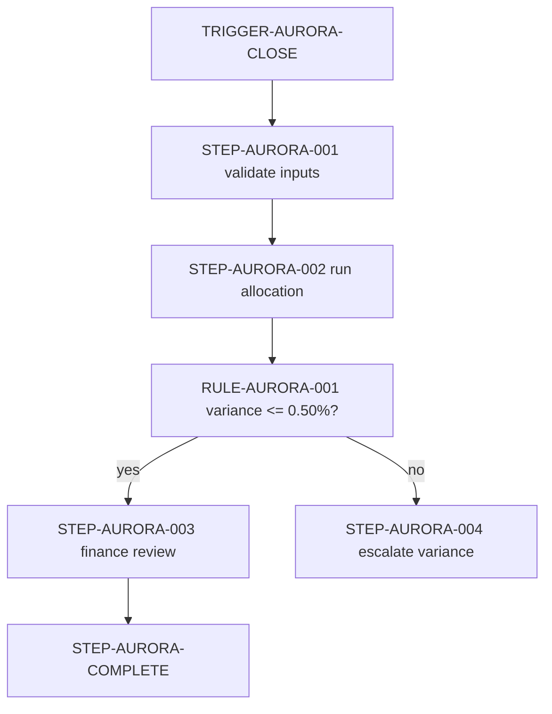

# Aurora Monthly Loss Allocation Process

**Document ID:** DOC-AURORA-0042
**Version:** DOCV-AURORA-0042-V3
**Status:** effective
**Owner:** ROLE-LOSS-OWNER
**Effective date:** 2026-02-01
**Next review date:** 2027-02-01

## Document metadata and governance

The process allocates the monthly loss estimate to the Aurora portfolio. The stable identity is `DOC-AURORA-0042`; this version adds a reconciliation control and supersedes version 2. The approving role is `ROLE-MODEL-GOVERNANCE-CHAIR`, with approval recorded in `EVID-AURORA-APPROVAL-003` on 2026-01-27.

## Purpose

Produce a reproducible monthly allocation with a traceable source dataset, reviewer evidence, and a signed handoff to Finance Operations.

## Scope and applicability

This process applies to the Aurora portfolio for US reporting months with a closed loss ledger. It excludes ad hoc scenario analysis, regulatory submissions, and portfolios without a validated ledger extract. It is tagged `governed_document`, `controlled_activity`, and `records`.

## Definitions and controlled terminology

- **Allocation basis:** The approved exposure-weighted basis used to distribute the portfolio loss estimate.
- **KPI:** Key performance indicator; the reconciliation completion rate in this process.
- **Close date:** The last calendar day of the reporting month after the ledger owner closes the extract.

## Roles and responsibilities

| Role ID | Responsibility | Accountabilities | Escalation path |
| --- | --- | --- | --- |
| ROLE-LOSS-OWNER | Process owner | Maintains process and resolves routine gaps | ROLE-MODEL-GOVERNANCE-CHAIR |
| ROLE-LEDGER-ANALYST | Performer | Runs extract, checks inputs, and records evidence | ROLE-LOSS-OWNER |
| ROLE-FINANCE-REVIEWER | Reviewer | Reviews reconciliation and signs handoff | ROLE-LOSS-OWNER |

## Preconditions, triggers, and scheduling

`TRIGGER-AURORA-CLOSE` starts the process on the second business day after the ledger close. `PRE-AURORA-LEDGER-CLOSED` requires the ledger extract to be marked closed and the prior-month correction queue to be empty.

## Inputs and entry criteria

The analyst receives `DATA-AURORA-LEDGER-001` with an as-of date, `DATA-AURORA-EXPOSURE-001` with exposure totals, and the approved allocation basis `CALC-AURORA-ALLOC-001` version 4. The extract passes row-count and missing-key checks before processing begins.

## Process overview

The analyst validates the two data assets, runs the allocation calculator, reviews the reconciliation rule, and publishes the approved output. A failed input check stops the process and escalates to the process owner.

**Diagram caption:** The process moves from a closed ledger to validated allocation, then branches on the reconciliation threshold. The tables remain authoritative.

## Atomic process steps

1. **STEP-AURORA-001 — Validate inputs.** `ROLE-LEDGER-ANALYST` confirms the ledger and exposure extracts have matching month, owner, and row-count metadata. The expected result is a passed input checklist stored as `EVID-AURORA-INPUT-003`.
2. **STEP-AURORA-002 — Run allocation.** The analyst runs `CALC-AURORA-ALLOC-001` version 4 using the approved basis and stores the output in `SYS-AURORA-REPORTING-001`. The expected result is one allocation output per portfolio segment.
3. **STEP-AURORA-003 — Review output.** `ROLE-FINANCE-REVIEWER` compares allocated total to the ledger loss total and records the signed review. The completion condition is an approved review record.
4. **STEP-AURORA-004 — Escalate variance.** If `RULE-AURORA-001` is false, the analyst stops publication, records the variance, and escalates to `ROLE-LOSS-OWNER`. No output is marked effective until the variance is resolved or waived.

| Step ID | Performer | Input | Action | Output | Evidence | Completion condition | Failure path |
| --- | --- | --- | --- | --- | --- | --- | --- |
| STEP-AURORA-001 | ROLE-LEDGER-ANALYST | Ledger and exposure extracts | Validate month, owner, row count, and keys | Passed input checklist | EVID-AURORA-INPUT-003 | All checks pass | Stop and escalate |
| STEP-AURORA-002 | ROLE-LEDGER-ANALYST | Approved calculator and validated inputs | Run allocation | Segment allocation output | EVID-AURORA-RUN-003 | Output checksum recorded | Restore prior run and escalate |
| STEP-AURORA-003 | ROLE-FINANCE-REVIEWER | Allocation and ledger totals | Compare and approve | Signed review | EVID-AURORA-APPROVAL-003 | Review status approved | Open exception |
| STEP-AURORA-004 | ROLE-LEDGER-ANALYST | Failed variance rule | Record and escalate | Variance issue | EVID-AURORA-VARIANCE-003 | Owner accepts remediation plan | No publication |

## Decision rules and thresholds

`RULE-AURORA-001` evaluates the absolute difference between allocated total and ledger loss total. The operator is less than or equal to, the threshold is `0.50%` of ledger loss, and the period is the reporting month. A false outcome requires owner review; `ROLE-LOSS-OWNER` may approve a time-bounded exception only with evidence.

| Rule ID | Condition | Operator | Threshold and unit | Outcome | Override authority |
| --- | --- | --- | --- | --- | --- |
| RULE-AURORA-001 | Absolute allocation variance / ledger loss | less_than_or_equal | 0.50 percent of monthly loss | Publish for finance review | ROLE-LOSS-OWNER with EVID-AURORA-EXCEPTION-003 |

## Controls, risks, and evidence

`CTRL-AURORA-001` mitigates `RISK-AURORA-001` (allocation does not reconcile to the closed ledger). It runs for every monthly close, is performed by `ROLE-FINANCE-REVIEWER`, and produces `EVID-AURORA-APPROVAL-003`. A failure prevents publication and follows `ESC-AURORA-001`.

| Control ID | Risk ID | Frequency or event | Owner | Evidence | Failure response |
| --- | --- | --- | --- | --- | --- |
| CTRL-AURORA-001 | RISK-AURORA-001 | Each monthly close | ROLE-FINANCE-REVIEWER | EVID-AURORA-APPROVAL-003 | Stop publication and escalate |

## Exceptions, failure paths, escalation, and recovery

`EXC-AURORA-001` covers a variance above 0.50% caused by a documented late ledger correction. Only `ROLE-LOSS-OWNER` may authorize it, and it expires at the next monthly close. Recovery reruns the calculator after the corrected extract is marked closed. `ESC-AURORA-001` routes unresolved issues from analyst to process owner to governance chair.

| Exception ID | Trigger | Authorized role | Recovery | Valid-to or review date |
| --- | --- | --- | --- | --- |
| EXC-AURORA-001 | Late ledger correction causes variance above threshold | ROLE-LOSS-OWNER | Correct extract, rerun calculator, repeat review | 2026-03-31 |

## Outputs, completion criteria, and downstream consumers

The process produces `OUT-AURORA-ALLOC-001`, a signed allocation report, and the evidence records listed above. Completion requires the approved report, matching checksum, evidence references, and a handoff acknowledgement from Finance Operations (`ROLE-FINANCE-REVIEWER`).

## Systems, data, calculators, and other dependencies

`SYS-AURORA-LEDGER-001` supplies the closed ledger, `SYS-AURORA-REPORTING-001` stores the report, and `CALC-AURORA-ALLOC-001` is a versioned spreadsheet calculator. The calculator is not executed by Document Enhancer; its owner validates the checksum and version before use. If the reporting system is unavailable, the analyst stores a restricted interim package and escalates.

## Metrics, service levels, and monitoring

`METRIC-AURORA-COMPLETE-001` measures the percentage of monthly closes with an approved report by the fifth business day. The target is 100%, with a warning threshold below 95%. `ROLE-LOSS-OWNER` reviews the metric monthly.

## Related requirements, policies, standards, and documents

The process implements `STD-OPS-DOC-001`, is governed by `POL-DOC-GOV-001`, and follows `POL-REC-001` for evidence retention. It is related to `DOC-AURORA-METH-0007`, the fictional allocation methodology.

## Records retention

The signed approval and final allocation report are records with retention basis `POL-REC-001`, minimum period seven years after fiscal year end, location `SYS-AURORA-REPORTING-001`, and review owner `ROLE-RECORDS-MANAGER`.

## Version history and approvals

| Version | Effective date | Change summary | Approver role | Decision |
| --- | --- | --- | --- | --- |
| 1.0 | 2024-02-01 | Initial fictional process | ROLE-MODEL-GOVERNANCE-CHAIR | Approved |
| 2.0 | 2025-02-01 | Added ledger key validation | ROLE-MODEL-GOVERNANCE-CHAIR | Superseded |
| 3.0 | 2026-02-01 | Added reconciliation control and exception route | ROLE-MODEL-GOVERNANCE-CHAIR | Approved |
