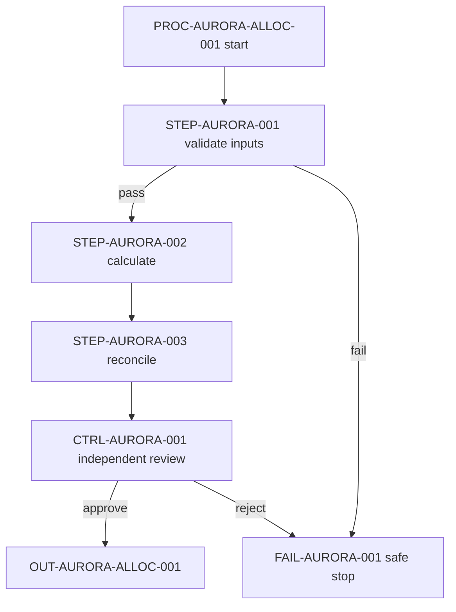

# Aurora Monthly Loss Allocation Process

**Document ID:** DOC-AURORA-0042
**Version:** DOCV-AURORA-0042-V4
**Status:** effective
**Owner:** ROLE-LOSS-OWNER
**Effective date:** 2026-08-01
**Next review date:** 2027-07-31

## Document metadata and governance

This fictional process allocates the approved monthly loss estimate for Aurora Bank N.A. and
Aurora Holdings Finance Company. It supports management risk reporting but is not itself classified
as a critical operation. The authoritative version is held in `SYS-AURORA-GRC-001`. Version 4 adds
legal-entity scope, independent challenge, data lineage, resilience, and obligation mapping.

### Document control (TBL-PROC-GOVERNANCE)

| Document ID | Version | Status | Classification | Legal entities and jurisdictions | Risk tier and critical-operation link | Business owner | Accountable executive | Approving authority | Effective date | Next review date |
| --- | --- | --- | --- | --- | --- | --- | --- | --- | --- | --- |
| DOC-AURORA-0042 | DOCV-AURORA-0042-V4 | effective | confidential | Aurora Bank N.A. and Aurora Holdings Finance Company; US | Tier 1; supports RISK-REPORT-AURORA-001, not a critical operation | ROLE-LOSS-OWNER | ROLE-CFO-AURORA | COMMITTEE-AURORA-MODEL-RISK | 2026-08-01 | 2027-07-31 |

## Purpose

Produce a complete, reproducible, and independently reviewed monthly allocation of the approved
Aurora loss estimate by legal entity and portfolio, with traceable data, decision rules, control
evidence, and handoff to Finance Operations and Risk Reporting.

## Scope and applicability

The process applies to the US-booked Aurora managed portfolio after the loss ledger closes for the
month. It includes Aurora Bank N.A. and Aurora Holdings Finance Company. It excludes regulatory
submissions, non-US branches, ad hoc stress scenarios, portfolios without an approved methodology,
and months with an unresolved ledger-integrity blocker. Local addenda may impose stricter cut-offs
but may not change the allocation formula or approval authority.

## Definitions and controlled terminology

**Allocation amount** is the legal-entity share of the approved monthly loss estimate.
**Closed month** means the Finance Controller has approved the ledger close in
`SYS-AURORA-LEDGER-001`. **Tier 1** means the process supports a material risk report and requires
annual review and second-line challenge. **Business day** follows calendar `CAL-US-NY-001`.

## Roles and responsibilities

The process preserves first-line ownership, second-line challenge, and third-line independence.
Internal Audit is not a process approver or control performer.

### Roles, accountability, and challenge (TBL-PROC-ROLES)

| Role ID | Governance capacity or line | Responsibility | Decision rights | Accountabilities | Escalation path |
| --- | --- | --- | --- | --- | --- |
| ROLE-CFO-AURORA | Accountable executive | Sponsors the process and resources | Accepts material residual risk within delegated authority | Alignment to risk appetite and financial-control framework | COMMITTEE-AURORA-RISK |
| ROLE-LOSS-OWNER | First line owner | Owns design, execution, controls, evidence, and issues | Approves routine completion after reviewer sign-off | Complete and accurate allocation | ROLE-CFO-AURORA |
| ROLE-LOSS-ANALYST | First line performer | Executes allocation steps | No override authority | Timely, complete execution evidence | ROLE-LOSS-OWNER |
| ROLE-FINANCE-REVIEWER | First line independent checker | Reviews population, formula, and outputs | Approves or rejects monthly execution | Credible challenge and documented conclusion | ROLE-CONTROLLER-AURORA |
| ROLE-MODEL-RISK-CHALLENGER | Second line | Challenges material methodology and limit breaches | Requires remediation or escalates unresolved risk | Independent risk-based challenge | COMMITTEE-AURORA-MODEL-RISK |

## Preconditions, triggers, and scheduling

The trigger is approval of the month-end ledger close. Execution starts by 09:00
America/New_York on the second business day after month end and completes by 17:00 on the third
business day. Preconditions are an approved methodology version, closed ledger, current mapping,
available systems, no active legal hold that blocks processing, and no unresolved Severity 1 data
issue.

## Inputs and entry criteria

All inputs must cover the same month and legal-entity population. The analyst records source counts
and totals before any transformation.

### Governed inputs (TBL-PROC-INPUTS)

| Input ID | System of record | Legal-entity and period scope | Owner and steward | Cut-off or freshness | Quality and reconciliation rule | Classification | Lineage or evidence | Fallback |
| --- | --- | --- | --- | --- | --- | --- | --- | --- |
| DATA-AURORA-LEDGER-001 | SYS-AURORA-LEDGER-001 | Both in-scope entities; closed reporting month | ROLE-LEDGER-OWNER / ROLE-FINANCE-DATA-STEWARD | Closed by 18:00 day 1 | Row count and total loss equal approved close record | restricted | EVID-AURORA-LINEAGE-001 | Stop; no manual substitute |
| DATA-AURORA-EXPOSURE-001 | SYS-AURORA-RISK-001 | Both in-scope entities; month-end exposure | ROLE-RISK-DATA-OWNER / ROLE-RISK-DATA-STEWARD | As of 23:59 month end | Exposure total reconciles to RISK-REPORT-AURORA-001 within USD 1.00 | confidential | EVID-AURORA-LINEAGE-002 | Use prior period only under EXC-AURORA-002 |
| MAP-AURORA-ENTITY-001 | SYS-AURORA-MDM-001 | Active portfolio-to-entity mappings | ROLE-REFERENCE-DATA-OWNER | Effective for reporting month | No unmapped active portfolio | confidential | EVID-AURORA-MAPPING-001 | Stop and escalate |

## Process overview

The analyst validates source completeness, creates a controlled working set, applies the approved
allocation formula, reconciles the result, obtains maker-checker approval, and publishes only the
approved output. A failed entry criterion blocks downstream work.

### Flow overview

**Diagram caption:** The monthly process stops on incomplete inputs or failed independent review;
the step, rule, control, and exception tables are authoritative.

## Atomic process steps

`STEP-AURORA-001` validates the full input population before calculation. No later step may begin
until its completion condition is met.

### Atomic process steps (TBL-PROC-STEPS)

| Step ID | Performer | Prerequisite and input | System or tool | Action | Key control ID | Output and expected result | Evidence | Timing or service level | Completion condition | Failure path |
| --- | --- | --- | --- | --- | --- | --- | --- | --- | --- | --- |
| STEP-AURORA-001 | ROLE-LOSS-ANALYST | Closed month and all three governed inputs | SYS-AURORA-CALC-001 | Validate counts, totals, dates, mappings, and classifications | CTRL-AURORA-INPUT-001 | Validated input manifest with zero unresolved blocker | EVID-AURORA-INPUT-001 | By 11:00 day 2 | Reviewer can reproduce each check | FAIL-AURORA-001 |
| STEP-AURORA-002 | ROLE-LOSS-ANALYST | STEP-AURORA-001 passed | CALC-AURORA-ALLOC-001 v4.2 | Apply FORM-AURORA-ALLOC-001 by entity and portfolio | CTRL-AURORA-CALC-001 | Allocation output totals to approved loss estimate | EVID-AURORA-CALC-001 | By 15:00 day 2 | Difference equals USD 0.00 after approved rounding | FAIL-AURORA-002 |
| STEP-AURORA-003 | ROLE-LOSS-ANALYST | Calculation output | SYS-AURORA-RISK-001 | Reconcile entity totals and investigate differences | CTRL-AURORA-RECON-001 | Signed reconciliation with all differences resolved | EVID-AURORA-RECON-001 | By 12:00 day 3 | No open difference above USD 1.00 | FAIL-AURORA-003 |
| STEP-AURORA-004 | ROLE-FINANCE-REVIEWER | Complete evidence packet | SYS-AURORA-GRC-001 | Review population, formula, reconciliation, and exceptions | CTRL-AURORA-001 | Approved or rejected monthly execution | EVID-AURORA-REVIEW-001 | By 17:00 day 3 | Approval record names version, period, and conditions | FAIL-AURORA-004 |

## Decision rules and thresholds

### Decision rules and thresholds (TBL-PROC-RULES)

| Rule ID | Data source and period | Condition | Operator | Threshold, unit, and boundary | Outcome and branch | Decision authority | Override rule | Evidence |
| --- | --- | --- | --- | --- | --- | --- | --- | --- |
| RULE-AURORA-001 | DATA-AURORA-EXPOSURE-001; month end | Unmapped exposure share | greater than | 0.00% of total exposure; any positive value fails | Stop at FAIL-AURORA-001 | ROLE-LOSS-OWNER | No override | EVID-AURORA-INPUT-001 |
| RULE-AURORA-002 | EVID-AURORA-RECON-001; reporting month | Absolute reconciliation difference | greater than | USD 1.00 after cent rounding | Investigate and block approval | ROLE-FINANCE-REVIEWER | EXC-AURORA-001 only for source timing, not unexplained difference | EVID-AURORA-RECON-001 |
| RULE-AURORA-003 | DATA-AURORA-EXPOSURE-001; current vs prior month | Portfolio-composition change | greater than | 10.00% of managed exposure | Obtain second-line review before publication | ROLE-MODEL-RISK-CHALLENGER | No self-approval | EVID-AURORA-CHANGE-001 |

## Controls, risks, and evidence

### Controls, risks, and evidence (TBL-PROC-CONTROLS)

| Control ID | Objective and risk IDs | Type | Trigger or frequency | Owner | Performer and reviewer | Population and procedure | Evidence and system of record | Threshold | Failure and issue response | Retention |
| --- | --- | --- | --- | --- | --- | --- | --- | --- | --- | --- |
| CTRL-AURORA-INPUT-001 | Complete and accurate inputs; RISK-AURORA-DATA-001 | Preventive, hybrid | Every monthly run | ROLE-LOSS-OWNER | ROLE-LOSS-ANALYST / ROLE-FINANCE-REVIEWER | 100% of input files, entities, and control totals | EVID-AURORA-INPUT-001 in SYS-AURORA-GRC-001 | Zero unresolved blockers | Stop; open data issue; escalate by 13:00 | REC-AURORA-CONTROL-001 under POL-REC-001 |
| CTRL-AURORA-CALC-001 | Approved formula and total allocation; RISK-AURORA-CALC-001 | Preventive, automated | Every calculation | ROLE-LOSS-OWNER | SYS-AURORA-CALC-001 / ROLE-FINANCE-REVIEWER | Full output population using approved calculator version | EVID-AURORA-CALC-001 in SYS-AURORA-GRC-001 | USD 0.00 total difference | Reject output; issue if repeat failure | REC-AURORA-CONTROL-001 |
| CTRL-AURORA-001 | Independent maker-checker approval; RISK-AURORA-APPROVAL-001 | Detective, manual | Every monthly run | ROLE-CONTROLLER-AURORA | ROLE-FINANCE-REVIEWER / ROLE-CONTROLLER-AURORA | Complete monthly evidence packet | EVID-AURORA-REVIEW-001 in SYS-AURORA-GRC-001 | All required evidence present and passed | Reject; escalate material gap to ROLE-CFO-AURORA | REC-AURORA-CONTROL-001 |

## Exceptions, failure paths, escalation, and recovery

An exception never changes the source data or conceals a control failure. Severity 1 integrity or
unauthorized-access events follow the incident framework and are not waivable here.

### Exceptions and recovery (TBL-PROC-EXCEPTIONS)

| Exception ID | Affected requirement or control | Trigger and scope | Residual risk | Compensating control | Owner | Approval authority | Expiry or review date | Monitoring | Recovery and closure evidence | Escalation |
| --- | --- | --- | --- | --- | --- | --- | --- | --- | --- | --- |
| EXC-AURORA-001 | STEP-AURORA-004 timing | Reporting-system outage after completed review | Delayed publication | Preserve signed packet; reconcile after recovery | ROLE-REPORTING-OWNER | ROLE-CONTROLLER-AURORA | Next business day | Two-hour status updates | Publication receipt plus post-recovery reconciliation | ROLE-CFO-AURORA after four hours |
| EXC-AURORA-002 | Current exposure input | Approved source delay affecting both entities | Stale allocation basis | Prior-period exposure plus 100% variance review and disclosure | ROLE-LOSS-OWNER | COMMITTEE-AURORA-MODEL-RISK | One reporting month | Daily until replacement | Recalculate with current data and quantify difference | ROLE-CFO-AURORA and ROLE-MODEL-RISK-CHALLENGER |

## Outputs, completion criteria, and downstream consumers

`OUT-AURORA-ALLOC-001` contains entity and portfolio allocations, source and calculator versions,
period, checksum, control results, approved exceptions, and approval ID. Completion requires all
steps and controls to pass, all exceptions to be current, and Finance Operations and Risk Reporting
to acknowledge the approved handoff. Draft or rejected outputs are never published.

## Systems, data, calculators, and other dependencies

### Dependency and resilience map (TBL-PROC-DEPENDENCIES)

| Dependency ID | Type and owner | Service or purpose | Criticality | Data and access | Provider or subcontractor | Service level and recovery objectives | Monitoring | Continuity, substitution, or exit |
| --- | --- | --- | --- | --- | --- | --- | --- | --- | --- |
| SYS-AURORA-LEDGER-001 | System / ROLE-LEDGER-OWNER | Closed loss ledger | High | Restricted financial data; least privilege | Internal | RTO 4h; RPO 0 after close | Availability and close-control dashboard | Restore from approved ledger recovery plan; no manual substitute |
| SYS-AURORA-CALC-001 | Governed calculator / ROLE-LOSS-OWNER | Execute approved allocation | High | Restricted inputs; maker-checker release | Internal | RTO 4h; version rollback to last approved release | Job, checksum, and version monitoring | Controlled rollback; manual calculation prohibited |
| TPSP-AURORA-CLOUD-001 | Third-party hosting / ROLE-TECHNOLOGY-OWNER | Host reporting workspace | Significant | Encrypted restricted data; privileged access monitored | Fictional Aurora Cloud; subcontractor inventory in TPR-AURORA-001 | Contract SLA 99.9%; RTO 8h; RPO 1h | Service, incident, concentration, and control-assurance review | Tested regional failover and exit plan EXIT-AURORA-001 |

## Metrics, service levels, and monitoring

### Metrics and escalation (TBL-PROC-METRICS)

| Metric ID | Definition and population | Formula | Unit and period | Data source | Owner | Target, limit, or tolerance | Reporting forum | Breach action |
| --- | --- | --- | --- | --- | --- | --- | --- | --- |
| METRIC-AURORA-001 | On-time approved runs; all scheduled monthly runs | approved by deadline / scheduled runs | percentage, monthly | SYS-AURORA-GRC-001 | ROLE-LOSS-OWNER | Target 100%; limit below 95% over rolling 3 months | COMMITTEE-AURORA-OPERATIONS monthly | Root-cause review and issue if limit breached |
| METRIC-AURORA-002 | Complete evidence packets; all completed runs | packets with all required artifacts / completed runs | percentage, monthly | SYS-AURORA-GRC-001 | ROLE-CONTROLLER-AURORA | 100%; no tolerance | COMMITTEE-AURORA-CONTROLS monthly | Reject execution and open control issue |
| KRI-AURORA-001 | Unmapped exposure; total month-end exposure | unmapped exposure / total exposure | percentage, each run | SYS-AURORA-RISK-001 | ROLE-RISK-DATA-OWNER | Limit 0.00% | COMMITTEE-AURORA-RISK | Stop process and escalate immediately |

## Related requirements, policies, standards, and documents

The internal obligation IDs below are fictional placeholders. They do not claim that an external
rule applies without an approved Legal or Compliance conclusion.

### Obligation and authority mapping (TBL-PROC-OBLIGATIONS)

| Mapping ID | Authority or obligation ID | Jurisdiction and legal entities | Applicability conclusion | Implementing step or rule | Control and evidence | Owner | Review date |
| --- | --- | --- | --- | --- | --- | --- | --- |
| MAP-AURORA-OBL-001 | OBL-AURORA-RISK-DATA-001 | US; both in-scope entities | Applicable to management risk-report lineage | STEP-AURORA-001 and RULE-AURORA-001 | CTRL-AURORA-INPUT-001 / EVID-AURORA-INPUT-001 | ROLE-RISK-DATA-OWNER | 2027-07-31 |
| MAP-AURORA-POL-001 | POL-DOC-GOV-001 and STD-CONTROL-EVID-001 | Global internal baseline; both entities | Applicable | Entire process | CTRL-AURORA-001 / EVID-AURORA-REVIEW-001 | ROLE-LOSS-OWNER | 2027-07-31 |

## Records retention

Record class `REC-AURORA-CONTROL-001` covers source manifests, calculation packages,
reconciliations, approvals, exceptions, and publication receipts. `SYS-AURORA-GRC-001` is the system
of record. Schedule `SCHED-AURORA-FIN-007` retains the fictional records for seven years after fiscal
year end unless a longer obligation or legal hold applies. `ROLE-RECORDS-AURORA` owns disposition
review and annual retrieval testing.

## Version history and approvals

### Version history and approvals (TBL-PROC-VERSIONS)

| Version | Change class | Effective date | Change summary and impact | First-line owner | Independent challenger | Approving authority | Decision and conditions | Evidence | Supersedes |
| --- | --- | --- | --- | --- | --- | --- | --- | --- | --- | --- |
| 4.0 | Material | 2026-08-01 | Added entity scope, input lineage, second-line challenge, resilience, third-party, and obligation mapping; training required before use | ROLE-LOSS-OWNER | ROLE-MODEL-RISK-CHALLENGER | COMMITTEE-AURORA-MODEL-RISK | Approved 2026-07-24; transition complete by effective date | EVID-AURORA-APPROVAL-004 | DOCV-AURORA-0042-V3 |
