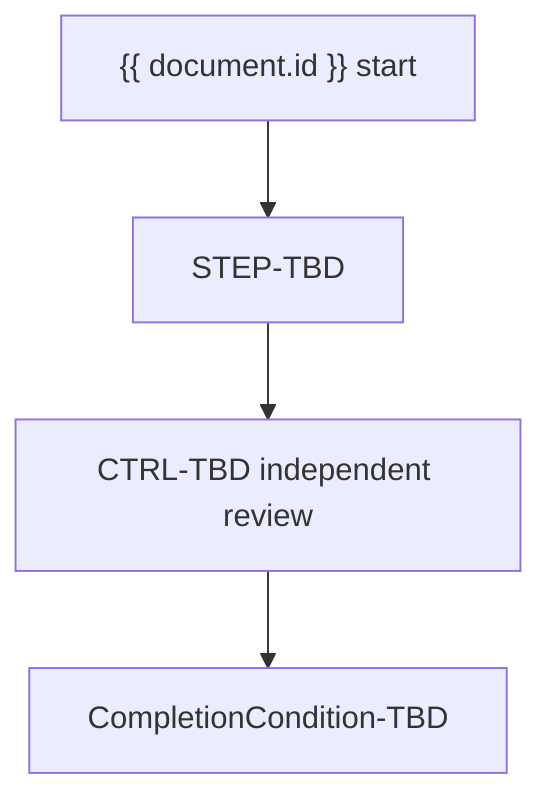

<!-- AUTHORING: This template is a governed target. Rendered output must not contain comments, instructions, or invented values. -->
# {{ document.title }}

**Document ID:** {{ document.id }}
**Version:** {{ document.version }}
**Status:** {{ document.status }}
**Owner:** {{ document.owner }}
**Effective date:** {{ document.effective_date }}
**Next review date:** {{ document.next_review_date }}

## Document metadata and governance

{{ sections.metadata }}

### Document control (TBL-PROC-GOVERNANCE)

| Document ID | Version | Status | Classification | Legal entities and jurisdictions | Risk tier and critical-operation link | Business owner | Accountable executive | Approving authority | Effective date | Next review date |
| --- | --- | --- | --- | --- | --- | --- | --- | --- | --- | --- |
| {{ tables.governance }} | TBD | TBD | TBD | TBD | TBD | TBD | TBD | TBD | TBD | TBD |

## Purpose

{{ sections.purpose }}

## Scope and applicability

{{ sections.scope }}

## Definitions and controlled terminology

{{ sections.definitions }}

## Roles and responsibilities

{{ sections.roles }}

### Roles, accountability, and challenge (TBL-PROC-ROLES)

| Role ID | Governance capacity or line | Responsibility | Decision rights | Accountabilities | Escalation path |
| --- | --- | --- | --- | --- | --- |
| {{ tables.roles }} | TBD | TBD | TBD | TBD | TBD |

## Preconditions, triggers, and scheduling

{{ sections.preconditions }}

## Inputs and entry criteria

{{ sections.inputs }}

### Governed inputs (TBL-PROC-INPUTS)

| Input ID | System of record | Legal-entity and period scope | Owner and steward | Cut-off or freshness | Quality and reconciliation rule | Classification | Lineage or evidence | Fallback |
| --- | --- | --- | --- | --- | --- | --- | --- | --- |
| {{ tables.inputs }} | TBD | TBD | TBD | TBD | TBD | TBD | TBD | TBD |

## Process overview

{{ sections.overview }}

### Flow overview

<!-- AUTHORING: Mermaid is illustrative. Repeat authoritative actions and decisions in text and tables. -->

**Diagram caption:** The flow identifies the governed process boundary. Authoritative actions,
decisions, controls, and recovery routes are defined below.

## Atomic process steps

{{ sections.steps }}

### Atomic process steps (TBL-PROC-STEPS)

| Step ID | Performer | Prerequisite and input | System or tool | Action | Key control ID | Output and expected result | Evidence | Timing or service level | Completion condition | Failure path |
| --- | --- | --- | --- | --- | --- | --- | --- | --- | --- | --- |
| {{ tables.steps }} | TBD | TBD | TBD | TBD | TBD | TBD | TBD | TBD | TBD | TBD |

## Decision rules and thresholds

{{ sections.rules }}

### Decision rules and thresholds (TBL-PROC-RULES)

| Rule ID | Data source and period | Condition | Operator | Threshold, unit, and boundary | Outcome and branch | Decision authority | Override rule | Evidence |
| --- | --- | --- | --- | --- | --- | --- | --- | --- |
| {{ tables.rules }} | TBD | TBD | TBD | TBD | TBD | TBD | TBD | TBD |

## Controls, risks, and evidence

{{ sections.controls }}

### Controls, risks, and evidence (TBL-PROC-CONTROLS)

| Control ID | Objective and risk IDs | Type | Trigger or frequency | Owner | Performer and reviewer | Population and procedure | Evidence and system of record | Threshold | Failure and issue response | Retention |
| --- | --- | --- | --- | --- | --- | --- | --- | --- | --- | --- |
| {{ tables.controls }} | TBD | TBD | TBD | TBD | TBD | TBD | TBD | TBD | TBD | TBD |

## Exceptions, failure paths, escalation, and recovery

{{ sections.exceptions }}

### Exceptions and recovery (TBL-PROC-EXCEPTIONS)

| Exception ID | Affected requirement or control | Trigger and scope | Residual risk | Compensating control | Owner | Approval authority | Expiry or review date | Monitoring | Recovery and closure evidence | Escalation |
| --- | --- | --- | --- | --- | --- | --- | --- | --- | --- | --- |
| {{ tables.exceptions }} | TBD | TBD | TBD | TBD | TBD | TBD | TBD | TBD | TBD | TBD |

## Outputs, completion criteria, and downstream consumers

{{ sections.outputs }}

## Systems, data, calculators, and other dependencies

{{ sections.dependencies }}

### Dependency and resilience map (TBL-PROC-DEPENDENCIES)

| Dependency ID | Type and owner | Service or purpose | Criticality | Data and access | Provider or subcontractor | Service level and recovery objectives | Monitoring | Continuity, substitution, or exit |
| --- | --- | --- | --- | --- | --- | --- | --- | --- |
| {{ tables.dependencies }} | TBD | TBD | TBD | TBD | TBD | TBD | TBD | TBD |

## Metrics, service levels, and monitoring

{{ sections.metrics }}

### Metrics and escalation (TBL-PROC-METRICS)

| Metric ID | Definition and population | Formula | Unit and period | Data source | Owner | Target, limit, or tolerance | Reporting forum | Breach action |
| --- | --- | --- | --- | --- | --- | --- | --- | --- |
| {{ tables.metrics }} | TBD | TBD | TBD | TBD | TBD | TBD | TBD | TBD |

## Related requirements, policies, standards, and documents

{{ sections.related }}

### Obligation and authority mapping (TBL-PROC-OBLIGATIONS)

| Mapping ID | Authority or obligation ID | Jurisdiction and legal entities | Applicability conclusion | Implementing step or rule | Control and evidence | Owner | Review date |
| --- | --- | --- | --- | --- | --- | --- | --- |
| {{ tables.obligations }} | TBD | TBD | TBD | TBD | TBD | TBD | TBD |

## Records retention

{{ sections.retention }}

## Version history and approvals

{{ sections.version }}

### Version history and approvals (TBL-PROC-VERSIONS)

| Version | Change class | Effective date | Change summary and impact | First-line owner | Independent challenger | Approving authority | Decision and conditions | Evidence | Supersedes |
| --- | --- | --- | --- | --- | --- | --- | --- | --- | --- |
| {{ tables.versions }} | TBD | TBD | TBD | TBD | TBD | TBD | TBD | TBD | TBD |

<!-- AUTHORING: End of template. Keep unknown facts visible and route them through review. -->
