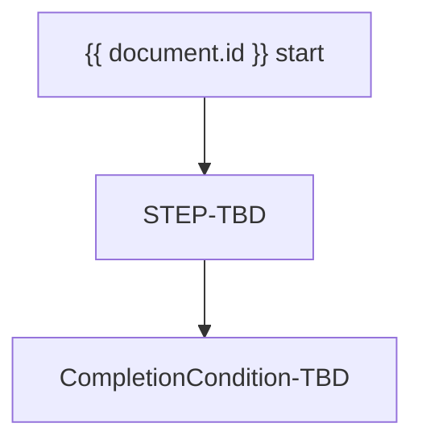

<!-- AUTHORING: This template is a governed target. Comments and unresolved controls must never appear in a rendered document. -->
# {{ document.title }}

**Document ID:** {{ document.id }}
**Version:** {{ document.version }}
**Status:** {{ document.status }}
**Owner:** {{ document.owner }}
**Effective date:** {{ document.effective_date }}
**Next review date:** {{ document.next_review_date }}

<!-- AUTHORING: Keep this metadata block complete; use TBD for unavailable values. -->
## Document metadata and governance

{{ sections.metadata }}

## Purpose

{{ sections.purpose }}

## Scope and applicability

{{ sections.scope }}

## Definitions and controlled terminology

{{ sections.definitions }}

## Roles and responsibilities

{{ sections.roles }}

### Roles and accountability (TBL-PROC-ROLES)

| Role ID | Responsibility | Accountabilities | Escalation path |
| --- | --- | --- | --- |
| {{ tables.roles }} | TBD | TBD | TBD |

## Preconditions, triggers, and scheduling

{{ sections.preconditions }}

## Inputs and entry criteria

{{ sections.inputs }}

## Process overview

{{ sections.overview }}

### Flow overview

<!-- AUTHORING: Mermaid is illustrative. Repeat authoritative rules in text and tables. -->

**Diagram caption:** The flow identifies the governed process boundary; authoritative actions and decisions are in the sections and tables below.

## Atomic process steps

{{ sections.steps }}

### Atomic process steps (TBL-PROC-STEPS)

| Step ID | Performer | Input | Action | Output | Evidence | Completion condition | Failure path |
| --- | --- | --- | --- | --- | --- | --- | --- |
| {{ tables.steps }} | TBD | TBD | TBD | TBD | TBD | TBD | TBD |

## Decision rules and thresholds

{{ sections.rules }}

### Decision rules and thresholds (TBL-PROC-RULES)

| Rule ID | Condition | Operator | Threshold and unit | Outcome | Override authority |
| --- | --- | --- | --- | --- | --- |
| {{ tables.rules }} | TBD | TBD | TBD | TBD | TBD |

## Controls, risks, and evidence

{{ sections.controls }}

### Controls, risks, and evidence (TBL-PROC-CONTROLS)

| Control ID | Risk ID | Frequency or event | Owner | Evidence | Failure response |
| --- | --- | --- | --- | --- | --- |
| {{ tables.controls }} | TBD | TBD | TBD | TBD | TBD |

## Exceptions, failure paths, escalation, and recovery

{{ sections.exceptions }}

### Exceptions and recovery (TBL-PROC-EXCEPTIONS)

| Exception ID | Trigger | Authorized role | Recovery | Valid-to or review date |
| --- | --- | --- | --- | --- |
| {{ tables.exceptions }} | TBD | TBD | TBD | TBD |

## Outputs, completion criteria, and downstream consumers

{{ sections.outputs }}

## Systems, data, calculators, and other dependencies

{{ sections.dependencies }}

## Metrics, service levels, and monitoring

{{ sections.metrics }}

## Related requirements, policies, standards, and documents

{{ sections.related }}

## Records retention

{{ sections.retention }}

## Version history and approvals

{{ sections.version }}

### Version history and approvals (TBL-PROC-VERSIONS)

| Version | Effective date | Change summary | Approver role | Decision |
| --- | --- | --- | --- | --- |
| {{ tables.versions }} | TBD | TBD | TBD | TBD |

<!-- AUTHORING: End of template. Do not add hidden instructions, proprietary examples, or unresolved control text to output. -->
